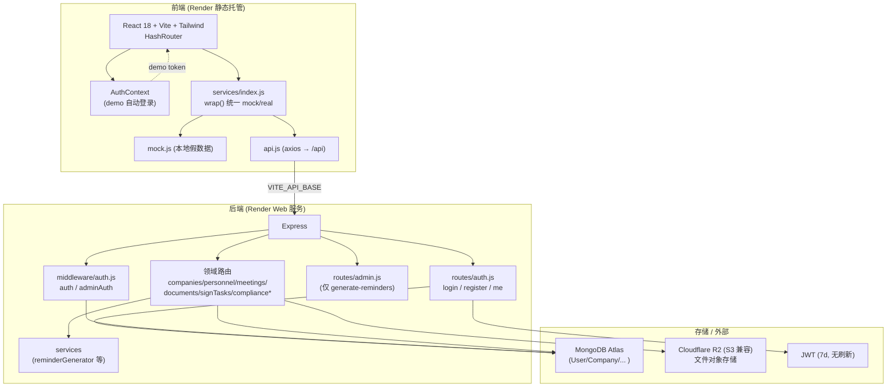

# CSMS v5 架构演进分析（架构评审 · 部分工作流）

> 架构师：高见远（Gao）｜ 评审日期：2026-07-17
> 输入：①《OPTIMIZATION-MASTER-PLAN-2026-07-17.md》②《UX-DECISIONS-TASKS-2026-07-17.md》③ 认证/后台代码现状实测
> 范围：架构盘点（A）+ 认证与后台缺口方案（B）+ 未来演进（C）+ 分阶段路线（D）+ 待拍板决策（E）
> 说明：本文只做架构分析与文档产出，不修改任何业务代码。所有代码事实均来自 Read 实测，附证据见附录。

---

## 0. 执行摘要（TL;DR）

| # | 核心发现 | 推荐动作 |
|---|---------|---------|
| 1 | **RBAC 角色词汇在栈内互相矛盾**：后端枚举 `admin/secretary/user`，前端 `AdminPanel` 用 `admin/manager/viewer`，`AuthContext` 用 `admin/secretary/manager/viewer`，演示 mock 还冒出 `manager→secretary` 映射。**没有任何单一真相源（source of truth）。** | 全栈统一为 4 角色：`admin / secretary / manager / viewer`，以 `User.role` 枚举为唯一真相源 |
| 2 | **真实后端登录后权限会"失效"**：后端返回 `{success, token, user:{...}}`，但客户端 `AuthContext` 期望扁平 `user`（含 `role`）。normalize 不展开 `user`，导致 `isAdmin/canEdit/canDelete` 在 live 模式下全为 `false`，管理员进后台被"Access Denied"。**演示能跑、上线即崩。** | 修正认证响应契约：后端返回扁平 `user` 或客户端归一化展开 `user` 字段 |
| 3 | **公开 `register` 可越权自封 admin**：`POST /api/auth/register` 公开且 `role` 来自请求体；前端注册写死传 `role:'admin'`。任何人可自创管理员。 | 关闭公开注册，改为 admin 发放 invite-token；默认 `ALLOW_PUBLIC_REGISTER=false` |
| 4 | **admin 后台是"壳"**：`AdminPanel.jsx` 全部用本地 React state（`INITIAL_USERS`），无任何 API 调用，用户增删改不落库；仅展示 Mode/状态。 | 后端补齐用户管理 + 审计日志 + 合规规则入口 API，`AdminPanel` 改为 API 驱动 |
| 5 | **无种子管理员、演示模式掩盖登录页**：无 seed 脚本；`AuthProvider` 在无后端时自动 demo 登录，`#/login` 形同虚设。 | CLI `seed-admin` + 零用户时首注册兜底；提供"退出演示"显式开关 |

> 面向未来最关键的三条主线：**统一身份与权限模型（B）→ 单库多实体隔离（C.1）→ 渐进式多端（PWA + 小程序 BFF，C.3/C.4）**。后文给出与 M1–M6 对齐的分阶段路线（D）与 5 个待拍板决策（E）。

---

## A. 当前架构盘点

### A.1 技术栈分层图

**要点**：单仓库前后端分离、Render 同时托管静态前端与 Express Web；MongoDB Atlas 单库单租户；文件走 R2；鉴权为 JWT（7 天、无刷新、无吊销）。

### A.2 模块/目录现状（实测）

| 层 | 现状 | 备注 |
|----|------|------|
| 前端入口 | `client/src/contexts/AuthContext.jsx` 负责登录态；`services/index.js` 的 `wrap()` 决定走 mock 还是 real | `USE_MOCK = import.meta.env.VITE_USE_MOCK !== 'false'`，默认走 mock |
| 认证后端 | `server/routes/auth.js`：`/login`、`/register`（公开）、`/me` | `register` 的 `role` 直接取请求体 |
| 鉴权中间件 | `server/middleware/auth.js`：`auth`（任意登录用户）、`adminAuth`（仅 `role==='admin'`） | 仅两档，无细粒度 |
| 后台端点 | `server/routes/admin.js`：仅 `POST /api/admin/generate-reminders` | 唯一 admin 端点，生成合规提醒 |
| 用户模型 | `server/models/User.js`：`name/email/password(bcrypt)/role(enum)/phone/company(ObjectId)/isActive` | 角色枚举 `admin/secretary/user` |
| 后台前端 | `client/src/pages/AdminPanel.jsx`：用户管理/权限矩阵/系统信息三 Tab | **纯本地 state，无 API 调用** |

### A.3 mock / real 切换机制点评（CSMS 特色）

机制：`services/index.js` 用 `wrap(apiFn, mockFn)` 统一封装——`USE_MOCK` 为真走 `mock.js`；为假走 `api.js`（真实 `/api`）。任何真实请求异常会**静默回退 mock**（`useMock=true` 并打日志）。`AuthContext` 另有"无后端则自动 demo 登录"逻辑；`api.js` 拦截器对 `401` 在非 demo 下跳 `#/login`。

**优点**
- 演示零依赖：无后端也能完整体验 UI，利于评审/售前。
- 归一化层 `responseNormalize.js` 抽象了 `{data:{data:X}}` 等多种响应形状，降低 mock/real 差异。

**债务（需正视）**
1. **静默回退是生产隐患**：真实后端抖动或报错时，前端悄悄切回 mock 假数据且不阻断用户操作，生产环境会出现"看着像成功、实际没落库"，且排查困难。
2. **契约漂移（本次实测核心 bug）**：后端认证返回嵌套 `{success, token, user}`，而 `normalize` 不展开 `user`，`AuthContext` 又按扁平结构取 `user.role`，导致 **live 模式权限全失效**（见 §0 #2）。mock 返回扁平结构反而"恰好能跑"。这正是 mock/real 双轨最危险的"假绿"。
3. **演示掩盖生产路径**：`AuthProvider` 自动 demo 登录使 `#/login` 默认不可达，真实登录/注册链路长期未被走通验证（D2/D3 决策也依赖真实身份）。
4. **env 开关语义脆弱**：`VITE_USE_MOCK !== 'false'` 之外的 `VITE_API_BASE` 拼接、HashRouter 下整页跳登录会白屏等，都是"环境魔法"。

**建议**：保留 mock 用于演示，但 (a) 生产构建**编译期锁定** `USE_MOCK=false` 且禁用静默回退；(b) 定义一份**显式 API 契约**（请求/响应 schema）作为 mock 与 real 的唯一对齐基准；(c) 给 demo 模式一个**显式退出开关**与角标，绝不默认自动登录生产环境。

---

## B. 认证与后台管理的架构缺口 + 方案（重点）

### B.1 缺口清单

| # | 缺口 | 实测证据 | 严重度 |
|---|------|---------|--------|
| ① | 演示模式掩盖登录页 | `AuthContext.jsx:34-49` 无后端即自动 setUser(DEMO_USER) | 🟠 中（阻断真实登录验证） |
| ② | 无种子管理员（seed） | 无任何 seed 脚本；首个 admin 只能靠登录写死或手改库 | 🔴 高（首次部署无法合规产生 admin） |
| ③ | `register` 公开且可越权 | `auth.js:11-52` 公开 + `role` 取请求体；`Login.jsx:47` 注册写死传 `'admin'` | 🔴 高（任意访客可自封 admin） |
| ④ | 无用户管理后端/UI 落库 | `AdminPanel.jsx` 全程 `INITIAL_USERS` 本地 state，无 API | 🔴 高（后台是壳，操作不持久） |
| ⑤ | `AdminPanel` 非真正运维后台 | 仅 User/Permission/System 三 Tab，System 只显示静态文本；无审计、无配置、无合规规则入口 | 🟠 中 |
| ⑥ | **角色词汇栈内矛盾** | 后端 `admin/secretary/user` vs 前端 `admin/manager/viewer` vs mock `manager→secretary` | 🔴 高（权限模型无真相源） |
| ⑦ | **live 模式权限失效** | 后端嵌套 `user` vs 客户端扁平期望（§0 #2） | 🔴 高（上线即崩） |
| ⑧ | JWT 7d 无刷新/无吊销 | `auth.js` 与 `middleware/auth.js` 均 7d 无 refresh | 🟠 中（离职/泄密难即时止血） |
| ⑨ | 密码策略前后端不一致 | 模型 `minlength:6`（`User.js:21`）vs 前端要求 8（`Login.jsx`/`AdminPanel`） | 🟡 低 |

### B.2 种子管理员引导（首次部署如何产生第一个 admin）

| 方案 | 机制 | 优点 | 缺点 | 推荐度 |
|------|------|------|------|--------|
| **A. CLI seed 脚本 + 零用户兜底** | `node scripts/seed-admin.js`（读 `ADMIN_EMAIL/ADMIN_PASSWORD` 或交互输入）；若库中 `User.count()===0`，`/register` 或引导页允许首个账号成为 admin | 部署可控、可审计；零用户兜底避免"卡死无法初始化"；适合 3 家上市公司的受控上线 | 需写脚本 + 环境变量管理 | ⭐ **推荐（组合）** |
| B. 纯环境变量注入 | 部署时由 env 注入首个 admin 凭据，`register` 始终 admin-only | 最简单、最安全 | 无兜底，env 缺失则无法初始化；不便演示 | 备选 |
| C. 纯"首注册即 admin" | 库为空时第一个注册账号自动 admin | 零运维 | 公网暴露下任何人可抢注 admin（与 ③ 冲突） | 不推荐（除非配合私有网络） |

**推荐落地**：方案 A。具体：`scripts/seed-admin.js` 在 CI/部署后执行；同时保留"零用户时注册自动为 admin"作为**本地/演示兜底**，但生产环境 `ALLOW_PUBLIC_REGISTER=false` 关闭该兜底，强制走 seed 或 invite。

### B.3 RBAC 成熟度

**核心问题不是"三态够不够"，而是"没有统一真相源 + 没有服务端执行"。** 当前前端 `canEdit/canDelete/isAdmin` 仅是客户端布尔，后端 `adminAuth` 只认 `admin`，中间角色（`secretary/manager/viewer/user`）行为在栈内各自解释。

**推荐统一角色模型（以 `User.role` 枚举为唯一真相源）**

| role | 业务映射（3 家港股上市公司） | 能力 |
|------|------------------------------|------|
| `admin` | 系统管理员 / 集团 IT | 用户管理、角色分配、系统配置、审计查看、全量删改 |
| `secretary` | **公司秘书**（核心操作用户） | 创建/编辑/上传/签署/归档；不可管用户、不可删系统级 |
| `manager` | **CFO / 部门负责人** | 创建/编辑/上传/签署；可删业务记录；不可管用户 |
| `viewer` | 外部审计 / 只读顾问 | 只读（看板、文件预览/下载，禁写） |

> 注：原后端枚举缺 `manager/viewer`，需扩展为 `['admin','secretary','manager','viewer']`；前端 `AdminPanel` 的 `manager/viewer` 与 `AuthContext` 的 `secretary/manager/viewer` 必须收敛到同一套。

**细粒度程度建议（回答"后端是否要权限矩阵"）**
- **推荐**：粗角色 + **服务端权限矩阵**。在后端实现 `can(user, action, resource)` 辅助（如 `canDelete` 需 `admin`；`canManageUsers` 需 `admin`；`canEdit` 需 `admin|secretary|manager`），所有写操作经中间件校验，**不信任前端 `canEdit`**。
- **暂不引入** per-resource ACL（如"某文件仅某人可看"）：当前 3 实体、合规场景以角色 + 公司维度足够；ACL 等到物理多租户或强合规要求再上，避免过早复杂化。
- **公司级行级过滤**：在 `secretary/manager/viewer` 上叠加 `company` 作用域（见 C.1），CFO 可跨本公司查看，集团 admin 可跨公司。

### B.4 后台管理控制台（与现有 AdminPanel 演进）

现有 `AdminPanel` 是"展示壳"。建议演进为**真正运维后台**，模块如下：

| 模块 | 内容 | 后端依赖（需新增） |
|------|------|-------------------|
| 用户管理 | 真实增删改查、启停 `isActive`、改 `company` | `GET/POST/PUT/DELETE /api/admin/users` |
| 角色分配 | 改 `role`（受 `canManageUsers` 约束，自己不可降权） | `PUT /api/admin/users/:id/role` |
| 系统配置 | 合规规则管理入口、分类字典（Category）、R2 桶/保留策略 | 复用 `compliance-rules`、`category` 路由 + admin 守卫 |
| 审计日志查看 | 读 `AuditLog`（归档解除/角色变更/删文件等） | `GET /api/admin/audit-logs`（分页+筛选） |
| 运营动作 | 手动触发提醒（已有 `generate-reminders`）、查看系统健康 | 已有 + 扩展 |

**演进路径**：`AdminPanel.jsx` 的本地 `INITIAL_USERS`/`handleSave`/`handleDelete` 改为调用上面的 admin API；三 Tab 保留，新增"审计日志"Tab；System 信息改为读真实健康/配置。前端已有的 `PERM_MATRIX` 可保留为**展示用**，但执行权以服务端矩阵为准。

### B.5 安全加固

| 项 | 现状 | 推荐方案 |
|----|------|---------|
| 注册开放 | 公开 + 可越权 | **默认关闭**；admin 经 `POST /api/auth/invite` 发 invite-token，注册带 token 才生效；`ALLOW_PUBLIC_REGISTER` 仅本地/演示开 |
| 密码策略 | 模型 6 位、前端 8 位 | 统一 **≥8 位 + 复杂度**，`bcrypt` round ≥ 12；前后端同一校验规则（抽到共享 schema） |
| JWT 机制 | 7d 无刷新、无吊销 | 引入 **refresh token**（httpOnly cookie + 短期 access 15min + `/api/auth/refresh` 轮换）；提供 `/api/auth/logout` 使 refresh 失效；`isActive=false` 时 `/me` 与写操作立即拒绝（实现吊销语义） |
| 传输/存储 | R2 私有桶 | 文件访问走**预签名 URL**（短期），不直接暴露 R2 公网地址；签署件另存副本（呼应 D2） |

---

## C. 面向未来的架构演进路线

用户背景：**3 家港股上市公司（众安集团 672.HK / 中国新城市 1321.HK / 众安智慧服务 2271.HK）的 CFO + 公司秘书**；CSMS 当前单租户单库。

### C.1 多实体 / 多租户

| 维度 | 方案甲：单库 + company 维度过滤 | 方案乙：物理多租户 |
|------|--------------------------------|-------------------|
| 机制 | 所有租户数据同库，`company` 字段过滤（模型已有 `User.company`） | 每公司独立 DB / Atlas tenant，连接串隔离 |
| 隔离强度 | 逻辑隔离（靠查询中间件，漏写易串数据） | 物理隔离（强） |
| 迁移成本 | **低（已建模）** | 高（需 tenant 路由、跨库聚合、备份策略重写） |
| 集团视图 | 天然支持 CFO 跨公司看板 | 需跨库聚合服务 |
| 数据驻留 | 单地域 | 可满足监管要求分地域 |

**推荐**：**现在用方案甲**，但立刻做两件事把未来切换成本压到最低——
1. 引入 `scopeByCompany(req)` 查询中间件，所有租户相关集合的读写**强制**带 `company` 过滤，杜绝漏写；
2. 数据访问收敛到仓储层，未来若要物理隔离，仅需替换连接串/tenant 路由，业务代码不动。
**物理多租户（乙）延后**到触发条件：实体 > 10 家、或出现数据驻留/强隔离合规要求。当前 3 家同集团，甲完全够用。

### C.2 M5 / M6 闭环对服务层 / 模型层的影响

- **模型扩展（T-M.1~4）**：`Document`(+meeting/stage/source/suffix/category/archivedAt/解锁字段)、`SignTask`(+type/status)、新建 `AuditLog`、`Category`。服务层需新增：归档状态机、`AuditLog` 写入中间件、分类字典服务。
- **聚合查询**：Dashboard 三来源（会议/直接/CTC）需要跨 `Meeting/SignTask/Document` 聚合——务必建**复合索引**（`company+status+dueDate` 等），否则随数据增长变慢。
- **存储成本**：D2 另存副本会使签署件数量翻倍，R2 成本上升。建议加 **对象生命周期/留存策略**（如归档原件转 R2 低频存储类），并评估是否需要 PDF 内文检索的解析服务（D5 二期）带来的计算/索引成本。
- **AuditLog 体量**：归档解除/角色变更等高频动作会让 `AuditLog` 增长快，建议加 **TTL/归档到冷存**，并仅对"合规关键动作"落审计，避免全量流水。

### C.3 移动端策略

- 现状：M3.6 在做响应式硬化（安全区/触控≥44pt/禁横滚）。
- **推荐：PWA 渐进增强**，而非独立原生 App。理由：签署/归档本质是 Web 表单 + 文件上传，原生 App 收益低而维护成本（双端发版、微信/应用商店审核）高。
- PWA 化动作：`manifest.json`（可安装）+ `service worker`（元数据与"最近查看文档"离线缓存、R2 预签名 URL 短期缓存）；弱网/地铁场景可看已加载内容。
- 退出标准：手机端"看纪要→建任务→上传→归档"成功率 100%（呼应主计划验收基线）。

### C.4 微信小程序签署模块（M4）

- **架构**：独立小程序前端（微信开发者工具，非 React Web）+ **共享同一套 Express API**。
- **是否需要 BFF**：**推荐为小程序单独加一层薄 BFF/网关**。理由：小程序单次请求成本高、网络受限，BFF 可聚合"会议 + signTask + 文档预签名 URL"为一次调用，并**隐藏 R2 内部细节**、统一鉴权。Web 端暂不需 BFF（已直连 API）。
- **鉴权同步**：小程序 `wx.login` 拿 `code` → BFF/API 用 code 换 `openid` → 签发 JWT（与 Web 同套 JWT 体系）；同一 `SignTask` 状态在 Web 与小程序间**共享**（以 `signTaskId` 为键，状态变更走同一写接口）。
- **签署状态同步**：以服务端 `SignTask.status` 为唯一真相源，小程序与 Web 都轮询/订阅同一接口；R2 上传完成回调更新状态。避免两端各存一份导致不一致。

### C.5 可观测性与审计

- **AuditLog 全链路**：实现 `audit(action, who, why)` 中间件，挂载在——归档解除（D3）、用户角色变更（B.3）、文档删除、合规规则变更、invite 发放。写入 `AuditLog{who, when, why, action, target}`。
- **操作审计面板**：在 `AdminPanel` 新增"审计日志"Tab 读 `AuditLog`（C.4 后台模块）。
- **基础可观测性**：结构化请求日志（含 `company`/`userId`/`action`）、错误上报（Render 日志已可用，后续可接 Sentry/OpenTelemetry）、`/api/health` 已存在可接监控探活。

### C.6 API 版本化

- 现状：路由无版本前缀（`/api/auth`、`/api/documents`…）。
- **推荐：现在就加 `/api/v1` 前缀**（改动小、零风险），Web 与小程序均指向 v1。
- 触发 v2 的条件：小程序 BFF 引入、物理多租户、或任何**破坏性**字段变更。版本化让你未来演进不伤存量客户端。

---

## D. 分阶段架构演进路线表（对齐 M1–M6）

| 阶段 | 对应里程碑 | 架构动作 | 关键技术决策 | 依赖 | 退出标准（Exit Criteria） |
|------|-----------|---------|-------------|------|--------------------------|
| **Phase 0 解阻塞** | M1.1 迁移 / M2.2 真实后端 | ① seed-admin 脚本 + 零用户兜底 ② 关闭公开 register（invite-token）③ 统一角色词汇（后端枚举扩为 4）④ 修正认证响应契约（live 权限失效）⑤ `/api/v1` 前缀（可选） | 种子机制=E 决策；register=E 决策；角色统一=E 决策 | 用户拍板 E 决策 | 生产可 seed 出首个 admin；真实登录后 `isAdmin/canEdit` 正确；演示不再默认掩盖登录页（显式开关） |
| **M3.6 移动端** | M3.6 | 响应式硬化 + **PWA 化**（manifest + service worker 离线缓存） | 移动端 = PWA（E 决策） | Phase 0 权限修复 | 手机闭环成功率 100%；可安装/弱网可看已加载内容 |
| **M5 闭环** | M5 | 模型扩展（Document/SignTask/AuditLog/Category）；`scopeByCompany` 中间件；聚合查询索引；`audit()` 中间件 | 单库多实体（C.1 甲）；服务端权限矩阵（B.3） | Phase 0；D1/D2/D3 决策 | 三来源闭环打通；归档解除/角色变更均留 AuditLog；Dashboard 聚合正确 |
| **M6 文件管理** | M6 | 分类字典服务；筛选/搜索并存；PDF 内文检索二期（解析服务 + 索引） | D4/D5 决策落地；R2 留存策略 | M5 命名/来源字段 | 找文件 ≤2 步；D4 6 大类+可扩展；D5 元数据搜索上线 |
| **M4 小程序** | M4 | 独立小程序前端 + **BFF 聚合层** + 共享 JWT（wx.login→JWT） | 小程序 BFF（E 决策）；R2 预签名 | M5 签署状态模型 | 小程序可签署且状态与 Web 同步；BFF 隐藏 R2 细节 |
| **多租户 / 平台化** | （未来） | `scopeByCompany` 成熟后评估物理多租户（乙）；审计面板；`/api/v2` 若破坏性变更 | 多租户 now-or-later（E 决策） | 实体规模/合规触发 | 集团跨公司看板可用；隔离达合规要求时平滑切换 |

---

## E. 待用户拍板的架构决策点（5 个）

### E.1 种子管理员机制
- **推荐**：CLI `seed-admin` 脚本（env 注入/交互）+ 零用户时首注册兜底（仅本地/演示）。
- **备选**：纯 env 注入 / 纯首注册即 admin。
- **影响**：决定首次上线的安全与可操作性；与 E.2 联动（生产环境是否允许公开注册兜底）。

### E.2 注册开放策略
- **推荐**：默认关闭公开注册；admin 经 invite-token 发放注册资格（`ALLOW_PUBLIC_REGISTER=false`）。
- **备选**：完全公开（现状，有越权风险）/ 完全 admin-only（无自助，需 admin 代建）。
- **影响**：安全性 vs 自助便利；关掉可彻底消除 §0 #3 越权风险。

### E.3 多租户 now-or-later
- **推荐**：现在用方案甲（单库 + `company` 过滤 + `scopeByCompany` 中间件），物理多租户（乙）延后到规模/合规触发。
- **备选**：现在就上物理多租户。
- **影响**：迁移成本（甲低/乙高）与隔离强度（甲逻辑/乙物理）的权衡；当前 3 家同集团，甲足够。

### E.4 移动端 PWA-or-App
- **推荐**：PWA（manifest + service worker 渐进增强），不建原生 App。
- **备选**：独立原生 iOS/Android App。
- **影响**：成本与维护（App 高）/ 上线速度（PWA 快）/ 离线能力（二者皆可，PWA 够用）。

### E.5 RBAC 细粒度程度
- **推荐**：统一 4 角色（admin/secretary/manager/viewer）+ **服务端权限矩阵** + `company` 级行级过滤；暂不引入 per-resource ACL。
- **备选**：粗粒度仅 role / 超细粒度 per-resource ACL。
- **影响**：实现复杂度（矩阵中等 / ACL 高）vs 合规精细度；推荐档在"够用且不冒进"。

---

## 附录：复核证据（代码实测索引）

| 事实 | 文件:行 |
|------|--------|
| 后端 `register` 公开、role 取请求体、JWT 7d | `server/routes/auth.js:11-52`、`57-99` |
| 中间件仅 `auth`/`adminAuth` 两档 | `server/middleware/auth.js:4-40` |
| 用户模型枚举 `admin/secretary/user`、密码 min 6 | `server/models/User.js:24-28`、`18-23` |
| admin 仅 `generate-reminders` 一个端点 | `server/routes/admin.js:9` |
| 前端 demo 自动登录、掩盖登录页 | `client/src/contexts/AuthContext.jsx:34-49` |
| 前端角色词汇 `admin/secretary/manager/viewer` | `AuthContext.jsx:53-58`；`AdminPanel.jsx:25-29` |
| `canEdit=admin‖secretary`、`canDelete=admin`、`isDemo` 前缀判断 | `AuthContext.jsx:143-146` |
| `AdminPanel` 纯本地 `INITIAL_USERS`，无 API | `AdminPanel.jsx:19-23`、`155`、`174-190` |
| `Login.jsx` 注册写死传 `role:'admin'` | `Login.jsx:47` |
| mock 登录返回扁平 `user`；含 `manager→secretary` 映射、冒出 `viewer` | `client/src/services/mock.js:334-353` |
| `normalize` 不展开嵌套 `user`（live 权限失效根因） | `client/src/utils/responseNormalize.js:13-28` |
| `wrap` 真实请求异常静默回退 mock | `client/src/services/index.js:27-39` |
| 后端登录返回 `{success, token, user}`（嵌套） | `server/routes/auth.js:79-95` |

---

*架构师：高见远（Gao）｜ 评审日期：2026-07-17 ｜ 本文为架构分析文档，不含业务代码改动。*
