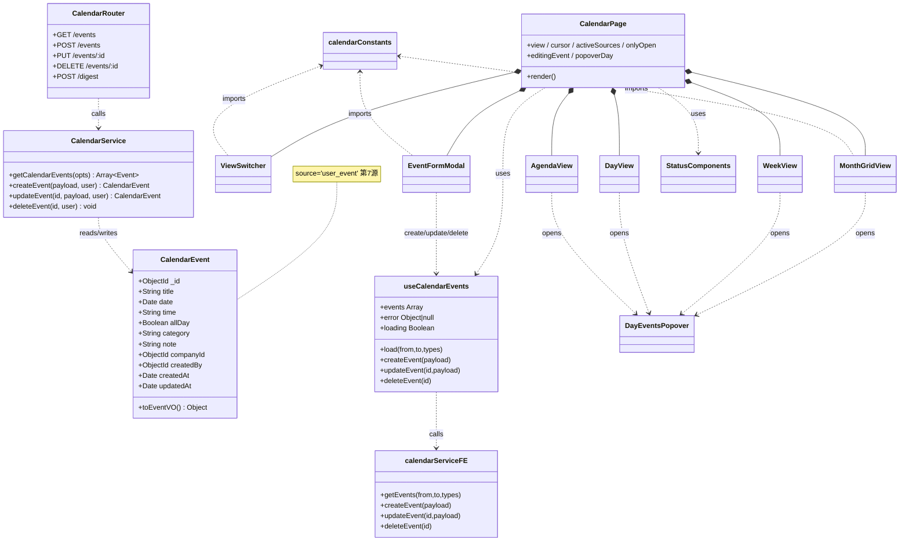
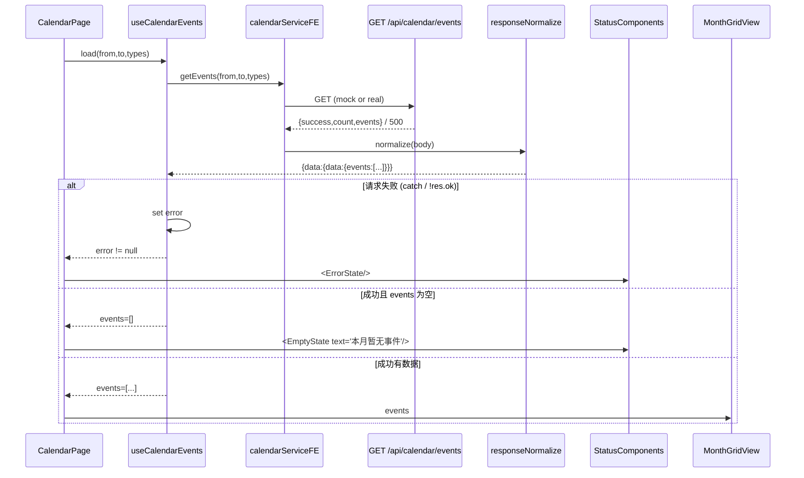
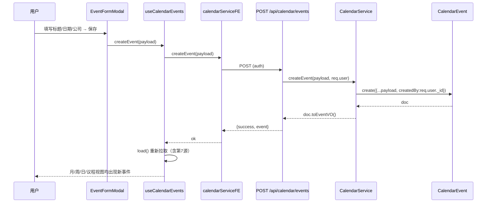
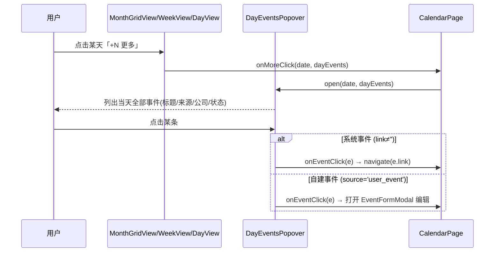
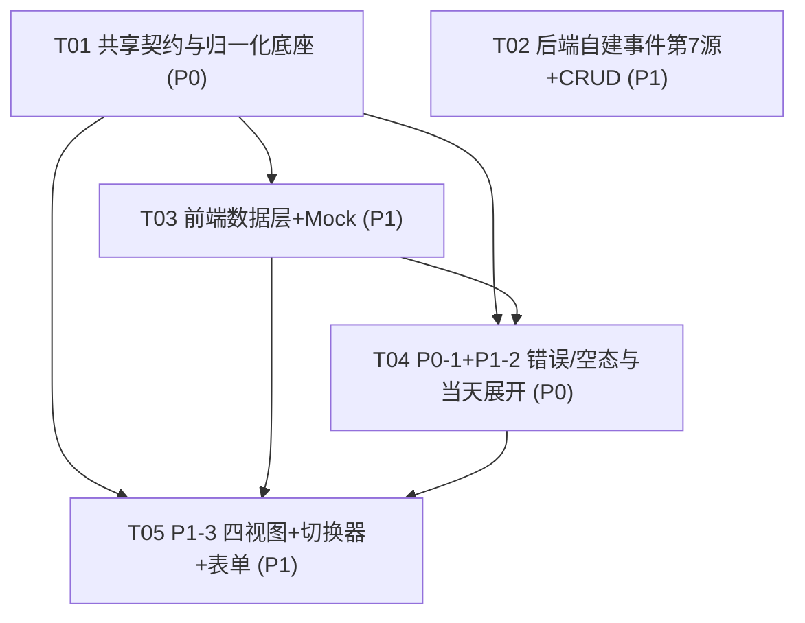

# CSMS 日历模块完整性增强 — 架构设计 + 任务分解

> 作者：高见远（架构师 / software-architect-2）
> 日期：2026-08-15
> 关联 PRD：`prd-calendar-2026-08-15.md`
> 技术栈：后端 Node.js + Express + MongoDB(Mongoose) + JWT（scope 行级权限）；前端 React + Vite + TailwindCSS + Lucide（默认走 mock，`USE_MOCK` 见 `client/src/services/index.js`）
> 范围声明：**本文仅覆盖日历模块的完整性增强（新建事件 + 错误/空态修复 + 当天展开 + 四视图）。与此前的性能优化 PRD 是两件独立的事，本文不含任何性能优化项。仅文档产出，不改代码。**

---

## 0. 主理人五项裁定（已融入设计）

| # | 裁定 | 设计落点 |
|---|------|---------|
| Q1 | 自建事件**单一来源** `user_event` / 「我的事件」+ **固定配色 `#14b8a6`**；用户自选配色 = P2 | `calendarConstants.SOURCE_COLOR.user_event = '#14b8a6'`；`SOURCE_LABEL.user_event = '我的事件'`。不自建多来源/多配色。 |
| Q2 | 自建事件**独立**，与合规提醒**不互通**（互通 = P2） | 本期 `CalendarEvent` 为独立集合，无 →`ComplianceReminder` 生成逻辑；P1-1 仅 CRUD。 |
| Q3 | **保持周日起始**（周一 = P2） | `WEEKDAYS` 维持 `['日','一',...,'六']`；新增周视图沿用周日首列。 |
| Q4 | 事件受 `scope` 行级约束：带 `companyId` 的事件仅 scope 内可见；**无 `companyId` 的个人事件仅创建者 + admin 可见**；admin 看全部 | 见 §3 `CalendarEvent` + §4 第 7 源查询与 CRUD 归属校验。 |
| Q5 | 议程视图默认 = **未来 90 天 upcoming，按日期分组** | `AgendaView` 默认 `from=今天, to=今天+90d`，仅 `status∈{open,overdue}` 且 `date>=今天`，按 `ymd(date)` 分组。 |

---

## Part A：系统设计

### 1. 实现方案（Implementation Approach）

**核心难点分析**

1. **生产「空白被误读」**：`Calendar.jsx:62-64` 的 `catch` 把任何失败都 `setEvents([])`，UI 显示「本月暂无事件 🎉」——无法区分「真无数据」与「接口挂了」。需在数据层显式区分「请求失败 / 加载中 / 成功空 / 成功有数据」四态。
2. **归一化脆弱路径**：`responseNormalize.js` 的 `ENTITY_KEYS` 不含 `events`，当前靠 `toArray(res?.data?.data, 'events')` 兜底（步骤 4 整包兜底）提取。属脆弱路径，PRD P0-1.2 要求补强。
3. **自建事件并入聚合管线**：需新增第 7 个 source `user_event`，走与 6 类系统源**完全相同的聚合出口**（统一事件结构），前端不需特判；并新增 CRUD 路由（auth + 归属/管理员校验）。
4. **四视图复用同一份事件契约**：月/周/日/议程都消费同一 `GET /api/calendar/events`，仅 `from/to` 不同；视图只换布局，取数逻辑统一下沉到一个 hook。
5. **当天溢出展开**：月/周/日视图单格 >3 条时「+N 更多」必须可点击展开当天全量（弹层），系统事件钻取原模块、自建事件打开编辑。

**框架与库选型（均为既有栈复用，无新依赖）**

- 后端：沿用 Express + Mongoose；聚合复用 `applyListScope(q, req, 'company')` 行级过滤；CRUD 复用 `auth` 中间件 + 归属校验。
- 前端：沿用 React + TailwindCSS + Lucide；**不引入新依赖**（如 `date-fns`）。周起始、加減天数、ISO 格式化等用原生 `Date` 小工具（`calendarDateUtils` 内联于 `calendarConstants.js` 或独立 helper），降低依赖与风险。
- 测试：`node:test` + `mongodb-memory-server`（已在 `devDependencies`），播种 6 源 + `user_event` 断言聚合非空与 CRUD。
- 架构模式：前端采用 **Container + 多个 Presentational 子视图**——`Calendar.jsx` 仅做状态编排（view/cursor/筛选/弹层/编辑态），取数下沉到 `useCalendarEvents` hook，四个视图组件为纯展示（props 注入 `events`/`onEventClick`/`onMoreClick`）。等价于「状态下沉 + 组件拆分」，符合既有代码风格。

---

### 2. 文件清单（File List）

**后端（新增 / 修改）**
- `server/models/CalendarEvent.js` — **新增**，自建事件模型
- `server/services/calendarService.js` — **修改**：`getCalendarEvents` 增加第 7 源 `user_event`；新增 `createEvent` / `updateEvent` / `deleteEvent`
- `server/routes/calendar.js` — **修改**：`GET /events` 不变（结构已含 `events`）；新增 `POST/PUT/DELETE /api/calendar/events`
- `server/tests/calendar.test.js` — **新增**：6 源聚合集成测试（memory Mongo 播种，断言 `count>0`、`events` 为数组、`types`/`scope` 过滤）
- `server/tests/calendar.crud.test.js` — **新增**：自建事件 CRUD + 第 7 源并入 + 归属/管理员校验

**前端·共享层（新增 / 修改）**
- `client/src/utils/responseNormalize.js` — **修改**：`ENTITY_KEYS` 增加 `'events'`
- `client/src/pages/calendar/calendarConstants.js` — **新增**：`SOURCE_COLOR`/`SOURCE_LABEL`（含 `user_event`）、`WEEKDAYS`、`STATUS_STYLE`、`VIEW_TYPES`、原生日期工具
- `client/src/pages/calendar/useCalendarEvents.js` — **新增**：取数 + 错误/空态 + CRUD hook
- `client/src/pages/calendar/StatusComponents.jsx` — **新增**：`ErrorState` / `EmptyState`

**前端·数据层（修改）**
- `client/src/services/index.js` — **修改**：`calendarService` 增加 `createEvent`/`updateEvent`/`deleteEvent`
- `client/src/services/mock.js` — **修改**：`calendar.getEvents` 增加 `user_event` 样例 + 增删改 mock（内存数组）

**前端·视图层（新增 / 修改）**
- `client/src/pages/Calendar.jsx` — **修改**：从 241 行单体拆分为「状态容器」——组合 `ViewSwitcher` + 当前视图 + `EventFormModal` + `DayEventsPopover` + `StatusComponents`；修复错误/空态与 `+N 更多` 可点
- `client/src/pages/calendar/ViewSwitcher.jsx` — **新增**：月/周/日/议程切换器
- `client/src/pages/calendar/MonthGridView.jsx` — **新增**：6×7 月网格（含 `+N 更多` 触发 `DayEventsPopover`）
- `client/src/pages/calendar/WeekView.jsx` — **新增**：7 列周视图（全天置顶、时间排序、溢出弹层）
- `client/src/pages/calendar/DayView.jsx` — **新增**：时间轴日视图（每小时一行 + `allDay` 横条）
- `client/src/pages/calendar/AgendaView.jsx` — **新增**：按日期分组的 upcoming 列表（默认 90 天）
- `client/src/pages/calendar/DayEventsPopover.jsx` — **新增**：当天全量事件弹层（可钻取/编辑）
- `client/src/pages/calendar/EventFormModal.jsx` — **新增**：新建/编辑事件表单 Modal

---

### 3. 数据结构与接口（Data Structures & Interfaces）

#### 3.1 统一事件结构（前后端一致契约，复用既有 6 源结构）

```jsonc
// 所有视图消费的统一事件对象（CalendarEvent 经 toEventVO 也映射为此结构）
{
  "id": "string",                 // 来源 _id（user_event 即 CalendarEvent._id）
  "source": "user_event",         // 第 7 源固定 'user_event'
  "module": "我的事件",            // 固定中文模块名
  "title": "string",              // 必填
  "date": "ISOString",            // 锚定日（Date 序列化）
  "time": "string|null",          // 可选 "14:30"；空 = 全天
  "allDay": "boolean",            // 默认 true
  "priority": "medium",           // 自建事件默认 'medium'
  "status": "open",               // 自建事件恒为 'open'（可扩展 completed）
  "overdue": false,
  "companyId": "string|null",     // 关联公司（scope 过滤依据）
  "companyName": "string|null",
  "link": ""                      // 自建事件空；点击打开编辑而非跳转
}
```

#### 3.2 `CalendarEvent` 模型 Schema（新增）

```jsonc
{
  "title":     "String (required)",
  "date":      "Date   (required, 锚定日)",
  "time":      "String (optional, 如 '14:30')",
  "allDay":    "Boolean (default true)",
  "category":  "String (optional 分类标签)",
  "note":      "String (optional 备注)",
  "companyId": "ObjectId ref Company (optional)",
  "createdBy": "ObjectId ref User (required, 归属)",
  "createdAt": "Date (timestamps)",
  "updatedAt": "Date (timestamps)"
}
```
索引建议：`{ companyId: 1, date: 1 }`（列表查询）、`{ createdBy: 1 }`（个人事件归属查询）。

#### 3.3 Mermaid 类图（classDiagram）



---

### 4. 程序调用流程（Program Call Flow）

#### 4.1 修复后加载流程（区分错误 / 空态）— P0-1



#### 4.2 自建事件创建闭环 — P1-1



#### 4.3 四视图切换（from/to 计算）— P1-3

```mermaid
sequenceDiagram
    participant U as 用户
    participant P as CalendarPage
    participant H as useCalendarEvents
    participant API as GET /api/calendar/events

    U->>P: 切到「周」/「日」/「议程」
    P->>P: 计算 from/to（周:周日~周六;日:当天;议程:今天~+90d）
    P->>H: load(from,to,activeSources)
    H->>API: getEvents(from,to,types)
    API-->>H: 统一 events[]
    H-->>P: events
    P->>WeekView: events (按天分列)
    Note over P: 月/日/议程同理，仅布局与 from/to 不同
```

#### 4.4 当天展开（「+N 更多」可点）— P1-2



---

### 5. 不明确项 / 假设（Anything UNCLEAR）

1. **`date-fns` 取舍**：为降低依赖与风险，本设计**不引入新依赖**，日期工具（周起始对齐、加減天、ISO 格式化）用原生 `Date` helper 实现于 `calendarConstants.js`。若团队坚持用 `date-fns`，仅需替换 helper 实现，接口不变。
2. **mock 模式 CRUD 持久性**：`mock.js` 的增删改在**会话内存数组**中生效（非持久），刷新页面后重置——符合「mock 仅演示」定位；真实后端走 Mongo，持久化。已在 §2 标注。
3. **自建事件 `status` 后续**：本期 `status` 恒为 `open`（无「完成」语义），P2 可扩展 `completed` + 勾选。
4. **摘要按钮范围**：`POST /api/calendar/digest` 维持「当前月」语义（PRD 未要求改），与议程 90 天默认不同，互不影响。
5. **议程「即将到来」是否含逾期**：按 Q5「upcoming」语义，议程仅含 `date>=今天` 的 `open/overdue` 项；历史逾期项不进议程（仍可在月/周/日视图看到）。
6. **scope 过滤在聚合层**：第 7 源依赖 `req.scopeCompanies`（由 `scopeMiddleware` 挂载）。`GET /events` 已挂 `scopeMiddleware`，CRUD 路由同样挂 `auth`（并手动校验 `createdBy`/admin），无需额外中间件。

---

## Part B：任务分解（Task Decomposition）

### 6. 依赖包（Required Packages）

```
# 后端（均已在 dependencies / devDependencies，无需新增）
- mongoose@^8          # ODM（既有）
- express@^4            # 路由（既有）
- mongodb-memory-server@^11  # devDependencies，集成测试播种（既已存在）

# 前端（均已在 dependencies，无需新增）
- react@^18             # UI（既有）
- vite@^5               # 构建（既有）
- tailwindcss@^3        # 样式（既有）
- lucide-react          # 图标（既有）
# 说明：本设计不引入 date-fns 等新依赖。
```

---

### 7. 任务清单（按依赖有序，≤5 个任务）

> 规则遵守：共 **5 个任务**（硬性上限内）；每个任务 ≥3 个文件；首个任务 T01 为共享底座（本特性无新增构建配置/依赖，故「基础设施」体现为统一契约 + 归一化补强 + 集成测试骨架，所有后续任务依赖之）；任务间尽量并行，仅 T05 依赖 T04。

#### T01 · 共享契约与归一化底座（Foundation）
- **Source Files**：
  - `client/src/utils/responseNormalize.js`（修改：`ENTITY_KEYS` 增 `'events'`）
  - `client/src/pages/calendar/calendarConstants.js`（新增：`SOURCE_COLOR`/`SOURCE_LABEL` 含 `user_event`+`#14b8a6`、`WEEKDAYS`、`STATUS_STYLE`、`VIEW_TYPES`、原生日期工具）
  - `server/tests/calendar.test.js`（新增：memory Mongo 播种 6 源，断言 `GET /events` 返回 `count>0` 且 `events` 为数组、`types`/`scope` 过滤）
- **Dependencies**：无
- **Priority**：P0
- **说明**：消除 `events` 兜底脆弱路径；沉淀所有视图/弹层/表单复用的常量；为 P0-1 验收①提供可跑绿的集成测试骨架。

#### T02 · 后端：自建事件第 7 源 + CRUD（P1-1 后端）
- **Source Files**：
  - `server/models/CalendarEvent.js`（新增模型）
  - `server/services/calendarService.js`（修改：`getCalendarEvents` 增加 `user_event` 第 7 源；新增 `createEvent`/`updateEvent`/`deleteEvent`）
  - `server/routes/calendar.js`（修改：新增 `POST/PUT/DELETE /api/calendar/events`，auth + 归属/管理员校验）
  - `server/tests/calendar.crud.test.js`（新增：CRUD + 第 7 源并入 + 归属校验单测）
- **Dependencies**：无（与 T01 独立，可并行；仅共用测试目录约定）
- **Priority**：P1
- **说明**：第 7 源查询遵循 Q4：`companyId` 走 scope；无 `companyId` 仅 `createdBy===req.user._id`；`req.scopeCompanies===null`（admin/auditor）看全部。`toEventVO` 映射统一结构（`source:'user_event'`、`module:'我的事件'`、`link:''`）。

#### T03 · 前端数据层 + Mock（P1-1 前端数据）
- **Source Files**：
  - `client/src/services/index.js`（修改：`calendarService` 增 `createEvent`/`updateEvent`/`deleteEvent`，复用 `wrap`）
  - `client/src/services/mock.js`（修改：`calendar.getEvents` 增 `user_event` 样例 + `createEvent`/`updateEvent`/`deleteEvent` 内存实现）
  - `client/src/pages/calendar/useCalendarEvents.js`（新增 hook：取数 + 错误/空态 + CRUD 封装）
- **Dependencies**：`[T01]`
- **Priority**：P1
- **说明**：把取数与四态（loading/error/empty/data）下沉到 hook；视图组件不再直接调 service，统一经 hook，保证四视图行为一致。

#### T04 · P0-1 + P1-2 错误/空态与当天展开
- **Source Files**：
  - `client/src/pages/Calendar.jsx`（修改：修复 `catch` 区分失败/空；`+N 更多` 由静态 `<div>` 改为可点按钮，触发 `DayEventsPopover`）
  - `client/src/pages/calendar/DayEventsPopover.jsx`（新增：当天全量事件弹层，可钻取/编辑）
  - `client/src/pages/calendar/StatusComponents.jsx`（新增：`ErrorState`/`EmptyState`，区分「加载失败」与「无待办」）
- **Dependencies**：`[T01, T03]`
- **Priority**：P0
- **说明**：落地 P0-1 前端修复（请求失败显式报错，不再静默为空）与 P1-2（当天 >3 条可点展开）。弹层四视图共用。

#### T05 · P1-3 四视图 + 切换器 + 新建/编辑表单
- **Source Files**：
  - `client/src/pages/Calendar.jsx`（修改：拆为状态容器，组合以下子组件 + 计算各视图 `from/to`）
  - `client/src/pages/calendar/ViewSwitcher.jsx`（新增：月/周/日/议程切换）
  - `client/src/pages/calendar/MonthGridView.jsx`（新增：6×7 月网格，复用 `DayEventsPopover`）
  - `client/src/pages/calendar/WeekView.jsx`（新增：7 列周视图，全天置顶、时间排序、溢出弹层）
  - `client/src/pages/calendar/DayView.jsx`（新增：时间轴日视图，`allDay` 横条）
  - `client/src/pages/calendar/AgendaView.jsx`（新增：按日期分组 upcoming 列表，默认 90 天）
  - `client/src/pages/calendar/EventFormModal.jsx`（新增：新建/编辑表单，title/date 必填校验，关联公司走 `companyService.getAll`（已受 scope）下拉）
- **Dependencies**：`[T01, T03, T04]`
- **Priority**：P1
- **说明**：四视图复用同一 `useCalendarEvents` 与统一事件契约，仅换布局与 `from/to`；来源筛选 chip（增「我的事件」）、「仅看未完成」、摘要按钮四视图共用。`user_event` 点击打开 `EventFormModal` 编辑，系统事件 `navigate(link)`。

---

### 8. 共享约定（Shared Knowledge）

```
- 统一事件契约（前后端）：{ id, source, module, title, date(ISO), time, allDay, priority, status(open|completed|overdue), overdue, companyId, companyName, link }
- 自建事件固定：source='user_event'、module='我的事件'、link=''、color='#14b8a6'；点击打开编辑而非跳转。
- 周起始：周日（WEEKDAYS=['日','一',...,'六']），周视图首列=周日。
- 错误/空态四态：loading / error(显式报错) / empty(成功无数据) / data；禁止 catch 后静默 setEvents([])。
- 取数唯一入口：useCalendarEvents.load(from,to,types)；所有视图经此 hook，不直连 service。
- 来源筛选/仅看未完成：在 hook 返回后客户端过滤（复用既有 monthEvents 过滤逻辑）。
- scope 过滤在服务端：GET /events 与 CRUD 均经 scopeMiddleware/auth；第 7 源 Q4 规则见 §3.3/§5.6。
- 归一化：responseNormalize 已补 'events'，组件仍用 toArray(res?.data?.data,'events') 防御式提取。
- 测试：node:test + mongodb-memory-server；播种 6 源 + user_event；断言聚合非空与 CRUD 归属。
- 质量门禁：ESLint 0 Error；vite build 0 Error；server/tests/* 全绿；新增写路径有单测。
```

---

### 9. 任务依赖图（Task Dependency Graph）



**建议实现顺序（并行示意）**
1. 起步并行：`T01`（底座）+ `T02`（后端，独立）→ 两者可同时开工。
2. `T01` 完成后：`T03`（前端数据层）。
3. `T03` 完成后：`T04`（修复 + 当天展开，P0 优先）。
4. 末段：`T05`（四视图 + 表单）依赖 T01/T03/T04，最后收口。
> P0（T01、T04）优先于 P1 视图（T05）；T02 后端可全程与前端并行。

---

*文档结束。配套图文件：`calendar-class-diagram.mermaid`、`calendar-sequence-diagram.mermaid`。*
