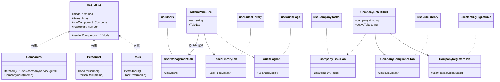
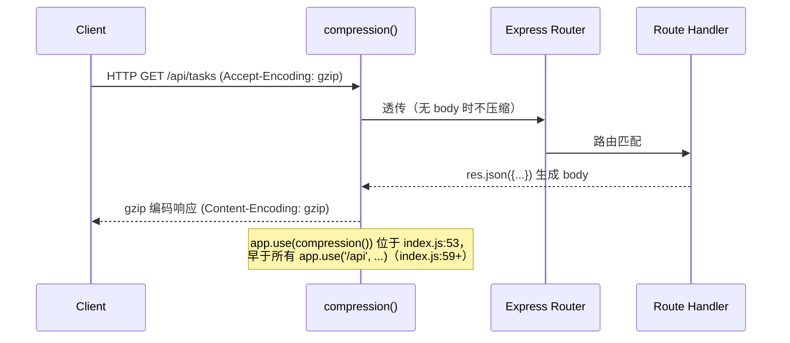
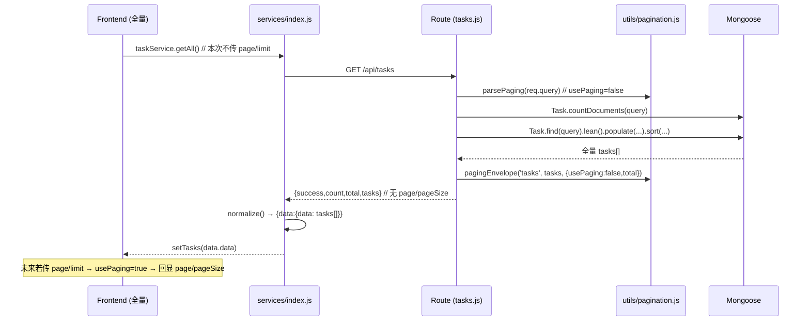
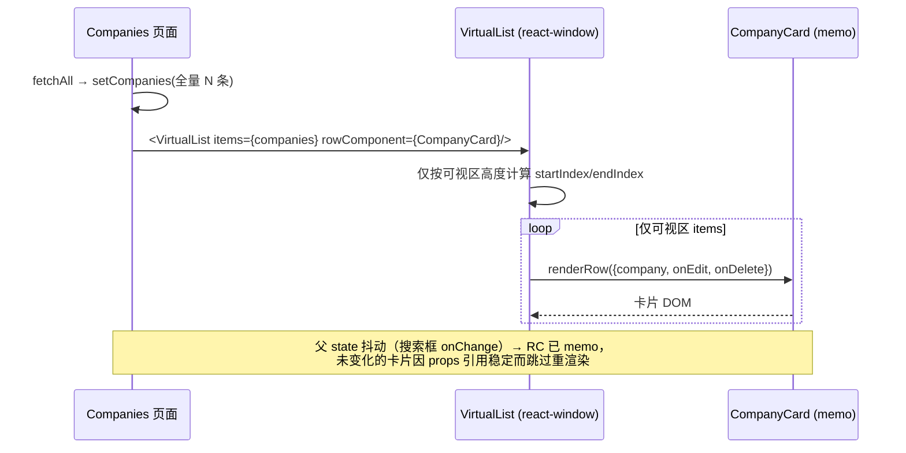
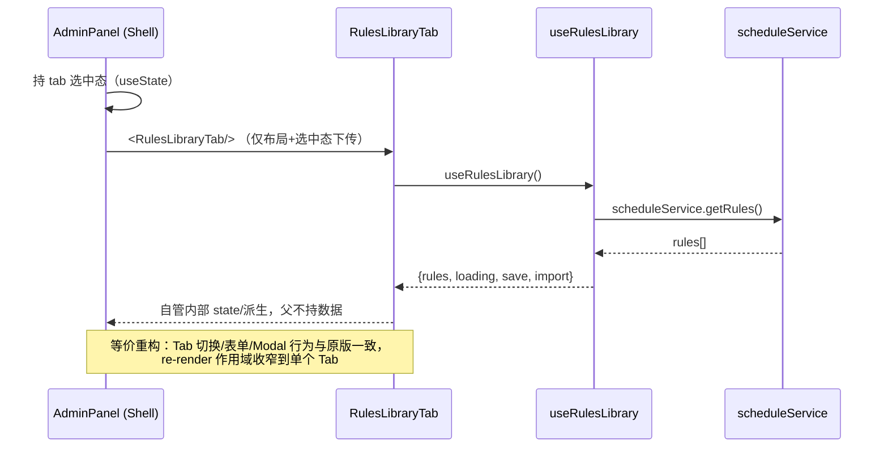

# CSMS（Claw）P0/P1 增量优化 — 系统架构设计 + 任务分解

> 文档角色：架构设计 + 有序任务分解（给工程师直接照做）
> 作者：高见远（软件架构师 Gao）
> 日期：2026-08-14
> 关联输入：
> - PRD：`deliverables/software-csms-optimize/prd-p0p1-2026-08-14.md`
> - 优化计划：`deliverables/optimization-plan-2026-08-11.md`
> - 主理人裁决：5 条待确认（Q1–Q5）已采纳
> 语言：简体中文

---

## 0. ⚠️ 现状核对（与 PRD / 优化计划的关键偏差，务必先读）

架构师实际通读仓库 HEAD（`E:/Claw`）后发现：**仓库当前代码已先行落地了 PRD 中部分被标记为「待实施」的条目**。这与 PRD §0「已落地内容」清单不一致——可能因更早的提交已包含这些改动。本着「不重复造轮子、不回退、不误伤」原则，本设计将已落地项转为**「验证/回归」任务**，仅对真实缺口给出实施细节。

| PRD 项 | 计划定位 | 仓库实际状态（已核对） | 本设计处理 |
|---|---|---|---|
| **4.1** `mongodb-memory-server` 移 `devDependencies` | P0 待实施 | **已完成**：根 `package.json:38` 已在 `devDependencies`，`dependencies` 无此项 | A1 → 验证项 |
| **3.3** `compression` 中间件 | P1 待实施 | **已完成**：`server/index.js:3` require、`index.js:53` `app.use(compression())`（位于所有路由前） | B1 → 验证项 |
| **1.2** 删除 `core-js` | QuickWin 待实施 | **已完成**：`client/package.json` 无 `core-js`；`client/src` 无 import | A2 → 验证项 |
| **3.1** 全只读查询 `.lean()` | P1 待实施 | **已完成（覆盖全部目标路由）**：`tasks.js:37`、`meetings.js:38`、`documents.js:49`、`signTasks.js:21`、`complianceReminders.js:25`、`complianceRules.js:22`、`companies.js:57`、`personnel.js:73`、`audit.js:18` 等均已 `.lean()` | B2 → 验证项（含写路径复核） |
| **2.2** 列表行 `React.memo` | P1 待实施 | **已完成（三列表均已完成）**：`Companies.jsx:37 CompanyCard = memo`、`Personnel.jsx:26 PersonRow = memo`、`Tasks.jsx:24 TaskRow = memo` | C2 → 验证项 |
| **2.1** 大列表虚拟化 | P1 待实施 | **未做**：`react-window`（client/package.json:25）已装但**全 `client/src` 零引用**（grep `react-window|FixedSizeList` = 0 命中）；三页仍 `.map` 全量渲染 | C1 → **实施** |
| **3.2** 六列表加分页契约 | P1 待实施 | **未做**：六路由返回全量数组，无 `skip/limit/total` 信封（`companies/personnel/audit` 已分页，本次**勿动**） | B3 → **实施** |
| **2.4** AdminPanel / CompanyDetail 拆分 | P1 待实施 | **未做**：两文件仍 `1627` / `1626` 行单文件 | D1 / D2 → **实施** |

> 结论：本迭代**真实实施面** = `B3 + C1 + D1 + D2`；`A1/A2/B1/B2/C2` 为「已落地·验证/回归」项。主理人仍可据此调整排期，但代码事实如上。

---

## 1. 实现方案 + 框架 / 依赖选型

### 1.1 技术难点与选型

| 难点 | 方案 | 理由 |
|---|---|---|
| 大列表（公司/人员/任务）千级 DOM 卡顿 | **`react-window` `FixedSizeList`/`FixedSizeGrid`**（已装，零新增依赖） | 仅渲染可视区，O(可视区) DOM；风险最低、等价视觉 |
| 后端只读查询水合成本高 | **Mongoose `.lean()`**（已普遍应用） | 返回纯 JS 对象，省去 Document 实例化；本次仅做写路径复核 |
| 六列表响应体随数据增长膨胀 | **统一分页信封**（opt-in，默认全量） | 与既有 `companies/personnel` 契约对齐；前端本次保持全量取数，零耦合 |
| HTTP 响应体过大 | **`compression`**（已装+已启） | 对 JSON/静态资源 gzip，一行中间件 |
| 巨型组件 re-render 范围大、难维护 | **按 Tab/Section 拆子组件 + 自定义 hooks，状态下沉** | 等价重构、零行为变更、可并行开发 |
| 部署误下载 MongoDB 二进制 | `mongodb-memory-server` 移至 `devDependencies`（已做） | 生产镜像干净、构建稳定 |

### 1.2 架构模式

- 前端：页面（Shell）持有「选中态」（当前 Tab / 当前 companyId），子 Tab 组件自持数据 state + 自定义 hook（数据获取/派生进 hook）。
- 后端：路由层保持「瘦 handler」，分页逻辑收敛到 `server/utils/pagination.js`（单一可测纯函数）。
- 传输：新增分页信封**不改变**既有的「资源键数组」形状，以兼容 `client/src/utils/responseNormalize.js` 的提取逻辑。

### 1.3 依赖变动（最终定稿，含「已落地」标注）

| 操作 | 包 | 位置 | 状态 |
|---|---|---|---|
| 已装·保留 | `compression@^1.8.1` | 根 `package.json` `dependencies:19` | ✅ 已落地（B1 验证） |
| 已移·保留 | `mongodb-memory-server@^11.2.0` | 根 `package.json` `devDependencies:38`（已从 dependencies 移除） | ✅ 已落地（A1 验证） |
| 已删·确认 | `core-js` | `client/package.json`（已无） | ✅ 已落地（A2 验证） |
| 已装·启用 | `react-window@^2.2.7` | `client/package.json` `dependencies:25` | 🔧 C1 启用（本次首次 import） |
| **无新增** | — | — | 本次不引入任何新第三方依赖 |

> 安装命令（仅当需重新安装校验时）：`npm install`（根）、`cd client && npm install`。`compression` / `react-window` 已声明，**无需** `npm i` 新包。

---

## 2. 文件列表（新增 / 修改，精确到文件）

### 2.1 后端（B3 — 六列表分页信封）

| 文件 | 操作 | 说明 |
|---|---|---|
| `server/utils/pagination.js` | **新增** | 分页纯函数 `parsePaging` / `pagingEnvelope`，全路由复用 |
| `server/routes/tasks.js` | 修改 | GET `/`（约 25–53 行）：加 `parsePaging` + `countDocuments` + opt-in `skip/limit` + `pagingEnvelope('tasks', …)` |
| `server/routes/meetings.js` | 修改 | GET `/`（约 15–52 行）：同上，资源键 `meetings` |
| `server/routes/documents.js` | 修改 | GET `/`（约 38–58 行）：同上，资源键 `documents` |
| `server/routes/signTasks.js` | 修改 | GET `/`（约 18–30 行）：同上，资源键 `tasks`（与 sign-task 服务返回键一致） |
| `server/routes/complianceReminders.js` | 修改 | GET `/`（约 8–34 行）：同上，资源键 `reminders` |
| `server/routes/complianceRules.js` | 修改 | GET `/`（约 9–29 行）：同上，资源键 `rules` |
| `server/routes/companies.js` `personnel.js` `audit.js` `resultsTimetable.js` `search.js` | **不修改** | 既有已分页/特殊契约，按 PRD「勿动」 |

### 2.2 前端 — 性能（C1 / C2）

| 文件 | 操作 | 说明 |
|---|---|---|
| `client/src/components/VirtualList.jsx` | **新增** | 薄封装 `react-window`：`FixedSizeList`（Tasks/Personnel）与 `FixedSizeGrid`（Companies 卡片网格）的统一入口；含容器宽度测量 |
| `client/src/pages/Companies.jsx` | 修改 | 列表区 `grid` → `VirtualList`（grid 模式）；`CompanyCard` 已是 `memo`，仅包裹 |
| `client/src/pages/Personnel.jsx` | 修改 | 列表区 `.map` → `VirtualList`（list 模式）；`PersonRow` 已是 `memo` |
| `client/src/pages/Tasks.jsx` | 修改 | 列表区 `.map` → `VirtualList`（list 模式）；`TaskRow` 已是 `memo` |

### 2.3 前端 — 巨组件拆分（D1 / D2）

| 文件 | 操作 | 说明 |
|---|---|---|
| `client/src/components/admin/UserManagementTab.jsx` | **新增** | `users` Tab（表格 + `UserForm` 弹窗） |
| `client/src/components/admin/PermissionMatrixTab.jsx` | **新增** | `permissions` Tab（角色权限矩阵） |
| `client/src/components/admin/DataScopeTab.jsx` | **新增** | `scope` Tab（数据权限分配） |
| `client/src/components/admin/RulesLibraryTab.jsx` | **新增** | `rules` Tab（搬迁 `RulesLibraryManager` + `StepsEditor` + `RuleItemEditor`） |
| `client/src/components/admin/SystemInfoTab.jsx` | **新增** | `system` Tab（System Info） |
| `client/src/components/admin/AuditLogTab.jsx` | **新增** | `audit` Tab（审计日志） |
| `client/src/hooks/useUsers.js` | **新增** | 用户列表/增删改取数 |
| `client/src/hooks/useAuditLogs.js` | **新增** | 审计日志取数 |
| `client/src/hooks/useRulesLibrary.js` | **新增** | 规则库读取/保存/导入（供 `RulesLibraryTab`） |
| `client/src/pages/AdminPanel.jsx` | 修改 | 退化为 Shell：仅持 `tab` 选中态 + `TabNav` + 渲染子 Tab；删除内联大组件 |
| `client/src/components/company/CompanyInfoTab.jsx` | **新增** | `info` Tab（公司信息 + links 编辑 + 登记册预览） |
| `client/src/components/company/CompanyPeopleTab.jsx` | **新增** | `people` Tab（人员关联） |
| `client/src/components/company/CompanyDocumentsTab.jsx` | **新增** | `documents` Tab（复用 `DocumentManager`） |
| `client/src/components/company/CompanyEquityTab.jsx` | **新增** | `equity` Tab（复用 `EquityGraph`） |
| `client/src/components/company/CompanyRegistersTab.jsx` | **新增** | `registers` Tab（ROD/ROM 生成） |
| `client/src/components/company/CompanyTasksTab.jsx` | **新增** | `tasks` Tab（任务子列表） |
| `client/src/components/company/CompanyComplianceTab.jsx` | **新增** | `compliance` Tab（提醒/规则） |
| `client/src/hooks/useCompanyTasks.js` | **新增** | 公司维度任务取数（供 `CompanyTasksTab`） |
| `client/src/hooks/useRuleLibrary.js` | **新增** | 规则库取数（供 `CompanyComplianceTab`） |
| `client/src/hooks/useMeetingSignatures.js` | **新增** | 会议签署态取数（供 `CompanyRegistersTab`/签署相关 Section） |
| `client/src/pages/CompanyDetail.jsx` | 修改 | 退化为 Shell：持 `companyId` + `activeTab` + `TabNav` + 渲染子 Tab；删除内联 Section |

> 说明：D1 先拆、D2 后拆（主理人 Q1 裁决）。每子文件目标 < 400 行；共享 UI（`Modal` / `FormField` / `ConfirmDialog`）继续复用 `components/`。

---

## 3. 数据结构与接口

### 3.1 统一分页契约（Q3 最终定稿）

**决策**：与既有 `companies.js:61-68`、`personnel.js:96-103` 完全对齐——**保留资源键数组**（不改 `responseNormalize.js`），新增 `total` + opt-in `page`/`pageSize`。**不**采用 PRD §4.3 草稿的 `{page, limit, total, pages, items}`，因其会破坏前端 `normalize` 提取且未与既有统一。

**查询参数**：`page`（≥1，默认 1）、`limit`（默认 50，封顶 100）。
**opt-in**：`usePaging = !!(page || limit)`。前端本次**不传参** → `usePaging=false` → 返回全量（与现状一致，2.1 虚拟化继续工作）。

```json
{
  "success": true,
  "count": 12,
  "total": 1234,
  "page": 1,
  "pageSize": 50,
  "tasks": [ { "_id": "...", "title": "...", "status": "in_progress" } ]
}
```
（未分页时 `page`/`pageSize` 字段省略；`tasks` 为全量数组。资源键随路由变化：`companies`/`personnel`/`tasks`/`documents`/`meetings`/`reminders`/`rules`/`signTasks`）

**字段取舍表**：

| 字段 | 取值 | 与既有对齐 | 备注 |
|---|---|---|---|
| `success` | `true` | ✅ 既有全有 | |
| `count` | 本次返回条数 | ✅ 既有用 `count` | 非 `items.length` 命名 |
| `total` | 匹配总数 | ✅ 既有 `total` | 新增以支持未来分页取数 |
| `page` | 当前页（仅分页） | ✅ 既有 `page` | query `page` |
| `pageSize` | 本页大小（仅分页） | ✅ 既有 `pageSize` | 对应 query `limit`（回显用 `pageSize` 与既有一致） |
| `<resourceKey>` | 资源数组 | ✅ 既有资源键 | 必须保持，否则 `normalize` 提取失败白屏 |
| `pages` | **不引入** | 既有无此字段 | 前端若需 `Math.ceil(total/pageSize)` 自算 |

### 3.2 分页工具（`server/utils/pagination.js`）类图

```mermaid
classDiagram
  class PaginationUtil {
    +parsePaging(query, opts) : {page, limit, usePaging, skip}
    +pagingEnvelope(resourceKey, items, meta) : Object
  }
  class TasksRouter {
    +GET / : buildPaging → countDocuments → find.lean().skip().limit() → pagingEnvelope('tasks')
  }
  class MeetingsRouter {
    +GET / : buildPaging → pagingEnvelope('meetings')
  }
  class DocumentsRouter {
    +GET / : buildPaging → pagingEnvelope('documents')
  }
  class SignTasksRouter {
    +GET / : buildPaging → pagingEnvelope('tasks')
  }
  class ComplianceRemindersRouter {
    +GET / : buildPaging → pagingEnvelope('reminders')
  }
  class ComplianceRulesRouter {
    +GET / : buildPaging → pagingEnvelope('rules')
  }
  PaginationUtil <.. TasksRouter
  PaginationUtil <.. MeetingsRouter
  PaginationUtil <.. DocumentsRouter
  PaginationUtil <.. SignTasksRouter
  PaginationUtil <.. ComplianceRemindersRouter
  PaginationUtil <.. ComplianceRulesRouter
```

### 3.3 前端虚拟列表 + 巨组件拆分 类图（关键关系）



---

## 4. 程序调用流程

### 4.1 compression 中间件位置（已落地，验证用）



### 4.2 B3 — 六列表分页取数（opt-in）



### 4.3 C1 — 虚拟列表渲染流（react-window）



### 4.4 D1/D2 — 巨组件拆分后父子 props 流



---

## 5. 任务列表（核心交付 · 按实现顺序分组，标注依赖与验收点）

> 状态图例：✅ 已落地·验证项 ｜ 🔧 待实施
> 全部任务共享质量门禁：**ESLint 0 Error；`cd client && npm run build` 0 Error；`npm test`（server/tests）全绿**。
> 沙箱限制：Atlas 不可达，后端端到端受限 → 以 mock + 单元/组件层测试为主；压测类指标在可联网/CI 复核。

### Phase A — 部署卫生 + QuickWin（验证既有落地）

#### A1 · 4.1 `mongodb-memory-server` 已移至 devDependencies ✅
- **目标文件**：根 `package.json`（确认 `devDependencies:38` 有 `mongodb-memory-server`，`dependencies` 无）
- **具体改动**：无（已落地）。验证动作：
  1. grep 确认根 `package.json` `dependencies` 不含 `mongodb-memory-server`；
  2. `npm install --omit=dev` 后无 MongoDB 二进制下载日志；
  3. `npm test` 正常启动内存 MongoDB、`server/tests/*` 全绿。
- **验收标准**：以上 3 项通过；ESLint/build 0 Error。
- **依赖项**：无。

#### A2 · 1.2 删除死依赖 `core-js` ✅
- **目标文件**：`client/package.json`（确认无 `core-js`）、`client/src`（确认零引用）
- **具体改动**：无（已落地）。验证动作：
  1. `client/package.json` 无 `core-js` 字段；
  2. `grep -rn "core-js" client/src` 命中 0；
  3. `cd client && npm run build` 0 Error。
- **验收标准**：以上通过；`react-window` 仍保留（供 C1）。
- **依赖项**：无。

### Phase B — 后端读优化

#### B1 · 3.3 `compression` 中间件 ✅
- **目标文件**：`server/index.js`（确认 `:3` require、`:53` `app.use(compression())` 在所有 `app.use('/api'…)` 之前）
- **具体改动**：无（已落地）。验证动作：
  1. 启动 server，`curl -H "Accept-Encoding: gzip" /api/health` 响应带 `Content-Encoding: gzip`（或 JSON 响应被压缩）；
  2. 确认 `compression()` 位于 `express.json`/路由之前（index.js:53 在 :59 之前 ✅）。
- **验收标准**：gzip 生效；ESLint/build 0 Error。
- **依赖项**：无。

#### B2 · 3.1 全只读查询 `.lean()` 复核 + 写路径排除清单 ✅
- **目标文件**：`server/routes/*.js`（所有 GET list/detail handler）
- **具体改动**：无新增（已普遍应用）。**写路径排除复核**（Q4）：
  - 写路径（POST/PUT/DELETE）一律使用 `findByIdAndUpdate` / `findByIdAndDelete` / `findOneAndUpdate` / `.save()` / `.deleteOne()` / `updateOne()` / `.create()`，**均不依赖 `.lean()` 的只读实例**，且从未在 GET 读后接 `.save()`。已 grep 确认：写操作集中在 `companies.js:183/194/272/322/359/376`、`personnel.js:320/331/481/482`、`documents.js:184/233/245`、`meetings.js:119/143/168`、`tasks.js:143/168/190`、`signTasks.js:55/66/98/104/114`、`complianceRules.js:55/69/80`、`complianceReminders.js:61/73/88`、`companyEntries.js:42/145/189`、`users.js:76/103` 等——**全部为更新/删除原语，无「GET 读后 save」误伤**。
  - 模型层：**无任何 virtuals**（`grep -rn "\.virtual(\|virtuals" server/models` = 0 命中），故 `.lean()` 不会丢失虚拟字段。
- **验收标准**：
  1. `grep -rn "\.lean()" server/routes` 覆盖所有只读路径（已覆盖）；
  2. 复核命令 `grep -rn "\.lean()" server/routes | grep -A1 "save\|findByIdAndUpdate"` 命中 0（无 lean 后接写）；
  3. `npm test` 全绿。
- **依赖项**：无（依赖 A1 测试可跑）。

#### B3 · 3.2 六列表统一加分页信封 🔧（**真实实施**）
- **目标文件**：
  - 新增 `server/utils/pagination.js`
  - 修改 `server/routes/tasks.js`、`meetings.js`、`documents.js`、`signTasks.js`、`complianceReminders.js`、`complianceRules.js`
- **具体改动点（每路由 GET list handler）**：
  1. 顶部 `const { parsePaging, pagingEnvelope } = require('../utils/pagination');`
  2. 在 `const <res> = await Model.find(query).lean()...` **之前**：`const { page, limit, usePaging, skip } = parsePaging(req.query);` 与 `const total = await Model.countDocuments(query);`
  3. 查询链式：`let q = Model.find(query).lean().populate(...).sort(...); if (usePaging) q = q.skip(skip).limit(limit); const items = await q;`
  4. 响应替换为 `res.json(pagingEnvelope('<resourceKey>', items, { usePaging, page, limit, total }));`，资源键：tasks→`tasks`、meetings→`meetings`、documents→`documents`、signTasks→`tasks`、complianceReminders→`reminders`、complianceRules→`rules`。
  5. `defaultLimit=50, maxLimit=100`（与 PRD 默认 50 对齐；封顶 100 与既有 `companies/personnel` 一致）。
- **`server/utils/pagination.js` 实现要点**：
  ```js
  function parsePaging(query = {}, { defaultLimit = 50, maxLimit = 100 } = {}) {
    const page = Math.max(1, parseInt(query.page, 10) || 1);
    const limit = Math.min(parseInt(query.limit, 10) || defaultLimit, maxLimit);
    const usePaging = !!(query.page || query.limit);
    return { page, limit, usePaging, skip: (page - 1) * limit };
  }
  function pagingEnvelope(resourceKey, items, { usePaging, page, limit, total }) {
    const base = { success: true, count: Array.isArray(items) ? items.length : 0, total, [resourceKey]: items };
    if (usePaging) { base.page = page; base.pageSize = limit; }
    return base;
  }
  module.exports = { parsePaging, pagingEnvelope };
  ```
- **验收标准**：
  1. 六路由返回信封含 `success/count/total/<resourceKey>`；传 `?page=1&limit=50` 时回显 `page`/`pageSize` 且 `items` 截断；不传参返回全量（与现状等价）；
  2. `total` 等于 `countDocuments` 结果；
  3. 前端 `normalize` 仍能提取数组（资源键不变）→ Companies/Personnel/Tasks 全量渲染不受影响；
  4. `npm test` 全绿；ESLint 0 Error。
- **依赖项**：B2（确保 lean 不影响）、A1（测试）。独立可测，不阻塞 C/D。

### Phase C — 前端性能

#### C1 · 2.1 大列表虚拟化（react-window）🔧（**真实实施**）
- **目标文件**：新增 `client/src/components/VirtualList.jsx`；修改 `Companies.jsx`、`Personnel.jsx`、`Tasks.jsx`
- **具体改动点**：
  1. 新增 `VirtualList.jsx`：统一封装 `react-window`。
     - `mode="list"` → `FixedSizeList`（Tasks / Personnel 单列）。
     - `mode="grid"` → `FixedSizeGrid`（Companies 卡片网格，`columnCount` 由测量宽度 / `rowComponent` 建议列数推算）。
     - 内置容器宽度测量（`ResizeObserver` 或 `useRef`+`offsetWidth`），满足 react-window 需显式像素 `width/height`。
     - 透传 `itemData` 给行组件（`onEdit`/`onDelete` 等回调），确保行组件 props 引用稳定。
  2. `Companies.jsx`：将 `:265-269` 的 `grid … {filtered.map(c => <CompanyCard …/>)}` 替换为 `<VirtualList mode="grid" items={filtered} rowComponent={CompanyCard} rowHeight={固定} columns={3} …/>`；`CompanyCard` 已是 `memo`，**仅包裹不重写**。注意：卡片需设固定高度以保证 `FixedSizeGrid` 行高一致。
  3. `Personnel.jsx`：将人员行 `.map` 替换为 `<VirtualList mode="list" items={filtered} rowComponent={PersonRow} rowHeight={64} …/>`（`PersonRow` 已 memo）。
  4. `Tasks.jsx`：将 `:300-312` 的 `{filtered.map(task => <TaskRow …/>)}` 替换为 `<VirtualList mode="list" items={filtered} rowComponent={TaskRow} rowHeight={112} …/>`（`TaskRow` 已 memo；注意 `users`/`getDaysRemaining` 等经 `itemData` 稳定传递）。
- **验收标准**：
  1. 数据仍全量拉取（不改服务端分页取数，与 B3 解耦）；
  2. 造数 1000+ 条时滚动帧率 ≥ 50fps（React DevTools Profiler / Chrome Performance）；
  3. 行视觉/行高/排序/筛选行为不变（等价）；
  4. `cd client && npm run build` 0 Error；ESLint 0 Error。
- **依赖项**：无（react-window 已装）。可与 B3 并行。

#### C2 · 2.2 列表行 `React.memo` + `useCallback` 复核 ✅
- **目标文件**：`Companies.jsx:37`、`Personnel.jsx:26`、`Tasks.jsx:24`
- **具体改动**：无（三列表行组件均已是 `memo`）。验证动作：
  1. 确认 `CompanyCard`/`PersonRow`/`TaskRow` 用 `React.memo`（或 `memo`）包裹；
  2. 传入的 `onEdit`/`onDelete` 等回调在父组件用 `useCallback` 记忆化（Companies `openEdit`/`handleDelete` 已 `useCallback`；Tasks `handleQuickComplete`/`handleAddNoteClick` 已 `useCallback`；Personnel `onEdit`/`onDelete` 在父用 `useCallback`）；
  3. Profiler 验证父 state 抖动（搜索框 onChange / Modal 开关）不触发未变化行重渲染。
- **验收标准**：以上通过；与 C1 一起验证虚拟化下的 memo 收益。
- **依赖项**：C1（同文件修改，建议同 PR 提交）。

### Phase D — 巨组件拆分（等价重构，零行为变更）

#### D1 · AdminPanel 拆分 🔧（**真实实施**，先于 D2）
- **目标文件**：
  - 新增 `client/src/components/admin/{UserManagementTab,PermissionMatrixTab,DataScopeTab,RulesLibraryTab,SystemInfoTab,AuditLogTab}.jsx`
  - 新增 `client/src/hooks/{useUsers,useAuditLogs,useRulesLibrary}.js`
  - 修改 `client/src/pages/AdminPanel.jsx`（退化为 Shell）
- **具体改动点**：
  1. 搬迁内联组件：`RulesLibraryManager`(205–884) + `StepsEditor`(885) + `RuleItemEditor`(907) → `RulesLibraryTab.jsx`；`UserForm`(44)/`Tick`(146)/`StatBadge`(151) 视情况随 `UserManagementTab` 或保留为共享小组件（建议留在 `AdminPanel.jsx` 顶部作为 Shell 级共享 UI，或抽到 `components/admin/_shared.jsx`）。
  2. 状态下沉：每个 Tab 自持 `useState`（如 `RulesLibraryTab` 持 `lib/loading/saving/activeSection/editing/draft` 等，原 206–217 的状态整体迁入）；数据获取进 `useRulesLibrary` / `useUsers` / `useAuditLogs`。
  3. Shell（`AdminPanel.jsx` 余下 1159+）：仅保留 `tab` 选中态（来自 `useSearchParams().get('tab')` 逻辑保留）、`TabNav`、按 `tab` 渲染对应子组件；`openNew/openEdit/loadUsers/loadAudit` 等逻辑下沉到对应 Tab/hook。
  4. 依赖关系：Tab 间无共享可变 state（原 `users` 仅 `UserManagementTab`/`DataScopeTab` 用 → 各自取数或经 props 下传 `companyId` 类静态值）。
- **验收标准**：
  1. 单文件行数显著下降（目标 < 400 行/文件）；
  2. Tab 切换 / 用户增删改 / 规则库编辑保存 / 审计查看 行为与拆前**逐一对齐**（建议拆前截屏/快照基线）；
  3. `npm run build` 0 Error、ESLint 0 Error；
  4. 不新增/删除任何功能。
- **依赖项**：无（纯前端重构）；建议紧接 C1/C2 之后，独立可测。

#### D2 · CompanyDetail 拆分 🔧（**真实实施**，后于 D1）
- **目标文件**：
  - 新增 `client/src/components/company/{CompanyInfoTab,CompanyPeopleTab,CompanyDocumentsTab,CompanyEquityTab,CompanyRegistersTab,CompanyTasksTab,CompanyComplianceTab}.jsx`
  - 新增 `client/src/hooks/{useCompanyTasks,useRuleLibrary,useMeetingSignatures}.js`
  - 修改 `client/src/pages/CompanyDetail.jsx`（退化为 Shell）
- **具体改动点**（按 `activeTab` 现有分支 `:841/1064/1112/1126/1133/1213/1254`）：
  1. `info` → `CompanyInfoTab`（公司信息 + links 编辑 + 登记册预览；持 `company` state 与 link 表单 state）
  2. `people` → `CompanyPeopleTab`（人员关联 links）
  3. `documents` → `CompanyDocumentsTab`（直接复用 `components/DocumentManager.jsx`，传入 `companyId`）
  4. `equity` → `CompanyEquityTab`（复用 `EquityGraph`）
  5. `registers` → `CompanyRegistersTab`（ROD/ROM 生成 + 签署态，配合 `useMeetingSignatures`）
  6. `tasks` → `CompanyTasksTab`（公司维度任务子列表，配 `useCompanyTasks`）
  7. `compliance` → `CompanyComplianceTab`（提醒/规则，配 `useRuleLibrary`）
  8. Shell 持 `companyId`（来自 `useParams()`）+ `activeTab`（`:101`）+ `TabNav`（`:826`）；各 Tab 经 props 接收 `companyId`/`company`，自管内部 state 与取数。
  9. 模块级纯函数 `calcRuleDueDate`/`shiftDays`/`isValidDate`（`:19-82`）保留在 Shell 或抽到 `utils/companyCompliance.js` 供 `CompanyComplianceTab` 复用。
- **验收标准**：
  1. 单文件行数显著下降（目标 < 400 行/文件）；
  2. Tab 切换 / 表单提交 / Modal 开关 / 表格展示 行为与拆前一致；
  3. `npm run build` 0 Error、ESLint 0 Error；
  4. 零行为变更（等价回归）。
- **依赖项**：D1（同模式，先积累拆分范式）；纯前端，独立可测。

---

## 6. 依赖包列表（新增 / 移除，含安装命令）

| 包 | 操作 | 所在 package.json | 版本 | 安装命令 | 状态 |
|---|---|---|---|---|---|
| `compression` | 已装·保留 | 根 | `^1.8.1` | 无需（已声明） | ✅ 已落地 B1 |
| `mongodb-memory-server` | 已移 devDeps·保留 | 根 `devDependencies` | `^11.2.0` | 无需 | ✅ 已落地 A1 |
| `core-js` | 已删 | `client` | — | 无需 | ✅ 已落地 A2 |
| `react-window` | 已装·**本次启用** | `client` `dependencies` | `^2.2.7` | 无需（C1 首次 `import`） | 🔧 C1 |

> 本次**不新增任何第三方依赖**；所有需要的包（compression / react-window / mongodb-memory-server）均已在 `package.json` 中声明。

---

## 7. 共享知识（跨文件约定）

1. **分页响应工具**：统一经 `server/utils/pagination.js` 的 `parsePaging` + `pagingEnvelope` 生成信封；**禁止**各路由手搓 `skip/limit/total`。新增/修改 list handler 一律走此工具，保证字段名（`success/count/total/page/pageSize/<resourceKey>`）全局一致。
2. **资源键不可改名**：`pagingEnvelope(resourceKey, …)` 的 `resourceKey` 必须与该路由原返回键一致（`tasks/meetings/documents/reminders/rules/signTasks`），否则 `client/src/utils/responseNormalize.js` 的 `ENTITY_KEYS` 提取失败 → 前端 `.filter/.map` 白屏。**这是 B3 的红线**。
3. **opt-in 分页语义**：前端本次**全量取数（不传 page/limit）**；后端 `usePaging=false` 时省略 `page/pageSize`。未来切前端分页取数（无限滚动）时，仅需前端传参，后端信封已就绪。
4. **行组件 props 约定**：虚拟列表行组件统一签名 `(props) => JSX`，且**必须用 `React.memo` 包裹**；父级传给行组件的回调（`onEdit`/`onDelete` 等）须 `useCallback` 记忆化，数据项用稳定 `key`（优先 `_id`）。
5. **自定义 hooks 命名规范**：`use<Domain>`（如 `useUsers`/`useCompanyTasks`/`useRulesLibrary`/`useMeetingSignatures`/`useAuditLogs`），置于 `client/src/hooks/`；hook 内部封装「取数 + loading + 错误 + 派生」，组件只消费。
6. **`.lean()` 使用红线（Q4）**：只读 GET 路径**必须** `.lean()`；任何「读取后需 `.save()` / `findByIdAndUpdate` / 依赖 Document 实例方法 / 虚拟字段」的路径**禁止** `.lean()`。本仓库当前模型无 virtuals，写路径均用更新原语，已安全；新增查询时复核此红线。
7. **巨组件拆分红线（Q1）**：等价重构、**零行为变更**；父 Shell 仅持「选中态 + 布局」，数据 state 下沉子组件/hook；共享 UI 复用 `components/` 既有组件，不重复造。
8. **质量门禁（全条目）**：ESLint 0 Error；`cd client && npm run build` 0 Error；`npm test`（`server/tests/*`）全绿。

---

## 8. 待明确事项（少量 · 非阻塞）

1. **Companies 网格虚拟化**：`Companies.jsx` 用 `grid-cols-1 md:grid-cols-2 lg:grid-cols-3` 卡片网格，`FixedSizeList` 仅支持 1D 纵向。本设计建议用 `FixedSizeGrid`（react-window）并保持卡片固定高度；若工程师评估响应式列数测量成本过高，可降级为「单列虚拟列表 + 卡片宽度 100%」（视觉略有变化，需主理人确认）。**建议保持 `FixedSizeGrid` 以严格等价**。
2. **`pages` 字段**：本次未引入 `pages`（与既有 `companies/personnel` 对齐）。若未来前端分页 UI 需要总页数，可前端 `Math.ceil(total/pageSize)`，或后续迭代在 `pagingEnvelope` 追加 `pages`（非破坏性）。
3. **前端分页取数（无限滚动）**：按 Q2 裁决**本迭代不做**，仅后端 B3 备好契约；前端保持全量 + 虚拟化（C1）。后续迭代可独立开启。
4. **`resultsTimetable.js:528-533`**：PRD 列为「已分页（勿动）」，当前为 `.limit(50)` 无 `skip/total`；本设计不改动它（保持既有的 `{success, results}` 形状）。若后续需要其也走 `pagingEnvelope`，单独排期。
5. **D1/D2 拆分粒度基线**：建议在拆分前对 AdminPanel / CompanyDetail 各 Tab 截图/快照留存，作为「行为零变更」回归基线（与 PRD §4.4 一致）。

---

> 文档结束。任务总数：**9 个**（A1, A2, B1, B2, B3, C1, C2, D1, D2），其中 **5 个已落地·验证项**（A1/A2/B1/B2/C2）、**4 个真实实施项**（B3/C1/D1/D2）；关键依赖链：B3 独立可测、C1 独立可测、D1 先于 D2、C2 随 C1 同 PR 提交。
