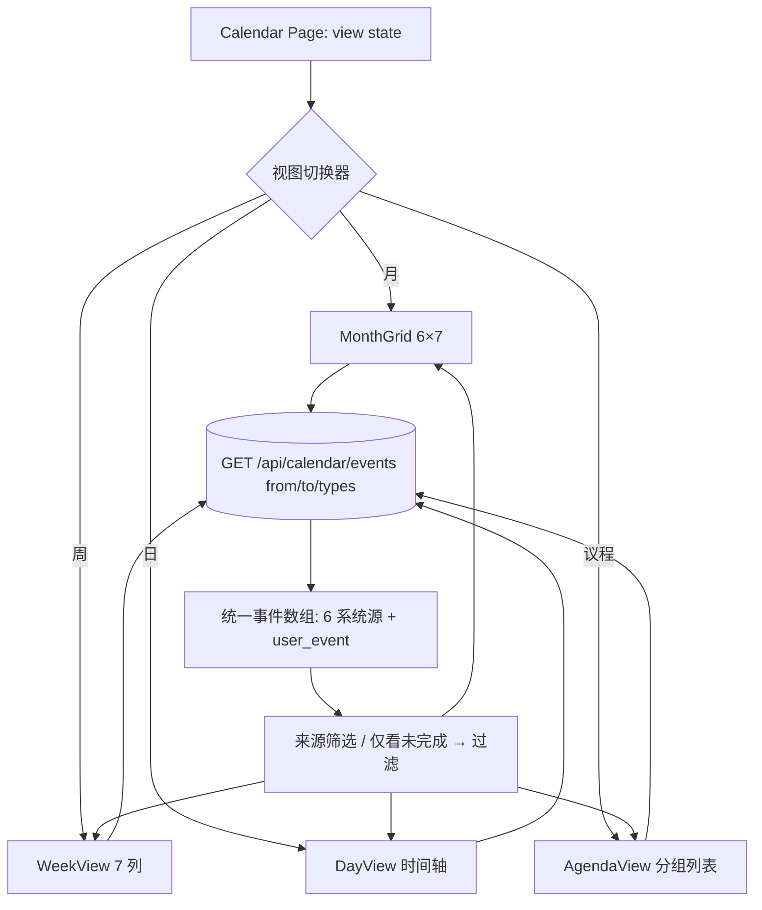

# Claw（CSMS）日历模块完整性增强 — PRD

> 文档角色：产品需求文档（简单 PRD / 新功能）
> 作者：许清楚（Product Manager）
> 日期：2026-08-15
> 关联代码：`client/src/pages/Calendar.jsx`、`server/routes/calendar.js`、`server/services/calendarService.js`、`client/src/services/index.js`、`client/src/services/mock.js`
> 技术栈：后端 Node.js + Express + MongoDB + JWT（scope 行级权限）；前端 React + Vite + TailwindCSS + Lucide（默认走 mock）
> 语言：简体中文
> 范围声明：**这是日历模块的新功能建设，与此前的性能优化 PRD 是两件独立的事，本文不包含任何性能优化项。** 仅文档产出，不改动代码。

---

## 0. 背景与现状（架构师落地前必读）

### 0.1 当前实现（只读月度聚合）
- **前端页**：`client/src/pages/Calendar.jsx`（241 行）。只读月度视图：来源筛选 chip（6 类）、「仅看未完成」开关、上/下月导航、6×7 月网格（**周日起始**，`WEEKDAYS` 见 `:23`、`buildGrid` 见 `:30-42`）、逾期高亮、事件点击 `navigate(e.link)` 跳原模块、「发送本月摘要」按钮。
- **后端路由**：`server/routes/calendar.js`。`GET /api/calendar/events`（`:22-33`，聚合 6 源、支持 `types` 过滤、受 `scopeMiddleware` 行级约束）、`POST /api/calendar/digest`（`:37-93`）。
- **聚合服务**：`server/services/calendarService.js:81` `getCalendarEvents`，把 6 类来源（compliance_reminder / task / company_filing / document / meeting / results_timetable）统一成一种事件结构。
- **前端数据层**：`client/src/services/index.js:602-611` `calendarService.getEvents(from, to, types)`（真实走 `/api/calendar/events`，mock 走 `mock.js` 的 `calendar.getEvents`）。
- **前端归一化**：`client/src/utils/responseNormalize.js` 的 `normalize` + `toArray`；Calendar 用 `toArray(res?.data?.data, 'events')`（`:60`）提取列表。

### 0.2 统一事件结构（前后端一致的契约）
```
{ id, source, module, title, date(ISO), date 锚定日, priority, status(open|completed|overdue), overdue, companyId, companyName, link }
```

### 0.3 已知缺口 / 风险（已在 PRD 中列为修复项）
1. **生产「空白/暂无事件」疑似由「错误被静默为空」放大**：`Calendar.jsx:62-64` 的 `catch` 直接 `setEvents([])`，任何 500 / 网络错误都会显示「本月暂无事件 🎉」，无法区分「真无数据」与「接口挂了」。
2. **归一化无 `events` 键**：`responseNormalize.js:12` 的 `ENTITY_KEYS` 不含 `events`；当前靠 `toArray(.., 'events')` 兜底提取仍可工作，但属脆弱路径，应在 PRD 的 P0 验证中补强（见 P0-1）。
3. 日历只读、无自建事件、无周/日/议程视图、当天 >3 条「+N 更多」仅是不可点文字（`Calendar.jsx:226-228`）。

---

## 1. 产品目标

**一句话**：把当前「只读月度聚合」升级为一个**真正完整的日历**——生产环境稳定展示全量跨模块事件、支持用户自建事件（CRUD）并并入所有视图、修复当天事件展开、并提供月/周/日/议程四种视图切换，让三间港股上市公司的 CFO/公司秘书在一处看清所有下一步动作。

**可量化成功指标（验收基线）**：
- **数据可信**：生产环境在真实数据下日历非空展示；接口出错时**显式报错**（toast / ErrorState），不再静默为「暂无事件」；后端集成测试（mongodb-memory-server 播种 6 源）断言 `getCalendarEvents` 返回 > 0 条。
- **自建事件闭环**：用户可在任意视图新建 / 编辑 / 删除事件，保存后立即并入当月与对应周/日/议程视图（mock 模式下即可完整走通）。
- **当天展开 100% 可点**：任意一天 > 3 条时「+N 更多」可点击展开查看当天全部事件。
- **四视图可用**：月 / 周 / 日 / 议程切换无报错；周/日/议程视图加载来自同一 `GET /events`（传对应 from/to），本地 mock 即可验证；视图切换交互流畅。
- **质量门禁**：ESLint 0 Error；`vite build` 0 Error；现有 `server/tests/*` 全绿；新增事件写路径有单测。

> 沙箱限制：连不上 Atlas（mongodb.net 被网络拦截），后端真实 DB 端到端受限；以 mock + 单元 / 组件层测试为主，生产非空验证靠后端集成测试（memory Mongo）与可联网 / CI 环境 smoke。

---

## 2. 用户故事

**终端用户侧（林才贺，vc —— 三间港股上市公司 CFO + 公司秘书）**
- 作为 CFO/公司秘书，我希望打开日历时**一定能看到**所有公司的合规、任务、申报、文档、会议、业绩排期事件，而不是一片「暂无事件」，以便第一时间掌握下一步动作（低容错）。
- 作为公司秘书，我希望能把**不属于任何 CSMS 模块**的个人/公司事件（如董事会现场会、出差、客户电话、内部备忘）自建到日历上，并关联到具体公司，以便所有待办集中在一处。
- 作为 CFO，我希望某天事件很多时能**点开「+N 更多」**看全当天清单，而不是看不到剩余项。
- 作为高管，我希望在**周 / 日 / 议程（列表）视图**间切换——周看排期、日看细节、议程看即将到来，以便高效规划。

**开发者 / 维护侧**
- 作为前端开发者，我希望新增的周/日/议程视图**复用同一份聚合事件契约**，仅换布局，避免每视图各写一套取数。
- 作为后端开发者，我希望用户自建事件走**与系统事件相同的聚合管线**（新增第 7 个 source），前端无需特判。
- 作为测试，我希望生产空白问题有**可复现的集成测试与显式错误上报**，避免再被「静默为空」掩盖。

---

## 3. 需求池（按 P0 / P1 / P2 分级，映射用户 4 项确认需求）

> 优先级：P0 必须（生产可用 / bug 修复）；P1 本迭代重点（用户确认「全部都要」）；P2 打磨 / 探索（划界，下轮再做）。

### 3.1 P0 — 生产数据展示修复与验证（用户需求 #1）

**P0-1 · 确认聚合接口在生产返回数据；空白按 bug 修复 + 验证手段**
- 涉及文件：`client/src/pages/Calendar.jsx:62-64`（错误静默为空）、`client/src/utils/responseNormalize.js:12`（`ENTITY_KEYS` 缺 `events`）、`server/services/calendarService.js:81`、`server/routes/calendar.js:22-33`
- 需求要点：
  1. **区分「无数据」与「错误」**：`catch` 中若请求失败，展示显式错误态（ErrorState / toast），**不得**显示「本月暂无事件 🎉」；仅当接口成功且 `events` 为空时才显示空态。
  2. **补强归一化**：在 `ENTITY_KEYS` 增加 `events`（或在 `normalize` 显式识别 `{ success, events }`），消除对 `toArray` 兜底路径的依赖。
  3. **后端集成测试**：新增 `server/tests/calendar.test.js`（mongodb-memory-server），播种 6 类来源各 ≥1 条当前月数据，断言 `GET /api/calendar/events` 返回 `count > 0` 且 `events` 为数组；覆盖 `types` 过滤与 scope 过滤。
  4. **验证手段（交付时必须附）**：
     - 单元/集成：上述测试在 CI 跑绿；
     - 手动 smoke：本地起服务 + memory Mongo 播种后，`curl '/api/calendar/events?from=...&to=...'` 返回非空；前端 mock 模式（默认）本就返回 8 条样例，可先据此验证 UI；
     - 生产验证（可联网环境）：真实账号登录后日历经渲染事件，且接口 500 时页面报错而非空白。
- 验收标准（可测）：
  1. 后端集成测试 `server/tests/calendar.test.js` 全绿，断言 6 源聚合非空；
  2. `normalize` 对 `{ success:true, events:[...] }` 能正确提取数组（补充断言）；
  3. 前端在请求失败时显示错误态而非「暂无事件」；成功且空才显示空态；
  4. ESLint / `vite build` 0 Error、`server/tests/*` 全绿。

### 3.2 P1 — 完整性增强（用户需求 #2 / #3 / #4）

**P1-1 · 用户自建事件（CRUD，并入聚合）— 用户需求 #2**
- 涉及文件（新增 / 改动）：
  - 新增模型 `server/models/CalendarEvent.js`（遵循现有模型命名：如 `ComplianceReminder.js` / `Task.js`）
  - `server/services/calendarService.js:81` `getCalendarEvents` 增加第 7 源 `user_event` 查询并合并
  - `server/routes/calendar.js` 在 `GET /events` 内并入用户事件；新增 `POST /api/calendar/events`、`PUT /api/calendar/events/:id`、`DELETE /api/calendar/events/:id`（均 `auth` + 归属/管理员校验）
  - `client/src/services/index.js:602-611` `calendarService` 增加 `createEvent` / `updateEvent` / `deleteEvent`
  - `client/src/services/mock.js:1446-1476` `calendar.getEvents` 增加自建事件样例 + 增删改 mock
  - `client/src/pages/Calendar.jsx` 增加「新建/编辑事件」入口与表单（Modal）
  - 前端常量 `SOURCE_COLOR` / `SOURCE_LABEL`（`Calendar.jsx:7-22`）增加 `user_event`
- 数据模型（`CalendarEvent`）建议字段：
  - `title: String`（必填）、`date: Date`（必填，锚定日）、`time: String`（可选，如 `"14:30"`，用于日/议程视图）
  - `allDay: Boolean`（默认 true）、`type`/`category: String`（可选分类标签）
  - `note: String`（备注，可选）、`companyId: ObjectId ref Company`（可选，关联公司）
  - `createdBy: ObjectId ref User`（归属）、`createdAt`/`updatedAt`（timestamps）
  - 聚合时映射为统一结构：`source:'user_event'`、`module:'我的事件'`、`link:''`（自建事件点击打开编辑而非跳转）
- 验收标准（可测）：
  1. 新建事件后，当月 / 周 / 日 / 议程视图均出现该事件（mock 模式可完整走通）；
  2. 编辑 / 删除即时反映；删除后从所有视图消失；
  3. 关联公司时事件带 `companyName` 并受 scope 约束（见 §5 Q4）；
  4. 后端 CRUD 接口有单测（创建/更新/删除/归属校验）；
  5. 前端表单校验（title/date 必填）、错误有提示；ESLint / `vite build` 0 Error。

**P1-2 · 修复当天事件展开（「+N 更多」可点击）— 用户需求 #3**
- 涉及文件：`client/src/pages/Calendar.jsx:226-228`（当前为不可点 `<div>+N 更多</div>`）、`:211-225`（当天事件渲染区）
- 需求要点：某天 > 3 条时，底部「+N 更多」改为**可点击**，点击后展开查看当天全部事件——采用**弹层（Popover/Modal）或行内展开列表**，列出当天所有事件的标题 / 来源 / 公司 / 状态，可点击钻取（系统事件跳 `link`，自建事件打开编辑）。
- 验收标准（可测）：
  1. 当天事件 > 3 条时「+N 更多」可点击（鼠标/键盘可达，`aria` 可聚焦）；
  2. 点击后完整展示当天全部事件，数量与底层 `dayEvents` 一致；
  3. 列表中每条可钻取 / 编辑；关闭后回到月视图；
  4. 周/日视图（P1-3）若单格溢出同样适用该展开交互。

**P1-3 · 视图切换（周 / 日 / 议程）+ 视图切换器 — 用户需求 #4**
- 涉及文件：`client/src/pages/Calendar.jsx`（现有月视图 `:116-238`，新增视图组件与切换器）、`client/src/services/index.js:602-611`（`getEvents` 需支持按视图传 from/to）、`client/src/services/mock.js:1446`（`getEvents` 已接受 from/to，复用即可）
- 需求要点：
  1. 在现有月视图之外增加 **周视图、日视图、议程/列表视图**，并提供**视图切换器**（月/周/日/议程）。
  2. 所有视图复用同一聚合事件契约与同一 `GET /api/calendar/events`（按当前视图计算 from/to 请求）。
  3. 导航（上/下、今天）随视图语义变化（月上/下月；周上/下周；日上/下日；议程上/下区间）。
  4. 来源筛选 chip、「仅看未完成」开关、摘要按钮在四视图共用。
- 验收标准（可测）：
  1. 四视图均可切换、无报错；切换后数据随 from/to 正确刷新；
  2. 周视图展示选中周 7 天事件；日视图展示选中日全天时间轴；议程视图为按日期分组的待办列表（默认范围见 §5 Q5）；
  3. 来源筛选 / 仅看未完成 / 摘要在四视图行为一致；
  4. mock 模式下四视图均有数据；ESLint / `vite build` 0 Error。

### 3.3 P2 — 本次不做 / 探索（划界，供排期参考）
- **P2-1** 自建事件与合规提醒**互通**（自建→生成合规提醒，或反向）；本迭代仅独立自建事件。
- **P2-2** 周起始日**配置项**（周日/周一全局切换）。
- **P2-3** 移动端适配（底部 Tab 高频入口、响应式周/日视图）。
- **P2-4** 事件 icon 区分 `user_event` 与系统源；议程分组标题 / 空态打磨。
- **P2-5** 拖拽改期（drag & drop 调整事件日期）。

---

## 4. UI / 交互设计稿

### 4.1 顶部控制栏（四视图共用）
```
┌──────────────────────────────────────────────────────────────┐
│ 日历                                    [发送本月摘要] [+ 新建] │
│ [月][周][日][议程]   ‹ 今天 ›   2026 年 8 月                  │
│ (chip)合规提醒 (chip)任务 (chip)公司申报 (chip)文档            │
│ (chip)会议 (chip)业绩排期 (chip)我的事件   ☑ 仅看未完成        │
└──────────────────────────────────────────────────────────────┘
```
> 视图切换器 + 导航 + 标题区随视图变化；来源 chip 增加「我的事件」；「新建」打开事件表单 Modal。

### 4.2 数据流与视图切换（mermaid）


### 4.3 月视图（现状增强，重点改「+N 更多」）
```
┌─── 日 ───┬─── 一 ───┬─── 二 ───┬─ ... ─┬─── 六 ───┐
│  1       │  2       │  3       │       │  6       │
│ [事件1]  │ [事件1]  │ [事件1]  │       │ [事件1]  │
│ [事件2]  │ [事件2]  │ [事件2]  │       │ [事件2]  │
│ [事件3]  │ [事件3]  │ [事件3]  │       │ [事件3]  │
│ +5 更多▶ │          │          │       │          │  ← 可点击→弹层列全量
└──────────┴──────────┴──────────┴─ ... ─┴──────────┘
```
- 改动点（P1-2）：「+N 更多」由静态文字改为按钮，点击打开 **当天事件弹层**（列出全部、可钻取/编辑）。

### 4.4 周视图（新增）
```
┌─────────┬─────────┬─────────┬─ ... ─┬─────────┐
│  周一    │  周二    │  周三    │       │  周日    │
│ 08:30 会议        │ 全天 申报 │       │ 14:00 我的事件 │
│ 10:00 任务        │ 09:00 合规 │       │            │
│ 全天 文档到期      │          │       │            │
└─────────┴─────────┴─────────┴─ ... ─┴─────────┘
```
- 7 列（按 WEEKDAYS 起始，见 §5 Q3）；每列按时间排序的事件块；全天事件置顶；溢出同月视图的展开交互。

### 4.5 日视图（新增）
```
┌────────────────────────────────────────────┐
│ 2026-08-15 周六                              │
│ 08:00 │                                      │
│ 09:00 │ ● 合规提醒 · 备存董事名册             │
│ 10:00 │ ● 任务 · 签署董事会决议               │
│ 11:00 │                                      │
│ 12:00 │ ── 午间 ──                           │
│ 14:00 │ ◆ 我的事件 · 客户电话 (14:30)         │
│ 15:00 │                                      │
└────────────────────────────────────────────┘
```
- 左侧时间轴（每小时一行），右侧事件块按 `time` 放置；`allDay` 事件置顶横条；点击空白可快速新建（可选，P2）。

### 4.6 议程 / 列表视图（新增）
```
┌────────────────────────────────────────────┐
│ 即将到来（按日期分组）                       │
│ ▸ 2026-08-15 周六                           │
│   ● 合规提醒 · 备存董事名册 · 中国新城市      │
│   ◆ 我的事件 · 客户电话 · —                  │
│ ▸ 2026-08-16 周日                           │
│   ● 业绩排期 · T1 董事会/公告 · 中国新城市    │
│ ▸ 2026-08-20 周三                           │
│   ● 公司申报 · AGM 到期 · 中国新城市          │
└────────────────────────────────────────────┘
```
- 扁平排序列表，按日期分组；每条可钻取/编辑；默认范围见 §5 Q5；空态文案区分「无待办」与「加载失败」。

### 4.7 新建 / 编辑事件表单（Modal，P1-1）
| 字段 | 类型 | 说明 |
|---|---|---|
| 标题 * | 文本 | 必填 |
| 日期 * | 日期选择 | 必填，锚定日 |
| 时间 | 时间选择 | 可选；空 = 全天 |
| 全天 | 开关 | 默认开 |
| 关联公司 | 下拉 | 可选，scope 内公司 |
| 分类/类型 | 下拉 | 可选标签 |
| 备注 | 多行文本 | 可选 |
| 保存 / 取消 | 按钮 | 编辑态显示「删除」 |

---

## 5. 待确认问题（≤5，聚焦真实歧义）

1. **自建事件来源标识与配色**：统一用单一 `user_event` / 「我的事件」+ 固定配色，还是允许用户自选来源色 / 分类标签？影响 `SOURCE_COLOR`/`SOURCE_LABEL` 设计。
2. **与合规提醒互通**：本迭代是否需「自建事件 ↔ 合规提醒」双向互通（如自建事件一键生成合规提醒，或反之）？还是仅做独立自建事件、互通留 P2 探索？
3. **周起始日**：现有月视图为**周日起始**（`WEEKDAYS` 周日开头）。新增周视图沿用周日，还是切香港惯例**周一**起始？是否需全局统一（影响月/周一致性与 P2-2 配置项）？
4. **权限与归属**：自建事件是否受 `scope` 行级约束？关联公司的事件是否仅 scope 内可见？**无关联公司的个人事件是否仅创建者可见**？admin 是否可见全部用户事件？
5. **议程视图默认范围**：议程默认展示「当月」「选中区间」还是「未来 N 天 / 全部 upcoming」？影响 `getEvents` 的 from/to 计算与导航语义。

---

*质量门禁重申（全条目适用）：ESLint 0 Error；`vite build` 0 Error；`server/tests/*` 全绿；新增写路径有单测。*
*沙箱限制：后端真实 DB 端到端受限（Atlas 不可达），以 mock + 单元 / 组件层测试为主；生产非空验证靠后端集成测试（memory Mongo）与可联网 / CI 环境 smoke。*
