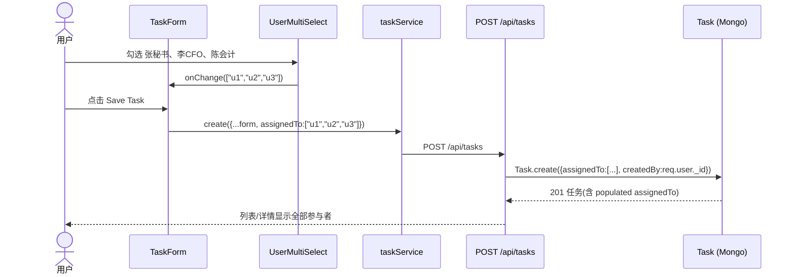
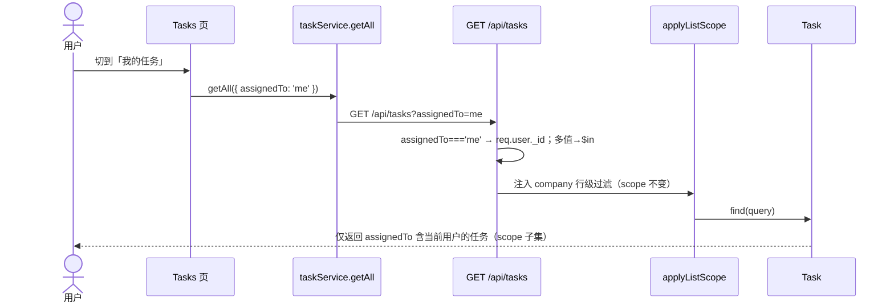
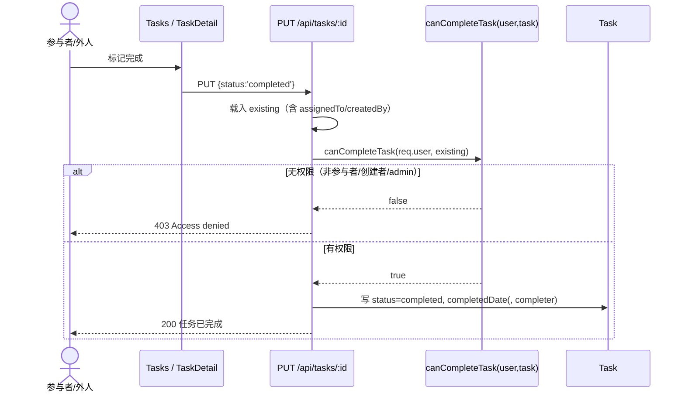
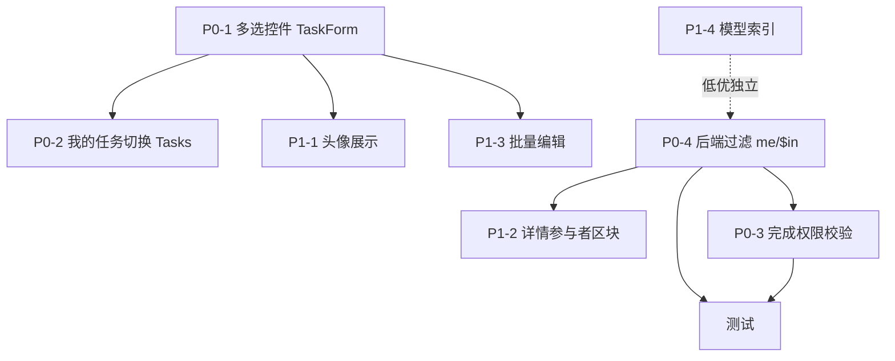

# 增量架构设计 — 任务多参与者（CSMS / Claw）

> 文档类型：**增量架构设计（仅方案文档，不出代码）**
> 系统：CSMS（港股公司秘书管理系统）— Claw
> 日期：2026-08-19
> 作者：高见远（Architect）
> 关联输入：`prd-incremental-2026-08-19.md`（许清楚，Product Manager，已拍板 3 项硬约束）
> 产出约束：本次**只产出设计文档**，不修改任何源码文件；探查仅用只读命令。

---

## 0. 硬约束回顾（来自 PRD §0，设计不得违背）

| # | 决策 | 设计含义 |
|---|---|---|
| 1 | 本次只出方案文档，不动代码 | 本文档即为交付物；所有改动标为【改写/新增】，但**不落地** |
| 2 | 任一参与者可标记完成即任务完成 | 任务级单一 `status`；权限判定只需「用户 ∈ 参与者 ∪ 创建者 ∪ admin」 |
| 3 | 维持 scope 全可见 | “我的任务”仅是 scope 可见集合上的**子集筛选**，不引入「仅参与者可见」 |

---

## 1. 实现方案 + 框架选型

### 1.1 核心判断：为什么这是「前端交互 + 路由小改」型增量

代码走查结论（详见 PRD §2，已复核源码）：

- `server/models/Task.js:53-56` — `assignedTo` **已经是 `[ObjectId ref User]` 数组**，无需改结构。
- `server/routes/tasks.js:89-108`（POST）— 已直接收 `req.body.assignedTo` 数组，无需改。
- `server/routes/tasks.js:13-55`（GET）— 已支持 `assignedTo` 过滤，但**原样等值赋值**，需增强 `me`/`$in`。
- `client/src/components/TaskForm.jsx:35,147-152` — 参与者是**单选 `<select>`**，提交时只取首个 id（`assignedTo: form.assignedTo ? [form.assignedTo] : undefined`）。这是**唯一实质前端缺口**。
- `client/src/pages/Tasks.jsx:126-136` — `fetchTasks()` 未传任何过滤参数，需加“我的任务”切换。
- `client/src/services/index.js:338-341` — `taskService.getAll(params)` 已支持 query 参数透传（`buildParams`），**服务层零改动**。

**结论**：数据结构零改动；风险集中在 ① `TaskForm` 单选→多选、② `Tasks` 页“我的任务”切换、③ 后端 `GET` 过滤增强与 `PUT` 完成权限校验。属低数据结构风险的体验型增量。

### 1.2 框架与控件选型（关键决策）

| 选型点 | 推荐方案 | 理由（结合本代码库实际） |
|---|---|---|
| 多选参与者控件 | **自建轻量多选组件 `UserMultiSelect`**（Tailwind + lucide 复选列表/下拉面板） | 代码库现状是 **Tailwind + 自定义 `UIHelpers`（`inputClass`/`FormField`/lucide 图标）**，`TaskForm` 全程用原生 `<select>` + Tailwind，**并未使用 MUI 组件**。引入 `MUI Autocomplete` 会与现有风格割裂且需额外主题接入。**零新依赖**最契合本库。 |
| 备选（若团队强推 MUI） | `MUI Autocomplete`（multiple） | 需确认项目已装 `@mui/material` 并接入主题；当前 `package.json` 未显式使用 MUI，属新增接入成本。 |
| 明确**不引入** | `react-select` 等第三方多选库 | 与现有 Tailwind 体系重复，且无必要，增加体积。 |

> **架构师拍板**：采用**自建 `UserMultiSelect`（Tailwind + lucide）**，保证「零新 npm 依赖 + 与现有 UI 一致」。该组件同时被 `TaskForm`（新建/编辑）复用，公司工作台经 `TaskForm` 复用自动受益。

### 1.3 架构模式

沿用现有「前端 React 组件 + 服务层（`taskService`）封装 `api` + 后端 Express 路由分层（route → model → middleware/scope）」，**不引入新分层**。完成权限判定建议以 **`tasks.js` 内私有 helper `canCompleteTask(user, task)`** 落地（见 §3、§7），不新建 middleware，避免过度抽象。

---

## 2. 文件列表（逐文件标注改动类型）

### 2.1 本期改动文件

| 文件（相对 `E:/Claw`） | 改动 | 说明 |
|---|---|---|
| `client/src/components/UserMultiSelect.jsx` | **【新增】** | 多选 User 控件（checkbox 下拉/面板），`value:[id]` ↔ `onChange([id])`，接收 `users`、`label`、`disabled` props。 |
| `client/src/components/TaskForm.jsx` | **【改写】** | 将 `跟进人/负责人` 单选 `<select>` 替换为 `<UserMultiSelect>`；`form.assignedTo` 由标量改为数组；`handleSubmit` 直接传 `assignedTo:[...ids]`（去“仅取首个”逻辑）；新增 `toIdArray()` 解析初始值（对象数组/标量 → id 数组）。 |
| `client/src/pages/Tasks.jsx` | **【改写】** | 顶部加“全部 / 我的任务”分段切换（`view` state）；`fetchTasks` 支持按 `view==='mine'` 传 `{ assignedTo:'me' }`；保留现有搜索/状态/优先级筛选与快捷完成。 |
| `server/routes/tasks.js` | **【改写】** | `GET /`：`assignedTo` 支持 `me`→`req.user._id`、逗号多值→`$in`；保持 `applyListScope`。`PUT /:id`：新增完成权限校验（调 `canCompleteTask`，非授权返回 `403`）；可选写 `completer`（Q6）。 |
| `server/models/Task.js` | **【改写（极小）】** | 仅新增 `taskSchema.index({ assignedTo: 1 })`（P1-4，非破坏性，可累加）。可选新增 `completer: { type: ObjectId, ref: 'User' }`（Q6）。 |
| `server/tests/tasks.participants.test.js` | **【新增】** | 覆盖：`assignedTo=me` 翻译、`$in` 多值、`applyListScope` 不被绕过、完成权限 403/200、附件门禁保留。 |

### 2.2 本期**不碰**的文件（范围最小化，明确声明）

| 文件 | 不碰理由 |
|---|---|
| `client/src/components/SignTaskForm.jsx` | 独立的签署任务表单，本增量聚焦 `TaskForm`（一般任务 + 经 `TaskForm` 的签署入口）。签署任务多参与者另议。 |
| `client/src/pages/CompanyDetail.jsx` / `components/company/*` | 公司工作台通过复用 `TaskForm` 自动受益，无需改工作台本身。 |
| `client/src/services/index.js` | `taskService.getAll(params)` 已支持 query 透传，零改动。 |
| `client/src/services/mock.js` | Mock 层的 `tasks.getAll` 当前未处理 `assignedTo`，但**不影响生产链路**；如需演示“我的任务”可后续小补（见 §7 共享知识备注），本增量不强制。 |
| `server/models/User.js` | `role`/`accessibleCompanies` 已就绪，scope 行级过滤依赖它们，不改。 |
| `server/middleware/scope.js`、`auth.js` | `applyListScope`/`inScope`/`auth` 已满足需求，不改。 |
| `Task` 模型核心结构（`assignedTo` 数组、`responsiblePerson`、`status` 枚举等） | PRD 决策：数据结构零改动。 |
| 类型枚举不一致（form vs model） | PRD §2 附带观察 = 单列 Bug，**本增量不动**（Q4）。 |

---

## 3. 数据结构和接口（Mermaid）

### 3.1 类图 / 数据契约

```mermaid
classDiagram
    class Task {
        +ObjectId _id
        +String title
        +String type
        +ObjectId company
        +Date dueDate
        +ObjectId[] assignedTo   // 已是 User 数组（本次不动结构）
        +String responsiblePerson // 文本兜底（Q3 仅展示）
        +String status
        +Date completedDate
        +ObjectId createdBy
        +ObjectId completer      // 可选·Q6 审计字段
        +canComplete(user) Boolean
    }
    class User {
        +ObjectId _id
        +String name
        +String email
        +String role  // admin/secretary/manager/viewer/auditor
        +ObjectId[] accessibleCompanies
    }
    class TasksRouter {
        +GET /api/tasks
        +POST /api/tasks
        +PUT /api/tasks/:id
        +canCompleteTask(user, task) Boolean
    }
    class UserMultiSelect {
        +User[] users
        +String[] value
        +onChange(String[]) void
    }
    class TaskForm {
        +UserMultiSelect assigneePicker
        +handleSubmit(payload)
    }
    Task "assignedTo *--" User : ref
    Task "createdBy -->" User
    Task "completer -->" User : 可选·Q6
    TasksRouter ..> Task : query/update
    TaskForm *-- UserMultiSelect : 复用
    UserMultiSelect ..> User : 渲染选项
```

### 3.2 关键接口变更

**`GET /api/tasks` — 入参变化**

| 参数 | 现状 | 本次 |
|---|---|---|
| `assignedTo` | 原样等值（如 `?assignedTo=uid`） | ① `me` → 翻译为 `req.user._id`；② 逗号多值 `a,b,c` → `{ $in: [a,b,c] }`；③ 单值仍等值 |
| 其他（status/priority/type/company…） | 不变 | 不变 |
| 行级 | `applyListScope(query,req,'company')` 不变 | **保持不变**（决策 #3：scope 全可见，过滤叠加） |

**`PUT /api/tasks/:id` — 完成权限校验（新增）**

```js
// 伪代码（落地于 server/routes/tasks.js 内，私有 helper）
function canCompleteTask(user, task) {
  if (!user || !task) return false
  if (user.role === 'admin') return true
  if (task.createdBy && user._id.toString() === task.createdBy.toString()) return true
  const ids = (task.assignedTo || []).map(id => id.toString())
  return ids.includes(user._id.toString())
  // Q3：assignedTo 与 responsiblePerson 皆空时 → 仅 creator/admin 可完成（已满足）
}
```

- 校验触发：仅当 `req.body.status === 'completed'` 时。
- 非授权：`return res.status(403).json({ message: 'Access denied: only creator, an assignee, or admin may complete this task' })`
- 保留现有 `signing`/`document_review` 附件门禁（#2.3）不变。
- 可选：校验通过且 `completer` 启用时写 `updateData.completer = req.user._id`。

**前端多选值 → `assignedTo` 数组契约**

```
UserMultiSelect.value: string[]   // User._id 列表
TaskForm.handleSubmit:
  payload.assignedTo = form.assignedTo?.length ? form.assignedTo : undefined
  // 直接传 [id1, id2, ...]，后端 POST/PUT 原样写库
```

---

## 4. 程序调用流程（Mermaid 时序图）

### 4.1 ① 创建任务：选多人提交



### 4.2 ② 切到“我的任务”过滤链路



### 4.3 ③ 参与者标记完成的权限校验链路



---

## 5. 增量任务列表（有序、含依赖、按实现顺序）

> 完全遵循实现顺序；P0 优先，P1/P2 其后。每个任务标注改动文件与前置依赖。

| 任务ID | 优先级 | 任务名 | 改动文件 | 依赖 | 说明 / 验收 |
|---|---|---|---|---|---|
| **T01** | P0-1 | 前端多选参与者控件 | 新增 `UserMultiSelect.jsx`；改写 `TaskForm.jsx` | 无 | 单选 `<select>`→`<UserMultiSelect>`；`form.assignedTo` 改数组；提交直传 `[ids]`，去“仅取首个”。验收：可勾选 ≥0 人，payload 含 `assignedTo:[...]`。 |
| **T02** | P0-2 | “我的任务”视图切换 | 改写 `Tasks.jsx` | T01（共用 users/服务，评审顺序） | 加“全部/我的”分段；`fetchTasks` 按 `view==='mine'` 传 `{assignedTo:'me'}`。验收：选“我的”仅显指派给自己的任务（仍是 scope 子集）。 |
| **T03** | P0-4 | 后端 `assignedTo` 过滤增强 | 改写 `server/routes/tasks.js`（GET /） | 无（可与 T02 并行） | `me`→`req.user._id`；逗号多值→`$in`；保留 `applyListScope`。验收：过滤正确、scope 外被拦。 |
| **T04** | P0-3 | 完成权限校验 | 改写 `server/routes/tasks.js`（PUT /:id，helper `canCompleteTask`） | T03（同文件连续改） | 完成动作仅 creator/assignee/admin 可；非授权 403；保留附件门禁。验收：外人 403、参与者/创建者/admin 200。**Q1 采纳收窄（待用户拍板，设计按此落地）**。 |
| **T05** | P1-4 | 模型查询索引 | 改写 `server/models/Task.js` | 无 | 加 `taskSchema.index({ assignedTo: 1 })`（非破坏性）。 |
| **T06** | P1-2 | 详情页参与者区块 | 改写 `client/src/pages/TaskDetail.jsx` | T03（依赖 GET /:id 已 populate） | 渲染“参与者（N）”列表（姓名/角色/邮箱）；`GET /:id` 已 populate `assignedTo(name/email/phone)`，无需后端改。 |
| **T07** | P1-1 | 参与者姓名清晰展示 | 改写 `Tasks.jsx`（行内头像/可点击） | T01 | 列表已能渲染多参与者；增强为头像/角色标签（体验增强，可并入 T02）。 |
| **T08** | 测试 | 参与者相关用例 | 新增 `server/tests/tasks.participants.test.js` | T03, T04 | 覆盖 me 翻译、`$in`、scope 不被绕过、403/200、附件门禁。 |
| **T09** | P1-3 | 批量编辑参与者 | 复用 `UserMultiSelect`（编辑弹窗） | T01 | 编辑时增删参与者（本质是 T01 控件的复用，无额外实现量）。 |
| — | P2-1/2/3 | 完成通知 / 移动端 / responsiblePerson 兜底输入 | 视决策 | 待定 | P2 可选，见 §8 Q5/Q6。 |

### 5.1 任务依赖关系图



---

## 6. 依赖包列表

| 包 | 是否新增 | 说明 |
|---|---|---|
| `@mui/material` / `react-select` / 任何其他多选库 | **否** | 采用自建 `UserMultiSelect`（Tailwind + lucide），**零新 npm 依赖**。 |
| 现有（react, vite, tailwindcss, lucide-react, express, mongoose, jsonwebtoken…） | 沿用 | 不升级、不增删。 |

> **架构师结论**：本次**不引入任何新依赖**。若团队最终选择 MUI Autocomplete（备选），需额外接入 `@mui/material` + 主题，属新增成本，不推荐。

---

## 7. 共享知识（跨文件约定）

1. **前端多选值格式**：`UserMultiSelect.value` 为 `string[]`（User `_id` 列表）；`TaskForm` 提交时直接作为 `assignedTo` 数组传给后端，不做字符串化。
2. **`assignedTo=me` 翻译位置**：**后端 `GET /api/tasks` 内**翻译（不前端传真实 id，更安全），`me` → `req.user._id`；多值逗号 → `{ $in: [...] }`（Q2 推荐方案，采纳）。
3. **完成权限判定函数位置**：`server/routes/tasks.js` 内私有 helper `canCompleteTask(user, task)`（不新建 middleware，避免过度抽象）。规则：`admin` 或 `user._id === task.createdBy` 或 `task.assignedTo` 含 `user._id` → 允许。
4. **错误码约定**：完成无权限 → `403 { message: 'Access denied: only creator, an assignee, or admin may complete this task' }`；附件缺失（signing/document_review）→ 维持现有 `400`。
5. **scope 不变**：所有列表/详情过滤**必须**叠加 `applyListScope` / `inScope`，保证决策 #3（scope 全可见）。
6. **`responsiblePerson` 处理**（Q3）：仅作**文本展示兜底**；完成权限以 `assignedTo`/创建者/admin 为准；两者皆空时仅创建者/admin 可完成（helper 已天然满足）。
7. **Mock 层备注（非强制）**：`client/src/services/mock.js` 的 `tasks.getAll` 当前未处理 `assignedTo`，若要演示“我的任务”可在 `filters.assignedTo==='me'` 时按 `DEMO_USER` 过滤。本增量不强制改 mock（不影响生产链路）；如演示需要，作为 T02 的小补丁。

---

## 8. 待明确事项（Q1–Q6 映射 + 架构师推荐）

| # | 问题 | 架构师推荐方案 | 需用户最终拍板 |
|---|---|---|---|
| **Q1** | 完成权限是否收窄？ | **采纳收窄**：`canCompleteTask` 限定 creator/assignee/admin（设计已按此落地）。比当前“scope 内任意登录用户可完成”更合审计责任链，同时兼容决策 #2（任一参与者即可完成）。 | ✅ **需拍板**：采纳收窄 vs 维持现状 |
| **Q2** | `assignedTo=me` 谁翻译？ | 后端 `GET /` 内翻译为 `req.user._id`（已纳入 T03）。 | 否（架构已定，推荐采纳） |
| **Q3** | `responsiblePerson` 文本兜底 | 仅展示兜底；完成权限基于 `assignedTo`/creator/admin；皆空时仅 creator/admin。 | 否（设计已覆盖） |
| **Q4** | 类型枚举不一致 | **本增量不动**，单列 Bug 修复。 | 否（已定：不动） |
| **Q5** | 移动端是否纳入本期 | 影响 P2-2；“我的/全部”切换与多选控件用 Tailwind 响应式即可天然适配；是否正式纳入排期待定。 | ✅ **需拍板**：是否纳入本期 |
| **Q6** | 是否加 `completer` 审计字段 | 推荐加 `completer: ObjectId ref User`，完成时写入，与 `completedDate` 并存，完善审计轨迹（P1，非破坏性）。 | ✅ **需拍板**：是否加字段 |

> **架构师提示**：Q1、Q5、Q6 为「需用户（vc）拍板」项。若 Q1 维持现状，则 T04 仅需保留（或降级为不实现）；若 Q6 否决，则 T04 不写 `completer`、`Task.js` 不加该字段。其余项设计已自洽，不需再决策。

---

## 9. 给主理人（高见远 → vc）的回报摘要

### ① 增量设计核心结论（5 条）
1. **数据结构零改动**：`Task.assignedTo` 已是 User 数组，后端 POST 收数组、GET 支持过滤——模型/核心结构不动，风险集中在前端交互 + 两处后端小增强。
2. **唯一实质前端缺口 = `TaskForm` 单选→多选**：改用自建 `UserMultiSelect`（Tailwind + lucide，**零新依赖**），提交直传 `assignedTo:[id...]` 数组。
3. **“我的任务”低成本打通**：服务层 `getAll(params)` 已就绪，仅 `Tasks` 页加“全部/我的”切换 + 后端把 `assignedTo=me` 翻译为 `req.user._id`（`$in`），并保留 scope 行级过滤（决策 #3 不变）。
4. **完成权限建议收窄为「参与者/创建者/admin 可完成」**（替换当前过宽的“scope 内任意人可完成”），以保审计责任链——以 `canCompleteTask` helper 落地，非授权返回 403；**列为 Q1 待拍板**。
5. **范围最小化**：明确不碰 `SignTaskForm`、公司工作台、`mock.js`（生产无关）、`User.js`、`scope.js`/`auth.js`、类型枚举不一致（单列 Bug）。

### ② 增量任务列表概览（按实现顺序）
- **T01 (P0-1)** 多选参与者控件 → 新增 `UserMultiSelect.jsx` + 改写 `TaskForm.jsx`
- **T02 (P0-2)** “我的任务”切换 → 改写 `Tasks.jsx`（依赖 T01）
- **T03 (P0-4)** 后端 `assignedTo` 过滤 `me`/`$in` → 改写 `tasks.js` GET（可独立于 T02）
- **T04 (P0-3)** 完成权限校验 `canCompleteTask` + 403 → 改写 `tasks.js` PUT（依赖 T03）
- **T05 (P1-4)** 模型索引 `assignedTo:1` → 改写 `Task.js`（独立低优）
- **T06 (P1-2)** 详情参与者区块 → 改写 `TaskDetail.jsx`（依赖 T03）
- **T07/T09 (P1-1/P1-3)** 头像展示 / 批量编辑（复用 T01 控件）
- **T08 (测试)** 新增 `server/tests/tasks.participants.test.js`（依赖 T03/T04）
- P2（通知/移动端/responsiblePerson 输入）视 Q5/Q6 决策后排入。

### ③ 待用户拍板的关键事项
- **Q1**：完成权限是否采纳「收窄为参与者/创建者/admin」？（设计已按采纳落地，待确认）
- **Q5**：移动端（P2-2）是否纳入本期？
- **Q6**：是否加 `completer` 审计字段？

### ④ 设计文档落盘路径
`E:/Claw/deliverables/software-csms-task-participants/design-incremental-2026-08-19.md`

> 注：本文档为方案文档，按决策 #1 **未修改任何源码**。开工前需用户确认 Q1/Q5/Q6 三项。
