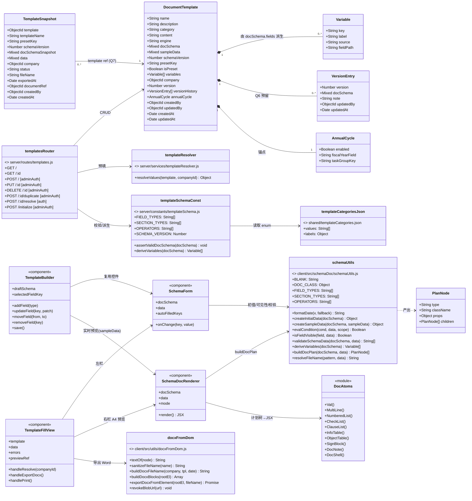
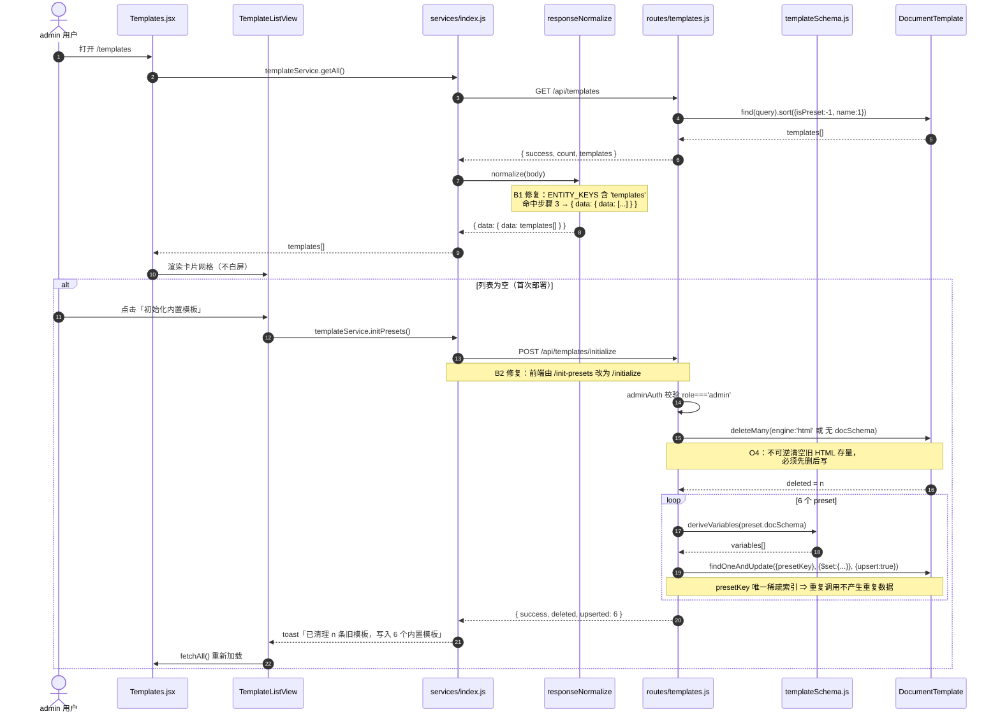
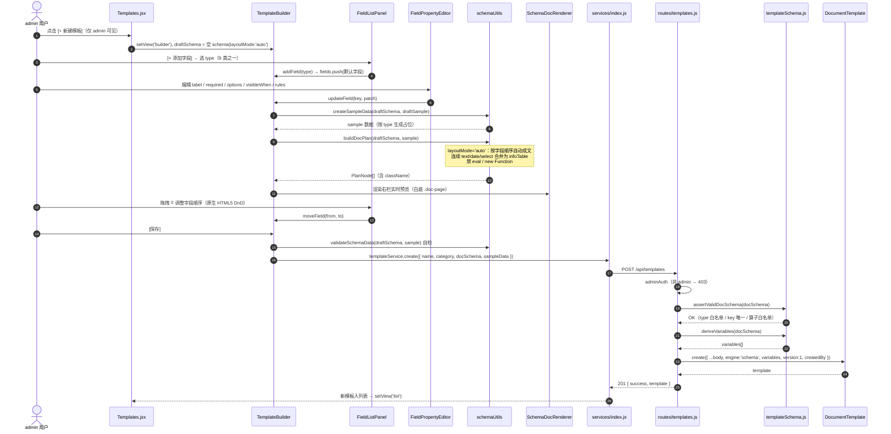
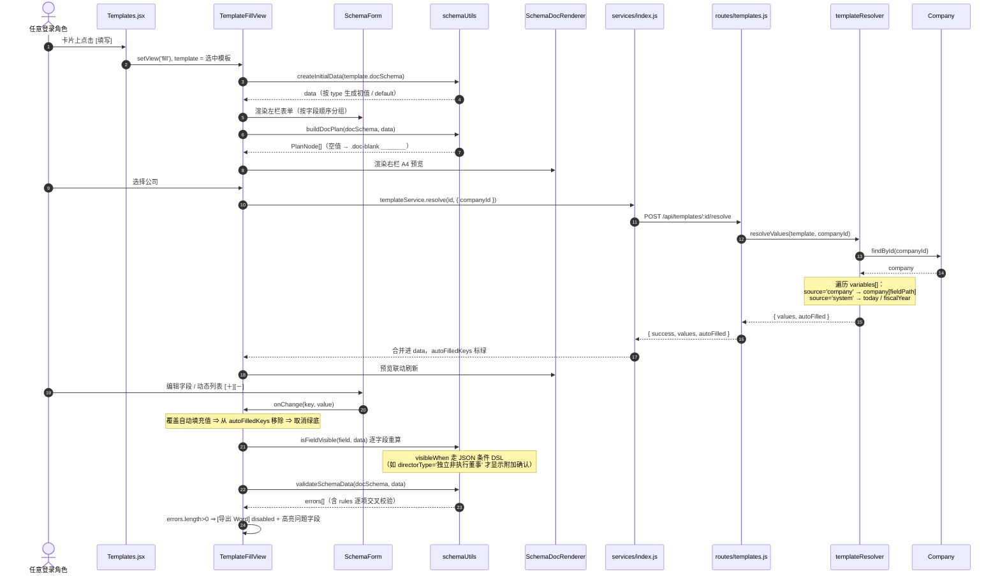
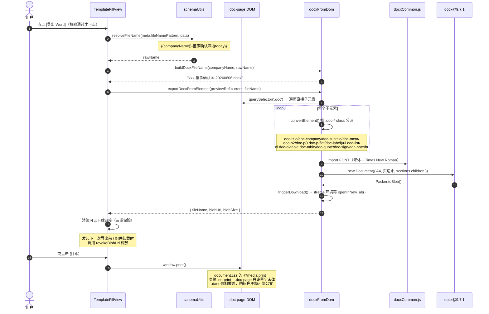
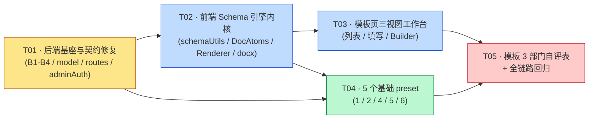

# 系统设计 · Claw 模板模块 v2（Schema 驱动合规文书引擎）

> 架构师：高见远 ｜ 日期：2026-08-06 ｜ 版本：v2.0 Phase 1
> 上游输入：`docs/prd-compliance-template-v2.md`（产品经理 许清楚）
> 参考方案：`2026-08-05-13-37-42/overview.md`
> 移植来源：`2026-08-05-13-37-42/hk-compliance-templates/src/{templates.jsx, App.jsx, docxExport.js, index.css}`
> 状态：**决策全闭合，可直接进入工程实现**

---

## 0. 决策落地对照表（先对齐，再看设计）

| # | 锁定决策 | 本设计的落地方式 |
|---|---|---|
| Q1 | 旧 HTML 模板废弃，纯 schema 单引擎 | 不保留 `engine:'html'` 分支；`engine` 字段值域收敛为 `'schema'` 单值（保留字段仅为可读性与未来扩展）；`{{变量}}` 字符串替换逻辑与 `/render` 路由**整体删除** |
| Q2 | 渲染放前端 | 后端只做存取 / 校验 / 预填解析；`SchemaDocRenderer` 在浏览器内成文，实时预览零网络往返 |
| Q3 | 归档 Documents → Phase 2 | 仅在 `TemplateSnapshot` 预留 `documentRef` 字段与 `finalize` 调用点注释，本期不接线 |
| Q4 | 权限 = admin | 后端 `POST/PUT/DELETE/initialize` 全部挂 `adminAuth`；前端 `useAuth().user.role === 'admin'` 控制入口显隐（双保险） |
| Q5 | 签名块自由文本 | `signBlock.items[].value` 为 segments，`source` 恒为 `manual`；不扩 `Company.links[].roles` |
| Q6 | 版本 → 模型支持，UI Phase 2 | `version` / `versionHistory[]` 本期建模并在 PUT 中**真实写入**（无 UI，但数据可回溯） |
| Q7 | 快照 → 独立集合，本期只建 model | 新增 `server/models/TemplateSnapshot.js`；**不注册路由**，不接 UI |
| Q8 | 结构页签 → Phase 2 | Builder 固定产出 `layoutMode:'auto'`；引擎同时支持 `'custom'`（6 个 preset 使用） |
| 年度 multitask | 仅模型锚点 | `annualCycle: { enabled, fiscalYearField, taskGroupKey }` |
| O1 | 6 preset 全本期内置，模板 3 单列 | T04 交付 5 个（1/2/4/5/6），**T05 单独交付模板 3** |
| O2 | Builder 开放 9 类字段 | `text/textarea/date/select/boolean/list/clauses/checklist/objectList`；`number/multiselect/matrix` 归 P2（引擎留扩展位，Builder 不出现在类型下拉） |
| O3 | 修 B2 改前端 | `client/src/services/index.js` 的 `initPresets` 改调 `/api/templates/initialize`，后端路径不动 |
| O4 | 旧 HTML 数据直接清空 | `/initialize` **先 `deleteMany` 旧记录，再 upsert 6 preset**，顺序不可颠倒；接口响应返回 `deleted` 计数以便审计。**不可逆** |
| O5 | 快照独立集合 | 同 Q7 |
| O6 | category 同源 | 单一事实源 `shared/templateCategories.json`；后端 `require` 直读，前端镜像 + vitest 同步断言 |

---

## 1. 实现方案与框架选型

### 1.1 核心技术难点

| # | 难点 | 解法 |
|---|---|---|
| D1 | 6 个写死的 `render(data)` JSX 函数 → 1 个通用解释引擎 | 抽出 **10 类区块原子** + **段落 segments 混排模型**；模板退化为纯 JSON。`layoutMode:'custom'` 用于还原 6 个 preset 的正式文书观感，`'auto'` 用于 Builder 新建 |
| D2 | MVP 中 `visibleWhen` / `validate` 是 **JS 函数**，存进 Mongo 后无法执行（且执行 = RCE） | 改为 **JSON 条件 DSL + 10 算子白名单**（`evalCondition` 纯函数）与 **JSON 校验规则 DSL**（`validateSchemaData` 纯函数）。全链路禁 `eval` / `new Function` / `dangerouslySetInnerHTML` |
| D3 | 内控评估报告的手写动态章节号（六／七） | 引擎在**可见区块**上统一做 `autoNumber`，中文序号自动递推；条件章节用 `group` 区块包裹 |
| D4 | 模板 3 objectList 双层字段（`itemDefFields` 定义层 / `itemDataFields` 数据层）+ 表格空值三态 + 4 条交叉校验 | `objectTable` 列支持 `type:'index'\|'value'` 与 `blankWhen` 条件三态；校验走 `scope:'item:<fieldKey>'` 的逐项规则 |
| D5 | Mongoose `Mixed` 静默丢改动 | 硬约定：**hydrate 后就地改 `docSchema` 必须 `markModified('docSchema')`**；能用 `$set` 显式路径的写法（`findOneAndUpdate`）优先，`$set` 不需要 markModified |
| D6 | Word 导出与屏幕预览必须一致 | 沿用 MVP「DOM → docx」思路：导出以已渲染的 `.doc` DOM 为唯一输入，遍历 `.doc-*` 语义 class 映射为 docx 元素。引擎产物强制套用 `DOC_CLASS` 常量表中的 class |
| D7 | 前后端 category 不同源导致必 500（B4） | 单一 JSON 事实源 + 前端镜像 + 单测守卫 |
| D8 | Claw 无 jsdom / RTL，无法做组件级 DOM 断言 | 引擎拆出**纯函数 `buildDocPlan(docSchema, data)`**（返回带 `className` 的区块计划树），React 层只做「计划树 → JSX」的机械映射。单测断言计划树 + `DOC_CLASS` 注册表，零新增 devDependency |

### 1.2 框架选型

**结论：不引入任何新依赖包（0 new deps）。**

| 关注点 | 选型 | 理由 |
|---|---|---|
| 前端框架 | 沿用 React 18.2 + Vite 5 | MVP 仅用 `useState/useEffect/useMemo/useCallback/useRef`，无 React 19 专属 API，降级安全 |
| 样式 | Tailwind 3（外壳）+ 纯 CSS（`.doc-*` 文书区） | MVP 的 `.doc-*` 是纯 CSS，无 `@apply`、无 Tailwind v4 语法，可整段搬迁 |
| Word 导出 | `docx@^9.7.1`（client 已装，与 MVP **完全同版本**） | 直接移植 `docxExport.js`，字体常量复用 `client/src/utils/docxCommon.js` 的 `FONT` |
| 字段拖拽排序 | **原生 HTML5 Drag & Drop**（`draggable` + `onDragStart/onDragOver/onDrop`） | Claw 未装 `dnd-kit`/`react-beautiful-dnd`；Builder 字段列表为单列小规模列表，原生 API 足够，避免为一个面板引入 30KB 依赖 |
| 后端 | 沿用 Express + Mongoose | 无新增 |
| 测试 | 沿用 `vitest@^2.1.9`（node 环境，纯函数） | 无 jsdom/RTL；所有断言面向纯函数与常量注册表 |

### 1.3 架构模式

```
┌─────────────────────── 前端（渲染 + 交互） ──────────────────────┐
│  Pages 层     Templates.jsx（三视图状态机：list / builder / fill）│
│  View 层      TemplateListView │ TemplateBuilder │ TemplateFillView│
│  Form 层      SchemaForm（EditableList / ObjectListEditor / …）   │
│  Engine 层    SchemaDocRenderer ──调用──▶ buildDocPlan（纯函数）  │
│  Core 层      schemaUtils（DSL 求值 / 校验 / 初值 / 派生 / 常量）  │
│  Export 层    docxFromDom（.doc DOM → docx）                      │
└───────────────────────────────┬───────────────────────────────────┘
                                │ REST（JSON only，无 HTML 传输）
┌───────────────────────────────▼───────────────────────────────────┐
│  Routes 层    routes/templates.js（auth / adminAuth 分级）        │
│  Service 层   services/templateResolver.js（公司预填解析）        │
│  Data 层      data/presets/*.js（6 份 schema JSON）               │
│  Model 层     DocumentTemplate │ TemplateSnapshot                 │
│  Const 层     constants/templateSchema.js ← shared/templateCategories.json │
└───────────────────────────────────────────────────────────────────┘
```

模式：前端 **MVVM + 解释器（Interpreter）**（schema=AST，`buildDocPlan`=解释器，DocAtoms=终结符）；后端 **分层 MVC**。

---

## 2. 文件清单（相对 `Claw/` 根目录）

### 2.1 共享契约

| 文件 | 状态 | 说明 |
|---|---|---|
| `shared/templateCategories.json` | **新增** | ⭐ category 唯一事实源（O6/B4）。纯 JSON，无运行时依赖 |

### 2.2 后端

| 文件 | 状态 | 说明 |
|---|---|---|
| `server/constants/templateSchema.js` | **新增** | 字段 type 枚举、区块 type 枚举、算子白名单、`SCHEMA_VERSION`、`assertValidDocSchema()`、`deriveVariables()` |
| `server/models/DocumentTemplate.js` | **修改** | 模型演进（见 §3.1） |
| `server/models/TemplateSnapshot.js` | **新增** | Q7/O5 快照独立集合，本期只建 model 不接路由 |
| `server/routes/templates.js` | **修改** | 全量重写：adminAuth 分级、B2/B3/B4 修复、`/initialize` 清旧写新、新增 `/resolve`、删除 `/render` |
| `server/services/templateResolver.js` | **新增** | 按 `variables[].source/fieldPath` 从 Company / system 解析预填值（R-P1-1） |
| `server/data/templatePresets.js` | **新增** | 6 个 preset 的聚合器 + 幂等元信息 |
| `server/data/presets/directorConfirmation.js` | **新增** | preset 1 · 董事确认函 |
| `server/data/presets/du004gUndertaking.js` | **新增** | preset 2 · DU004G |
| `server/data/presets/internalControlReport.js` | **新增** | preset 4 · 内控评估报告 |
| `server/data/presets/boardResolution.js` | **新增** | preset 5 · 董事会声明和决议记录 |
| `server/data/presets/projectCharter.js` | **新增** | preset 6 · 项目章程 |
| `server/data/presets/departmentSelfAssessment.js` | **新增** | ⭐ preset 3 · 部门自评表（**T05 单列任务**） |

### 2.3 前端 · 契约与工具

| 文件 | 状态 | 说明 |
|---|---|---|
| `client/src/constants/templateCategories.js` | **新增** | category 前端镜像（ESM）+ 中文 label + 徽标色 |
| `client/src/constants/templateCategories.test.js` | **新增** | ⭐ 同源守卫：`fs` 读 `shared/templateCategories.json` 断言与镜像完全一致 |
| `client/src/utils/responseNormalize.js` | **修改** | B1：`ENTITY_KEYS` 补 `'templates'` |
| `client/src/utils/responseNormalize.test.js` | **修改** | B1 回归单测 |
| `client/src/services/index.js` | **修改** | B2：`initPresets` → `/api/templates/initialize`；B3：删 `render`，加 `resolve`、`duplicate` |
| `client/src/services/mock.js` | **修改** | mock 模板改 schema 形状；删 `render` mock，加 `resolve` mock |
| `client/src/utils/docxFromDom.js` | **新增** | 移植 MVP `docxExport.js`（`exportDocxFromElement` / `buildDocxBlocks` / `buildDocxFileName` / `sanitizeFileName` / `revokeBlobUrl` / `textOf`），`FONT` 改 import 自 `docxCommon.js` |

### 2.4 前端 · 引擎内核

| 文件 | 状态 | 说明 |
|---|---|---|
| `client/src/schemaDoc/schemaUtils.js` | **新增** | ⭐ 纯函数内核：`BLANK`、`DOC_CLASS`、`FIELD_TYPES`、`SECTION_TYPES`、`OPERATORS`、`formatDate`、`normalize*`、`createInitialData`、`createSampleData`、`evalCondition`、`isFieldVisible`、`validateSchemaData`、`deriveVariables`、`buildDocPlan`、`resolveFileName` |
| `client/src/schemaDoc/DocAtoms.jsx` | **新增** | 10 类原子组件（`Val`/`MultiLine`/`NumberedList`/`CheckList`/`ClauseList`/`InfoTable`/`ObjectTable`/`SignBlock`/`DocNote`/`DocShell`） |
| `client/src/schemaDoc/SchemaDocRenderer.jsx` | **新增** | `buildDocPlan` 产物 → JSX 的机械映射；`preview` / `print` 两种模式 |
| `client/src/schemaDoc/SchemaForm.jsx` | **新增** | 填写表单：`FieldControl` + `EditableList` + `ObjectListEditor`（移植自 MVP `App.jsx`，样式换 Claw 令牌） |
| `client/src/schemaDoc/document.css` | **新增** | `.doc-*` 全套样式 + `@media print` + `.dark` 强制覆盖（R-P1-2） |
| `client/src/schemaDoc/schemaUtils.test.js` | **新增** | 纯函数单测：DSL 算子、校验、autoNumber、初值 |
| `client/src/schemaDoc/docPlan.test.js` | **新增** | ⭐ `buildDocPlan` 计划树 + `DOC_CLASS` 注册表断言（docx 导出锚点守卫，R-P1-5） |

### 2.5 前端 · 页面

| 文件 | 状态 | 说明 |
|---|---|---|
| `client/src/pages/Templates.jsx` | **修改（重写）** | 三视图状态机容器（`view: 'list' \| 'builder' \| 'fill'`），非弹窗 |
| `client/src/pages/templates/TemplateListView.jsx` | **新增** | 视图 A：搜索 + 分类 + 卡片网格 + 空态初始化 |
| `client/src/pages/templates/TemplateBuilder.jsx` | **新增** | 视图 B：三栏工作台（仅 admin） |
| `client/src/pages/templates/FieldListPanel.jsx` | **新增** | Builder 左栏：字段列表 + 原生 HTML5 拖拽排序 |
| `client/src/pages/templates/FieldPropertyEditor.jsx` | **新增** | Builder 中栏：按 type 动态渲染属性表单（含 objectList 双层） |
| `client/src/pages/templates/TemplateFillView.jsx` | **新增** | 视图 C：左表单 / 右 A4 预览 + 打印 + 导出 Word |
| `client/src/index.css` | **修改** | 追加一行 `@import './schemaDoc/document.css';`（置于 Tailwind 指令之后） |

**合计：新增 25 个文件 / 修改 7 个文件。**

---

## 3. 数据结构与接口

### 3.1 `DocumentTemplate` Mongoose 字段表（演进后）

| 字段 | 类型 | 必填 | 默认 | 说明 |
|---|---|---|---|---|
| `name` | `String` | ✅ | — | `trim: true`（不变） |
| `description` | `String` | — | — | 不变 |
| `category` | `String` enum | — | `'other'` | ⭐ enum 来自 `shared/templateCategories.json`，**禁止就地硬编码**（B4） |
| `content` | `String` | ❌ | `''` | ⭐ `required` 由 `true` **改为不填**（Q1 后无 html 引擎使用者），保留仅为历史兼容 |
| `engine` | `String` enum `['schema']` | — | `'schema'` | ⭐ 新增。单值 enum，写入其它值直接校验失败 |
| `docSchema` | `Mixed` | — | `{}` | ⭐ 新增。模板 schema 主体。**严禁命名 `schema`（Mongoose 保留字，直接抛错）** |
| `sampleData` | `Mixed` | — | `{}` | ⭐ 新增。Builder 实时预览与卡片预览用示例数据 |
| `schemaVersion` | `Number` | — | `1` | ⭐ 新增。契约版本 |
| `presetKey` | `String` | — | — | ⭐ 新增。`unique: true, sparse: true`，内置模板幂等键 |
| `isPreset` | `Boolean` | — | `false` | 沿用；`true` 时后端**强制拒绝 DELETE**（403） |
| `variables[]` | `Array` | — | `[]` | 形状保留；⭐ 由 `deriveVariables(docSchema)` 派生，`source` enum **补 `'system'`** → `['company','director','meeting','system','manual']` |
| `variables[].key` | `String` | — | — | = `field.key` |
| `variables[].label` | `String` | — | — | = `field.label` |
| `variables[].source` | `String` enum | — | `'manual'` | = `field.source` |
| `variables[].fieldPath` | `String` | — | `''` | = `field.fieldPath` |
| `company` | `ObjectId → Company` | — | — | 不变（空 = 通用模板） |
| `version` | `Number` | — | `1` | ⭐ 新增（Q6）。每次 PUT `docSchema` 变更时 `+1` |
| `versionHistory[]` | `Array` | — | `[]` | ⭐ 新增（Q6）。`{ version:Number, docSchema:Mixed, note:String, updatedBy:ObjectId→User, updatedAt:Date }`；**上限保留最近 20 条**（`$slice: -20`），防文档膨胀 |
| `annualCycle` | `Object` | — | `{ enabled:false }` | ⭐ 新增锚点。`{ enabled:Boolean, fiscalYearField:String, taskGroupKey:String }`。本期只存不用 |
| `createdBy` | `ObjectId → User` | — | — | 不变 |
| `updatedBy` | `ObjectId → User` | — | — | ⭐ 新增，配合 versionHistory |
| `timestamps` | — | — | — | 不变 |

**索引**：`{ presetKey: 1 }`（unique + sparse）、`{ category: 1, name: 1 }`、`{ isPreset: -1, name: 1 }`（列表默认排序）。

### 3.2 `docSchema` v1 契约（`Mixed` 内部结构）

```jsonc
{
  "schemaVersion": 1,
  "layoutMode": "custom",              // 'auto' | 'custom'
  "meta": {
    "docTitle":    "董 事 确 认 函",
    "docSubtitle": "LETTER OF CONFIRMATION — Risk Management and Internal Control",
    "companyField": "companyName",     // 抬头公司名取值字段；空则不渲染 .doc-company
    "headerMeta": {                    // → .doc-meta（左右两栏）
      "left":  [{ "text": "股份代号：" }, { "var": "stockCode", "blank": "＿＿＿＿" }],
      "right": [{ "text": "日期：" }, { "var": "letterDate", "format": "date" }]
    },
    "fileNamePattern": "{{companyName}}-董事确认函-{{today}}",
    "archiveNote": "存档说明：……保存期不少于七年。"
  },

  "fields": [
    {
      "key": "directorType",           // 必填，唯一，/^[A-Za-z_][A-Za-z0-9_]*$/
      "label": "董事类别",
      "type": "select",                // 9 类之一
      "required": true,
      "placeholder": "",
      "hint": "",
      "default": "",
      "options": ["执行董事", "非执行董事", "独立非执行董事"],   // select
      "checkboxLabel": "",             // boolean
      "newItemText": "（请填写…）",     // list / clauses / checklist
      "addLabel": "添加条款",
      "emptyHint": "暂无条款，请点击「添加」新增。",
      "itemTitleKey": "module",        // objectList
      "itemDefFields":  [ { "key":"module","label":"模块名称","type":"text" } ],
      "itemDataFields": [ { "key":"effective","label":"是否有效","type":"select","options":[…] } ],
      "newItem": { "module":"", "evidenceRequired": true, "effective":"", "evidence":"", "note":"" },
      "source": "manual",              // 'company' | 'system' | 'manual'
      "fieldPath": "",                 // source=company 时如 'name' / 'registrationNumber'
      "visibleWhen": { "field": "x", "op": "eq", "value": "y" }   // 条件 DSL，可省略
    }
  ],

  "rules": [                            // 跨字段 / 逐项交叉校验
    {
      "id": "sa-effective-required",
      "scope": "item:assessmentItems",  // 'form' | 'item:<fieldKey>'
      "when": { "field": "$item.effective", "op": "falsy" },   // when 为真 ⇒ 报错
      "message": "自评模块「{{$item.module|第 {{$index1}} 项}}」尚未选择是否有效。"
    }
  ],

  "layout": {                           // layoutMode='custom' 时必填
    "sections": [ /* 见 §3.3 */ ]
  }
}
```

`sampleData` 独立存于模型同名列（不放在 `docSchema` 内），避免示例数据污染契约。

### 3.3 区块（Section）契约 · 10 类

| # | `type` | 关键属性 | 产出 DOM / class |
|---|---|---|---|
| 1 | `heading` | `text`、`autoNumber?`、`visibleWhen?` | `<p class="doc-h2">` |
| 2 | `paragraph` | `segments[]`、`flat?`（`.doc-p-flat`）、`bold?`（`.doc-label`）、`visibleWhen?` | `<p class="doc-p [doc-p-flat]">` |
| 3 | `infoTable` | `rows[] = { label, value: segments[] }` | `<table class="doc-table">` + `<th class="doc-th-key">` |
| 4 | `checkList` | `mode:'items'\|'single'`、`field`、`text?`、`placeholder?` | `<ul class="doc-list"><li><span class="doc-box">☑/☐` |
| 5 | `clauseList` | `field`、`variant:'checked'\|'ordered'\|'plain'`、`marker?`、`quote?`、`placeholder?` | `checked`→`.doc-list`；`ordered`→`<ol class="doc-ol">`；`plain`→多个 `.doc-p`（`quote:true` 外包 `.doc-quote`） |
| 6 | `objectTable` | `field`、`columns[]`、`emptyText?` | `<table class="doc-table">` + `<thead>` |
| 7 | `signBlock` | `items[] = { label, value: segments[] }`、`note?` | `.doc-sign` > `.doc-sign-grid` > `.doc-sign-row` > `.doc-sign-label` + `.doc-line`；`note`→`.doc-note` |
| 8 | `note` | `text` | `<p class="doc-note">` |
| 9 | `divider` | — | `<hr class="doc-rule">` |
| 10 | `group` | `visibleWhen?`、`children[]`（递归 sections） | 透明容器（**不产出 DOM 包裹层**，直接展开子区块，保证 docx 遍历不多一层） |

**`segments[]` 混排模型**（`paragraph` / `infoTable.rows[].value` / `signBlock.items[].value` 共用）：

```jsonc
[
  { "text": "本人 ", "bold": false },
  { "var": "directorName", "blank": "＿＿＿＿＿＿", "format": "text" },
  { "text": "，现任本公司", "bold": true },
  { "var": "letterDate", "format": "date" },
  { "join": ["ownerName", "ownerTitle"], "separator": " ／ " }   // 多字段拼接
]
```
`format` ∈ `text | date`；`var` 取空值时输出 `<span class="doc-blank">{blank ?? BLANK}</span>`。

**`objectTable.columns[]`**：

```jsonc
{ "key": "$index", "label": "序号", "type": "index", "width": 6,  "align": "center" }
{ "key": "module", "label": "内控模块", "type": "value", "width": 38, "blank": "＿＿＿＿＿＿" }
{ "key": "evidence", "label": "证据索引", "type": "value", "width": 18,
  "blankWhen": { "cond": { "field": "$item.evidenceRequired", "op": "truthy" },
                 "whenTrue": "＿＿＿＿", "whenFalse": "—" } }   // ⭐ 空值三态
```

### 3.4 条件 DSL（算子白名单，共 10 个 + 3 组合器）

| 算子 | 语义 | 组合器 |
|---|---|---|
| `eq` / `ne` | 相等 / 不等（`String()` 后比较） | `{ "all": [c1, c2] }` |
| `in` / `nin` | 值属于 / 不属于数组 | `{ "any": [c1, c2] }` |
| `gt` / `gte` / `lt` / `lte` | 数值比较（`Number()` 转换，`NaN` 恒 false） | `{ "not": c1 }` |
| `truthy` / `falsy` | 非空判定（含空串 / 空数组 / `false` / 未勾选 checklist） | — |

`field` 路径支持 `$item.<key>`（逐项作用域）与 `$index` / `$index1`（0/1 基序号）。
**引擎实现约束：`evalCondition` 为纯函数 switch，遇到白名单外算子返回 `false` 并 `console.warn`，绝不 `eval`。**

### 3.5 类图



### 3.6 REST 接口契约

| 方法 | 路径 | 中间件 | 请求体 | 响应 | 说明 |
|---|---|---|---|---|---|
| GET | `/api/templates` | `auth` | query: `category`, `search` | `{ success, count, templates: [] }` | ⭐ 顶层键 `templates`（B1 前端补键） |
| GET | `/api/templates/:id` | `auth` | — | `{ success, template }` | — |
| POST | `/api/templates` | **`adminAuth`** | `{ name, description, category, docSchema, sampleData }` | `201 { success, template }` | `variables` 由 `deriveVariables(docSchema)` 派生（**忽略客户端传入**）；`engine:'schema'`、`schemaVersion` 由服务端写死 |
| PUT | `/api/templates/:id` | **`adminAuth`** | 同上 | `{ success, template }` | ⭐ `docSchema` 变更时：先 push 旧版进 `versionHistory`（`$slice:-20`），`version+1`；就地改 Mixed 必须 `markModified('docSchema')` |
| DELETE | `/api/templates/:id` | **`adminAuth`** | — | `{ success }` / `403` | ⭐ `isPreset:true` → `403 预设模板不可删除`（后端强校验，非仅前端隐藏） |
| POST | `/api/templates/:id/duplicate` | **`adminAuth`** | `{ name? }` | `201 { success, template }` | R-P1-6 另存副本；副本 `isPreset:false`、`presetKey:undefined`、`version:1` |
| POST | `/api/templates/:id/resolve` | `auth` | `{ companyId }` | `{ success, values: {key:value}, autoFilled: [key] }` | ⭐ R-P1-1 预填；仅返回值，不渲染 |
| POST | `/api/templates/initialize` | **`adminAuth`** | — | `{ success, deleted, upserted }` | ⭐ 见 §3.7 |
| ~~POST~~ | ~~`/api/templates/:id/render`~~ | — | — | — | ⭐ **删除**（B3 修复方式：Q1 废弃字符串替换 + Q2 渲染移前端，错误契约整体消除） |

### 3.7 `/initialize` 幂等 + 清旧算法（O4，顺序不可颠倒）

```
步骤 1（不可逆 · 清旧）：
  DocumentTemplate.deleteMany({
    $or: [
      { engine: 'html' },
      { engine: { $exists: false } },
      { docSchema: { $exists: false } },
      { docSchema: null },
      { docSchema: {} }
    ]
  })  → deleted

步骤 2（幂等 · 写新）：
  for (const p of templatePresets) {
    DocumentTemplate.findOneAndUpdate(
      { presetKey: p.presetKey },
      { $set: { name, description, category, engine:'schema', schemaVersion,
                docSchema: p.docSchema, sampleData: p.sampleData,
                variables: deriveVariables(p.docSchema), isPreset: true },
        $setOnInsert: { version: 1, createdBy: req.user._id } },
      { upsert: true, new: true, setDefaultsOnInsert: true, runValidators: true }
    )
  }  → upserted

响应：{ success: true, deleted, upserted }
```

> **Mixed 写入说明**：`findOneAndUpdate` + `$set: { docSchema: {...} }` 是**显式路径赋值**，Mongoose 会正常持久化，**无需** `markModified`。`markModified('docSchema')` 仅在「先 `findById()` hydrate、再 `doc.docSchema.xxx = ...` 就地改、最后 `doc.save()`」的写法中**必须**调用（PUT 路由即此场景）。两种写法不可混用。

---

## 4. 程序调用流程（时序图）

### 4.1 初始化内置模板 + 列表加载（修 B1 / B2 / B4）



### 4.2 admin 新建模板（Builder，视图 B）



### 4.3 填写 + 公司预填（视图 C）



### 4.4 导出 Word / 打印



---

## 5. 任务列表（有序 · 标依赖 · 按实现顺序）

> **说明**：默认任务上限为 5 个。本次严格遵守 5 个上限，同时满足锁定决策 O1「模板 3 部门自评表单列独立任务」——T05 即为模板 3 专属任务。
> T03 将「列表 / 填写 / Builder」三视图合并为一个任务，是刻意设计：三者共享同一个 `Templates.jsx` 状态机容器，拆开会造成同一文件的并行改动冲突。

### T01 · 后端基座与契约修复（P0）

| 项 | 内容 |
|---|---|
| **依赖** | 无 |
| **优先级** | P0（不完成，后续所有验收结论均不可信） |
| **产出文件** | `shared/templateCategories.json`（新增）<br>`server/constants/templateSchema.js`（新增）<br>`server/models/DocumentTemplate.js`（修改）<br>`server/models/TemplateSnapshot.js`（新增）<br>`server/routes/templates.js`（修改·重写）<br>`server/services/templateResolver.js`（新增）<br>`client/src/constants/templateCategories.js`（新增）<br>`client/src/constants/templateCategories.test.js`（新增）<br>`client/src/utils/responseNormalize.js`（修改）<br>`client/src/utils/responseNormalize.test.js`（修改）<br>`client/src/services/index.js`（修改）<br>`client/src/services/mock.js`（修改） |
| **验收点** | 1. `normalize({success:true,count:2,templates:[a,b]})` 返回 `{data:{data:[a,b]}}`，单测通过（**B1**）<br>2. `templateService.initPresets()` 实际请求 `/api/templates/initialize`，无 404（**B2**）<br>3. `/:id/render` 路由与 `templateService.render` / `mockTemplates.render` 已彻底删除；新增 `/:id/resolve` 可用（**B3**）<br>4. `shared/templateCategories.json` 与 `client/src/constants/templateCategories.js` 值完全一致，同步单测通过；用任一 category 值 POST 保存均不 500（**B4**）<br>5. 非 admin 调 POST/PUT/DELETE/initialize 均返回 403；`isPreset:true` 删除返回 403<br>6. `docSchema` 字段名不是 `schema`；PUT 就地改 Mixed 后 `markModified('docSchema')` 已调用，改动可持久化（写完 → 重新 `findById` 断言值已变）<br>7. `TemplateSnapshot` model 可 `require` 且 `mongoose.model` 注册成功（不接路由）<br>8. `content` 不再 `required`，仅传 `{name, docSchema}` 即可创建成功 |

### T02 · 前端 Schema 引擎内核（P0）

| 项 | 内容 |
|---|---|
| **依赖** | T01 |
| **优先级** | P0 |
| **产出文件** | `client/src/schemaDoc/schemaUtils.js`（新增）<br>`client/src/schemaDoc/DocAtoms.jsx`（新增）<br>`client/src/schemaDoc/SchemaDocRenderer.jsx`（新增）<br>`client/src/schemaDoc/document.css`（新增）<br>`client/src/utils/docxFromDom.js`（新增）<br>`client/src/schemaDoc/schemaUtils.test.js`（新增）<br>`client/src/schemaDoc/docPlan.test.js`（新增）<br>`client/src/index.css`（修改·追加 import） |
| **验收点** | 1. 9 类字段 + 10 类区块全部实现；`layoutMode:'auto'` 与 `'custom'` 均可渲染<br>2. `evalCondition` 覆盖 10 算子 + `all/any/not`，白名单外算子返回 `false` 且不抛错<br>3. `autoNumber` 在条件章节隐藏时序号连续（构造「六章隐藏」用例断言下一章为「六、」而非「七、」）<br>4. **全仓 `grep -rn "eval(\|new Function\|dangerouslySetInnerHTML" client/src/schemaDoc client/src/utils/docxFromDom.js` 结果为空**<br>5. `docPlan.test.js` 断言 `DOC_CLASS` 注册表 24 个 class 名逐一未变（doc / doc-page / doc-company / doc-title / doc-subtitle / doc-rule / doc-meta / doc-p / doc-p-flat / doc-h2 / doc-label / doc-blank / doc-quote / doc-table / doc-th-key / doc-center / doc-list / doc-box / doc-ol / doc-sign / doc-sign-grid / doc-sign-row / doc-sign-label / doc-line / doc-note / doc-empty）<br>6. `document.css` 中 `.doc-page` 白底黑字，且存在 `.dark .doc-page` 显式覆盖与 `@media print` 规则<br>7. `docxFromDom` 的 `FONT` 来自 `docxCommon.js`，未重复定义 |

### T03 · 模板页三视图工作台重写（P0）

| 项 | 内容 |
|---|---|
| **依赖** | T02 |
| **优先级** | P0 |
| **产出文件** | `client/src/pages/Templates.jsx`（修改·重写）<br>`client/src/pages/templates/TemplateListView.jsx`（新增）<br>`client/src/pages/templates/TemplateFillView.jsx`（新增）<br>`client/src/pages/templates/TemplateBuilder.jsx`（新增）<br>`client/src/pages/templates/FieldListPanel.jsx`（新增）<br>`client/src/pages/templates/FieldPropertyEditor.jsx`（新增）<br>`client/src/schemaDoc/SchemaForm.jsx`（新增） |
| **验收点** | 1. 三视图为**同页切换**（`view` 状态机），非弹窗；工作台占满横向空间<br>2. 列表：搜索 + 分类筛选可用；卡片显示 `[内置]` 徽标、分类标签、字段数、变量标签（前 4 + N）<br>3. 按钮可见性：`[填写][预览]` 全角色；`[新建][编辑][删除]` 仅 `user.role==='admin'`；`isPreset:true` 不显示 `[删除]`<br>4. 填写视图：左表单右 A4 预览实时联动；空值预览为 `＿＿＿＿`；自动填充值绿底、被覆盖后取消绿底<br>5. 校验未通过 ⇒ `[导出 Word]` `disabled` 且问题字段高亮<br>6. Builder 三栏布局；`[+ 添加字段]` 只提供 9 类；原生 HTML5 拖拽可改顺序；右栏用 sampleData 实时预览；底部提示「本期布局为自动成文，自定义结构见 Phase 2」<br>7. `FieldPropertyEditor` 对 `objectList` 提供 `itemDefFields` / `itemDataFields` 双层配置 UI<br>8. `admin` 可完成「新建 → 加 8 个字段 → 保存 → 填写 → 导出 Word」全链路<br>9. `eslint src` 零 error（`vite-plugin-checker` overlay 不报红） |

### T04 · 5 个基础 preset 落地与初始化联调（P0）

| 项 | 内容 |
|---|---|
| **依赖** | T02（schema 契约）、T01（路由/模型）；建议在 T03 完成后联调 |
| **优先级** | P0 |
| **产出文件** | `server/data/templatePresets.js`（新增·聚合器）<br>`server/data/presets/directorConfirmation.js`（新增）<br>`server/data/presets/du004gUndertaking.js`（新增）<br>`server/data/presets/internalControlReport.js`（新增）<br>`server/data/presets/boardResolution.js`（新增）<br>`server/data/presets/projectCharter.js`（新增） |
| **验收点** | 1. 5 份 schema JSON 全部 `layoutMode:'custom'`、`schemaVersion:1`，`presetKey` 分别为 `director-confirmation` / `du004g-undertaking` / `internal-control-report` / `board-resolution` / `project-charter`<br>2. MVP 的 `sample` 全部迁入 `sampleData`；MVP 的 `visibleWhen` 函数已改写为条件 DSL（董事确认函 `directorType eq '独立非执行董事'`；内控评估报告 `noInternalAudit truthy`）<br>3. MVP 的 `validate` 函数已改写为 `rules`（内控评估报告：勾选无内审 ⇒ 替代安排说明必填）<br>4. 内控评估报告的动态章节号由 `autoNumber` + `group` 实现，勾选/不勾选「未设内审」时序号均连续正确<br>5. 屏幕预览与导出 Word 视觉与 MVP 版本一致（逐模板肉眼比对截图）<br>6. **重复调用 `/initialize` 两次，模板总数不变**（presetKey 幂等）<br>7. 首次 `/initialize` 后旧 HTML 模板记录数为 0（O4） |

### T05 · 模板 3「部门管理层年度内控自评表」+ 全链路回归（P0）

| 项 | 内容 |
|---|---|
| **依赖** | T03、T04 |
| **优先级** | P0（**全部工作量的单点高峰，单列缓冲**） |
| **产出文件** | `server/data/presets/departmentSelfAssessment.js`（新增）<br>`server/data/templatePresets.js`（修改·注册第 6 份）<br>`client/src/schemaDoc/docPlan.test.js`（修改·补 objectTable 三态用例） |
| **验收点** | 1. `objectList` 双层字段完整还原：`itemDefFields = [module(text), evidenceRequired(boolean)]`，`itemDataFields = [effective(select Y/N/N-A), evidence(text), note(text)]`<br>2. `objectTable` 5 列（序号 6% / 内控模块 38% / 是否有效 10% / 证据索引 18% / 说明），列宽与 MVP 一致<br>3. **空值三态**：证据索引列 —— 有值→值；无值且 `evidenceRequired:true`→`＿＿＿＿`（`.doc-blank`）；无值且 `false`→`—`。说明列 —— 有值→值；无值且 `effective==='N'`→`须补充说明`（`.doc-blank`）；否则 `—`<br>4. **4 条交叉校验**全部由 `rules` DSL 实现并逐条可复现：<br>　① 模块名称为空 ⇒ 报「第 N 项尚未填写模块名称」<br>　② `effective` 为空 ⇒ 报「模块「X」尚未选择是否有效」<br>　③ `effective==='N'` 且 `note` 为空 ⇒ 报「必须填写说明及整改安排」<br>　④ `evidenceRequired===true` 且 `effective` 非空且 `!=='N/A'` 且 `evidence` 为空 ⇒ 报「须填写证据索引」<br>5. 6 个默认自评模块（财务汇报 / 营运管理 / 合规管理 / 信息科技 / 人力资源 / 授权审批）作为 `default` 写入<br>6. **PRD §6 全部 8 条 DoD 逐条复验通过**，`cd client && npm run test` 全绿，`npm run build` 通过 |

### 5.1 任务依赖图



**并行建议**：T03 与 T04 在 T02 完成后可并行（前者动 `client/src/pages`，后者动 `server/data`，零文件重叠）。

---

## 6. 依赖包列表

### 6.1 新增依赖

**无。本期不引入任何新的 npm 包。**

### 6.2 复用的既有依赖（版本以 `client/package.json` / `server/package.json` 现状为准）

| 包 | 版本 | 用途 |
|---|---|---|
| `react` / `react-dom` | `^18.2.0` | UI 框架（MVP 无 React 19 专属 API，降级安全） |
| `docx` | `^9.7.1` | Word 导出（与 MVP **完全同版本**，`docxExport.js` 可原样移植） |
| `lucide-react` | `^0.294.0` | 图标（`GripVertical` 用于拖拽把手，`FileText` / `Eye` / `Pencil` / `Trash2` / `Printer` / `Download`） |
| `react-hot-toast` | `^2.6.0` | 操作反馈 |
| `axios` | `^1.6.2` | HTTP |
| `tailwindcss` | `^3.3.6` | 工作台外壳样式（文书区不走 Tailwind） |
| `vitest` | `^2.1.9` | 纯函数单测（node 环境，无需 jsdom） |
| `mongoose` | 现状 | 后端 ODM |
| `express` | 现状 | 后端路由 |

> **刻意不引入**：`dnd-kit` / `react-beautiful-dnd`（改用原生 HTML5 DnD）、`ajv`（schema 校验用手写白名单，避免把 JSON Schema 编译器搬进来）、`jsdom` / `@testing-library/react`（引擎拆纯函数后不需要 DOM 测试）。

---

## 7. 共享知识（工程师必须遵守的横切约定）

### 7.1 category 同源常量（O6 / B4）

**唯一事实源**：`shared/templateCategories.json`

```jsonc
{
  "values": [
    "board_resolution", "agm_resolution", "minutes", "director_change",
    "shareholder_notice", "annual_report",
    "internal_control", "risk_management", "ipo_filing",
    "compliance_filing", "project_governance", "other"
  ],
  "labels": {
    "board_resolution":   "董事会决议",
    "agm_resolution":     "股东大会决议",
    "minutes":            "会议记录",
    "director_change":    "董事变更",
    "shareholder_notice": "股东通知",
    "annual_report":      "年度报告",
    "internal_control":   "内部监控",
    "risk_management":    "风险管理",
    "ipo_filing":         "IPO 及申报",
    "compliance_filing":  "合规申报",
    "project_governance": "项目治理",
    "other":              "其他"
  }
}
```

- **后端**：`server/constants/templateSchema.js` 内 `const { values, labels } = require('../../shared/templateCategories.json')`，Model 的 `enum: values`。**禁止在 Model 里内联字面量数组。**
- **前端**：`client/src/constants/templateCategories.js` 为 ESM 镜像（Vite 不跨 root 引用 JSON，故采用镜像）。
- **守卫**：`client/src/constants/templateCategories.test.js` 用 `fs.readFileSync` 读 `shared/templateCategories.json`，断言 `values` 数组与 `labels` 对象与镜像**逐项全等**。改一边不改另一边 ⇒ 单测红。

**preset → category 映射（定死）**：

| preset | presetKey | category |
|---|---|---|
| 董事确认函 | `director-confirmation` | `annual_report` |
| DU004G 董事声明及承诺 | `du004g-undertaking` | `ipo_filing` |
| 部门管理层年度内控自评表 | `department-self-assessment` | `internal_control` |
| 内控评估报告模板 | `internal-control-report` | `internal_control` |
| 董事会声明和决议记录 | `board-resolution` | `board_resolution` |
| 项目章程（项目立项） | `project-charter` | `project_governance` |

### 7.2 字段 type 枚举（9 类，本期开放）

```js
export const FIELD_TYPES = [
  'text',       // 单行文本
  'textarea',   // 多行文本（渲染时按换行拆段）
  'date',       // YYYY-MM-DD → 「YYYY年M月D日」
  'select',     // 单选，options: string[] | {value,label}[]
  'boolean',    // 单勾选框，checkboxLabel 描述文案
  'list',       // 可增删改文本条目，值 string[]
  'clauses',    // 同 list，语义为「条款」，值 string[]
  'checklist',  // 可增删改 + 可勾选，值 {text,checked}[]
  'objectList', // 可增删改对象条目，值 object[]，双层 itemDefFields/itemDataFields
]
// P2 预留（引擎留扩展位，Builder 类型下拉不出现）：'number' | 'multiselect' | 'matrix'
```

**初值规则**（`createInitialFieldValue`）：`field.default` 优先深拷贝 → `boolean`→`false` → `list/clauses/checklist/objectList`→`[]` → 其余→`''`。

**空值判定**（`isEmptyValue`）：数组类→长度为 0；`checklist`→无任一 `checked`；`boolean`→`!== true`；其余→`String(v ?? '').trim() === ''`。

### 7.3 区块 type 枚举（10 类）

```js
export const SECTION_TYPES = [
  'heading', 'paragraph', 'infoTable', 'checkList', 'clauseList',
  'objectTable', 'signBlock', 'note', 'divider', 'group',
]
// ⚠️ 不提供 'html' 区块类型（安全红线）
```

### 7.4 条件 DSL 算子白名单（10 + 3 组合器）

```js
export const OPERATORS = ['eq','ne','in','nin','gt','gte','lt','lte','truthy','falsy']
export const COMBINATORS = ['all','any','not']
```
`evalCondition(cond, data, scope)` 为**纯 switch 函数**；未知算子 → 返回 `false` + `console.warn`。
作用域变量：`$item.<key>`（objectList 逐项）、`$index`（0 基）、`$index1`（1 基）。

### 7.5 `BLANK` 与空值占位约定

```js
export const BLANK = '＿＿＿＿＿＿＿＿'   // 8 个全角下划线，与 MVP 完全一致
```
- 区块／segment 可用 `blank` 覆盖为更短的占位（如 `'＿＿＿＿'` / `'＿＿'`）。
- 空值一律渲染为 `<span class="doc-blank">{blank}</span>`，**不得输出空字符串**（打印件必须留白可手写）。

### 7.6 `.doc-*` 语义 class 约定（**docx 导出锚点，禁止随意重命名**）

```js
/**
 * ⚠️⚠️ 警示：本注册表中的每个 class 都是 client/src/utils/docxFromDom.js 的
 * 导出锚点。"顺手"重命名任何一个都会静默破坏 Word 导出（屏幕看不出问题）。
 * 修改前必须同步修改 docxFromDom.convertElement 并更新 docPlan.test.js 断言。
 */
export const DOC_CLASS = {
  page:'doc-page', root:'doc', company:'doc-company', title:'doc-title',
  subtitle:'doc-subtitle', rule:'doc-rule', meta:'doc-meta',
  p:'doc-p', pFlat:'doc-p-flat', h2:'doc-h2', label:'doc-label',
  blank:'doc-blank', quote:'doc-quote',
  table:'doc-table', thKey:'doc-th-key', center:'doc-center',
  list:'doc-list', box:'doc-box', ol:'doc-ol',
  sign:'doc-sign', signGrid:'doc-sign-grid', signRow:'doc-sign-row',
  signLabel:'doc-sign-label', line:'doc-line',
  note:'doc-note', empty:'doc-empty',
}
```
- 引擎产物**必须**通过 `DOC_CLASS.*` 引用，禁止内联字符串字面量。
- `.doc-page` 为预览容器（A4 比例 + 白底），`.doc` 为文书根（`buildDocxBlocks` 从这里开始遍历）。
- **暗色主题防污染**：`document.css` 必须写 `.doc-page, .dark .doc-page { background:#fff; color:#000; }` 与 `.doc, .dark .doc, .doc *, .dark .doc * { color:#000 !important; font-family:'宋体', SimSun, 'Times New Roman', serif; }`。

### 7.7 Mongoose `Mixed` 写入约定（硬约束）

| 写法 | 是否需要 `markModified` | 适用场景 |
|---|---|---|
| `doc = await Model.findById(id); doc.docSchema = newSchema; doc.markModified('docSchema'); await doc.save()` | ✅ **必须** | PUT `/api/templates/:id`、任何 hydrate 后就地改的场景 |
| `Model.findOneAndUpdate(filter, { $set: { docSchema: obj } }, opts)` | ❌ 不需要（显式路径 `$set`） | `/initialize` 的 upsert |
| `Model.create({ docSchema: obj })` | ❌ 不需要 | POST 新建 |

**一律禁止**：`findByIdAndUpdate(id, { ...req.body })` 直接铺开请求体写 Mixed（现有 PUT 就是这么写的，是 B 类隐患，本期重写）。
**同样适用于**：`sampleData`、`versionHistory[].docSchema`、`annualCycle`、`TemplateSnapshot.data` / `docSchemaSnapshot`。

### 7.8 API 响应形状与前端归一化约定

- 后端模板路由统一返回扁平形状：列表 `{ success, count, templates }`、单条 `{ success, template }`。
- 前端 `normalize()` 靠 `ENTITY_KEYS` 命中主负载键。**新增任何后端路由，必须同步补齐单数 + 复数键**，否则落到步骤 4 兜底 ⇒ `.filter is not a function` 白屏。
- 所有列表型 `setState` 必须经 `toArray(payload, 'templates')` 防御。

### 7.9 权限约定（Q4）

- 后端：`POST` / `PUT` / `DELETE` / `POST /:id/duplicate` / `POST /initialize` 一律 `adminAuth`；`GET` / `POST /:id/resolve` 用 `auth`。
- 前端：`const { user } = useAuth(); const isAdmin = user?.role === 'admin'`；`[新建]/[编辑]/[删除]` 与 `builder` 视图入口全部由 `isAdmin` 控制。
- **前端隐藏 ≠ 安全**。两侧都要做，缺一不可。

### 7.10 安全红线（P0，验收硬指标）

```
禁止出现在 client/src/schemaDoc/**、client/src/pages/templates/**、client/src/utils/docxFromDom.js：
  eval(          new Function(          dangerouslySetInnerHTML
  Function(      setTimeout('...')      innerHTML =
```
条件与校验**只能**走 JSON DSL + 算子白名单；schema 里不提供 `html` 区块类型；用户输入永远只作为**文本节点**渲染。

### 7.11 命名与编码约定

- 后端 CommonJS（`require` / `module.exports`），前端 ESM。
- `docSchema` 三个字：**`schema` 是 Mongoose 保留字，命名为 `schema` 会直接抛错**，任何层级（包括子文档）都不得使用。
- 日期存储一律 `YYYY-MM-DD` 字符串（表单原生 `<input type="date">` 语义），渲染层调 `formatDate` 转中文长日期；`Date` 类型仅用于 `timestamps` / `exportedAt`。
- 文件名模式 `fileNamePattern` 支持 `{{fieldKey}}` 与内置 `{{today}}`（`YYYYMMDD`）；渲染后过 `sanitizeFileName`。

---

## 8. 待明确事项

**无。**

PRD §5 的 O1–O6 已全部闭合（O1/O3/O4 由主理人锁定，O2/O5/O6 由本设计定死并写入 §5 任务与 §7 共享知识）。Q1–Q8 及年度 multitask 的落地方式见 §0 对照表。

实现期若出现新的不确定点，按以下默认原则自行决断并在 PR 说明中记录，**不阻塞开发**：
1. 引擎能力不足以还原某个 preset 的排版细节 ⇒ 优先扩 `segments` / 区块属性，**绝不**新增区块 type（保持 10 类闭合）。
2. Builder 属性表单与 preset schema 冲突 ⇒ 以 preset（`custom` 布局）为准，Builder 只保证 `auto` 布局产物合法。
3. 任何需要新增 npm 依赖的方案 ⇒ 先退回原生实现，确无解再上报。

---

## 附录 A · 关键风险清单

| 等级 | 风险 | 缓解 |
|---|---|---|
| 🔴 | `schema` 为 Mongoose 保留字，命名即抛错 | 强制 `docSchema`；§7.11 已写死 |
| 🔴 | `Mixed` 不触发变更检测，改动静默丢失 | §7.7 三种写法对照表 + T01 验收点 6（写后重读断言） |
| 🔴 | `/initialize` 清旧不可逆，误删生产数据 | 挂 `adminAuth`；先删后写顺序固化；响应返回 `deleted` 计数供审计；上线前 DBA 全库备份 |
| 🔴 | B1–B4 不修，新引擎验收结论不可信 | T01 为唯一无依赖前置任务，必须最先完成 |
| 🟠 | 用户 JSON 被当代码执行（XSS / RCE） | 纯声明式 DSL + 算子白名单 + 无 `html` 区块 + T02 验收点 4 的 grep 门禁 |
| 🟠 | 暗色主题污染正式公文与打印件 | `.doc-page` 写死白底 + `.dark` 显式覆盖 + `@media print` |
| 🟠 | `.doc-*` class 被「顺手改名」静默破坏 docx 导出 | `DOC_CLASS` 注册表 + 警示注释 + `docPlan.test.js` 逐项断言 |
| 🟠 | 模板 3 是单点工作量高峰，可能拖慢整体 | 单列为 T05，前置 4 个任务先交付可用系统；模板 3 延后不阻断其余 5 个 preset 上线 |
| 🟡 | `versionHistory` 内嵌数组导致文档膨胀 | `$slice: -20` 上限；快照走独立集合 `TemplateSnapshot` |
| 🟡 | 前端 category 镜像与 shared JSON 漂移 | vitest 同步守卫单测 |
