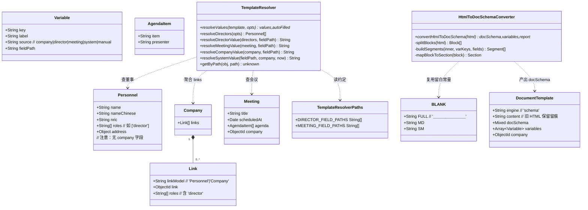
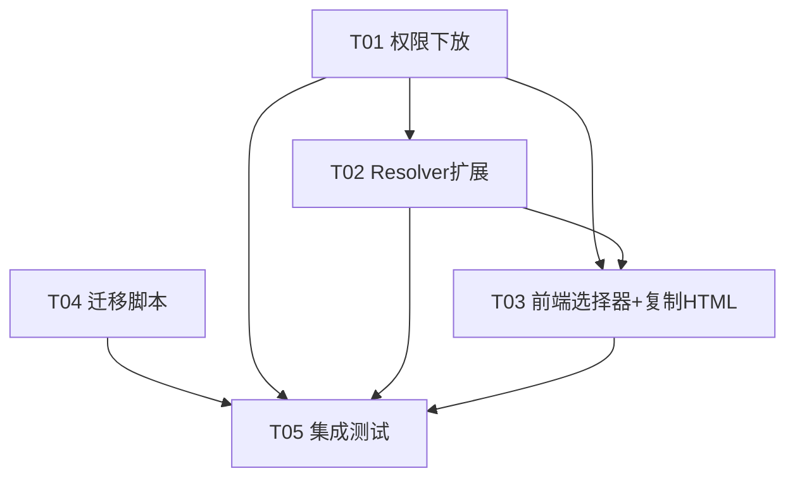

# Claw CSMS — 模板模块增量架构设计与任务分解（4 决策）

> 架构师：高见远（Gao）｜输入：产品经理许清楚增量 PRD（4 决策）＋ 已核实技术现状
> 受众：工程师寇豆码（据此批量实现）｜约定：不写实现代码，只给设计 / 文件清单 / 数据结构 / 接口 / 调用流程 / 任务 / 依赖 / 共享约定 / 待明确项。

---

## 0. 关键事实校正（已实际 read 模型，非臆测）

PRD 的两处字段假设与代码现状不符，本设计按**真实代码**落地：

| PRD 假设 | 代码真实情况（已 read） | 本设计取数口径 |
|---|---|---|
| `Personnel.role === 'director'` | `Personnel` 字段为 **`roles: [String]`**（数组，如 `['director']`）；且 **Personnel 无 `company` 字段** | 董事身份以 `Company.links[]`（`linkModel:'Personnel'`、`roles` 含 `'director'`）为唯一事实源；resolver 优先用前端传的 `directorIds` 直查 `Personnel`，未传则按 `companyId` 聚合 `Company.links` |
| `meeting.date` | `Meeting` 日期字段为 **`scheduledAt`**（Date）；另有 `title`、`agenda:[{item, presenter, ...}]` | fieldPath 约定同时接受 `meeting.date`（别名）与 `meeting.scheduledAt`，并新增 `meeting.title` / `meeting.agenda` |

其他已核实现状：
- `server/middleware/auth.js` 仅导出 `auth` 与 `adminAuth`；需新增 `editorAuth = admin||secretary`。
- `server/services/templateResolver.js` 的 `resolveValues(template, companyId, options)` 当前对 `director`/`meeting` 直接 `continue`；纯函数 `getByPath`/`toDateString`/`formatAddress`/`resolveCompanyValue`/`resolveSystemValue` 可复用。
- `VARIABLE_SOURCES` 已含 `director`/`meeting`，`DocumentTemplate.variables` schema 已支持；**无需改模型 enum / schema**。
- `server/data/presets/_shared.js` 导出 `BLANK='＿＿＿＿＿＿＿＿'`（8 个全角下划线），转换留白复用之。
- 测试：`"test:server": "node --test server/tests/*.test.js"`（node:test）；`"test:client": "node client/node_modules/vitest/vitest.mjs run"`（vitest）；已含 `mongodb-memory-server` 依赖。
- `previewRef`（`TemplateFill.jsx`）指向包裹 `<SchemaDocRenderer>` 的 `<div className="bg-white">`；复制 HTML 即序列化该节点。
- `templateService.resolve(id, data)` 已把 `data` 作为请求体转发，前端只需补 `directorIds`/`meetingId`。

---

## 1. 实现方案概述

### 决策 1 · 旧 HTML 模板自动转换（不被 `/initialize` 删除）
- 新建**纯函数** `server/services/htmlToDocSchema.js`：`convertHtmlToDocSchema(html) -> { docSchema, variables, report }`，**仅用正则 / 字符串解析，不引 jsdom**（安全面小、零新依赖）。
- 新建迁移脚本 `scripts/migrateHtmlTemplates.cjs`（CommonJS，`require` 上述模块）：
  1. 连库 → 查 `engine:'html'` 文档；
  2. **先备份**：把命中原始文档整体写入 `scripts/backups/html-templates-<ts>.json`；
  3. 逐条 `convertHtmlToDocSchema(content)` → `assertValidDocSchema` 校验 → `updateOne({_id}, {$set:{ engine:'schema', docSchema, variables: deriveVariables(docSchema) }})`（保留 `content` 留痕）；
  4. **可重跑**：只查 `engine:'html'`，首跑后已变 `schema`，再跑即 no-op；
  5. **出报告**：控制台 + 写入 `scripts/migration-reports/migrate-html-<ts>.json`，含 `found/converted/skipped/failed/tablesDegraded`。
- **关键免删原理**：`/initialize` 仅 `deleteMany({engine:'html', ...})`；迁移后 `engine:'schema'`，天然不被清。**故 `/initialize` 无需改动**。

### 决策 2 · 董事 / 会议自动填充
- `templateResolver.resolveValues` 新签名为 `resolveValues(template, { companyId, directorIds, meetingId, now })`。
- 新增 `resolveDirectorValue(directors, fieldPath)` 与 `resolveMeetingValue(meeting, fieldPath)`，复用 `getByPath`/`toDateString`；董事来源：优先 `Personnel.find({_id:{$in:directorIds}})`，否则按 `companyId` 聚合 `Company.links`。
- 路由 `POST /:id/resolve` 现收 `directorIds`/`meetingId` 并透传给 resolver（仍只返回值，不渲染 HTML）。
- 前端 `TemplateFill` 在公司选择器下方新增「选择董事」（多选，数据源 `companyService.getDirectorEntries(companyId)`）与「选择会议」（数据源 `meetingService.getByCompany(companyId)`），选完将 `directorIds`/`meetingId` 一并传入 `resolve`。

### 决策 3 · 复制 HTML 按钮
- 新增 `client/src/utils/copyPreviewHtml.js`：
  - `serializePreviewToHtml(element)`：克隆预览节点 → 包成独立 A4 HTML（内嵌最小 `.doc-*` 样式表）→ 返回字符串；
  - `copyHtmlToClipboard(html)`：`navigator.clipboard.writeText` + 非安全上下文降级到隐藏 `<textarea>`+`execCommand('copy')`。
- `TemplateFill` 工具条新增「复制 HTML」按钮，点击即序列化 `previewRef.current` 并复制。无需后端。

### 决策 4 · 权限下放（方案 A）
- `auth.js` 新增 `editorAuth`（`admin||secretary`）。
- 路由 5 个写接口（`POST /`、`PUT /:id`、`DELETE /:id`、`POST /:id/duplicate`、`POST /initialize`）由 `adminAuth` 换 `editorAuth`；`POST /:id/resolve` 维持 `auth`。
- 前端 `TemplateList`（写按钮包 `isAdmin` → `canEdit`）、`TemplateBuilder`（`if(!isAdmin)` → `if(!canEdit)`）。`AuthContext.canEdit = isAdmin||secretary` 已存在，无需改。

---

## 2. 文件清单（相对 `C:/Users/Vincent/WorkBuddy/Claw/`）

| # | 路径 | 改动 | 职责 |
|---|---|---|---|
| 1 | `server/middleware/auth.js` | 修改 | 新增 `editorAuth`（admin｜secretary），与 `auth`/`adminAuth` 一并导出 |
| 2 | `server/routes/templates.js` | 修改 | 5 个写接口 `adminAuth`→`editorAuth`；`/resolve` 收 `directorIds`/`meetingId` 透传；`/initialize` 不变 |
| 3 | `server/services/templateResolver.js` | 修改 | `resolveValues` 新签名；新增 `resolveDirectorValue`/`resolveMeetingValue`/`resolveDirectors`；复用既有纯函数 |
| 4 | `server/services/templateResolverPaths.js` | **新增** | `DIRECTOR_FIELD_PATHS` / `MEETING_FIELD_PATHS` 常量（fieldPath 命名唯一事实源） |
| 5 | `server/services/htmlToDocSchema.js` | **新增** | 纯函数 `convertHtmlToDocSchema(html)`，正则/字符串解析，输出合法 docSchema |
| 6 | `scripts/migrateHtmlTemplates.cjs` | **新增** | 迁移脚本：连库→备份→转换→落库→报告；可重跑 |
| 7 | `client/src/components/templates/TemplateFill.jsx` | 修改 | 董事/会议选择器；「复制 HTML」按钮；`resolve` 透传 `directorIds`/`meetingId` |
| 8 | `client/src/components/templates/TemplateList.jsx` | 修改 | 写按钮守卫 `isAdmin`→`canEdit` |
| 9 | `client/src/components/templates/TemplateBuilder.jsx` | 修改 | `if(!isAdmin)`→`if(!canEdit)` |
| 10 | `client/src/utils/copyPreviewHtml.js` | **新增** | 预览 DOM → 独立 A4 HTML 字符串；复制到剪贴板（含降级） |
| 11 | `client/src/services/mock.js` | 修改 | `mockTemplates.resolve(id, data)` 支持 `director`/`meeting` 示例值（demo 可用） |
| 12 | `server/tests/templateResolver.test.js` | **新增** | node:test：company/system 回归 + director/meeting 单测 |
| 13 | `server/tests/htmlToDocSchema.test.js` | **新增** | node:test：转换算法（段落/标题/变量/表格降级/留白契约） |
| 14 | `server/tests/templates.routes.test.js` | **新增** | node:test + mongodb-memory-server：权限 403/200、`/resolve` 返回 director/meeting |
| 15 | `server/tests/testDb.js` | **新增** | mongodb-memory-server 启停 helper |
| 16 | `client/src/components/templates/TemplateFill.test.jsx` | **新增** | vitest：复制 HTML 按钮调用序列化、董事/会议选择器渲染 |

> 注：本任务**不引入任何新 npm 包**，故无 `package.json` 改动（满足"项目基础设施"规则——无新增配置/依赖，仅确认现状）。

---

## 3. HTML→docSchema 转换算法设计（重点）

### 3.1 设计红线
- **不引 jsdom**：旧 HTML 结构简单（`<h1>..<h6>/<p>/<div>/<br>/<ul>/<ol>/<table>/<hr>` + `{{var}}`），用正则 + 字符串切分足够，且避免重依赖与安全面。
- **segments 契约**（对齐 `assertValidSegments`）：每段必须是 `join`/`var`/`text`/`blank` 之一；**严禁** `{text:'', blank:true}`（text 分支会先命中并吞掉 blank）。留白一律用 `{blank:true}`（解析时 `resolveSegments` 以 `seg.blank||BLANK` 兜底）。
- **字段 key** 必须匹配 `FIELD_KEY_PATTERN = /^[A-Za-z_][A-Za-z0-9_]*$/`；中文/非法 var 名需 sanitize。
- `assertValidDocSchema` 在脚本内对每份产物做终校验，不合法即记入报告 `failed`。

### 3.2 `convertHtmlToDocSchema(html)` 精确步骤
```
输入: html (旧模板 content，可能含 <!doctype>/<html>/<head>/<body>/<script>/<style>)

1. 清洗 stripDangerous(html):
   - 去掉 <script>...</script>、<style>...</style>、<!doctype>、<html>/<head>/<body> 包裹标签
   - 归一化空白：\r\n|\r -> \n；连续空行压成单 \n
   - 在块级标签边界插入 \n 哨兵，便于逐块切分

2. 切分块 splitBlocks(clean): 用正则提取每个顶层块
   - 块级: h1..h6 / p / div / ul / ol / table / hr
   - 形如: /<(h[1-6]|p|div|ul|ol|table|hr)\b[^>]*>([\s\S]*?)<\/\1>/gi  （hr 无闭合单独处理）
   - 返回 [{ tag, inner }]

3. 变量抽取 buildSegments(inner, varKeys, fields):
   - 用 VAR_RE = /\{\{\s*([\w.]+)\s*\}\}/g 顺序扫描
   - 文本段 -> { text: <片段> }；变量段 -> { var: <sanitizedKey> }
   - 顺序：text → var → text → ... （相邻 text 合并）
   - 归一：删除纯空白 text；若整段空 -> 返回 []（调用方跳过空块）
   - 关键：绝不产出 {text:'', blank}；单变量段落即 [{var:key}]

4. var 名 -> 字段 key sanitizeKey(name):
   - 若匹配 FIELD_KEY_PATTERN -> 直接用（如 companyName, meeting_date）
   - 否则：非 [A-Za-z0-9_] 替换为 '_'，首字符非字母/下划线则前缀 'f_'，仍空则 'field_<n>'
   - 首次出现时登记字段：fields.push({ key, label: 原 name 美化, source:'manual', type:'text' })
     （source 默认 manual：保证迁移产物不会因未知 source 而静默失效；用户可在 Builder 再设 company/director/meeting）

5. 块 -> section 映射：
   - h1..h6 -> { type:'heading', level: N, text: headingText(inner) }
       * heading.text 为纯字符串（渲染器只读 section.text）
       * 若含 {{var}}：变量替换为 BLANK_MD（短留白）作占位，并仍登记字段
   - p / div -> 按 <br> 拆成若干 chunk；每非空 chunk -> { type:'paragraph', segments: buildSegments(chunk) }
   - ul / ol -> 抽取 <li>；每个 li 作为一段 paragraph，segments=[{ text: bulletPrefix(tag)+itemText }]
       * 说明：渲染器 clauseList 仅读 section.field 绑定的 data 数组、不读字面 items，
         静态迁移列表用 paragraph+前缀最忠实且零绑定风险
   - table -> 降级：
       * 统计行/列数 info={rows,cols,htmlSnippet}
       * report.tablesDegraded.push(info)
       * 产出 { type:'note', text:'⚠️ 原模板含表格（N 行 M 列），已降级为占位，请人工补全。' }
       * 再产出 { type:'paragraph', segments:[{ blank:true }] } 留填空位
   - hr -> { type:'divider' }
   - 空块（inner 仅空白）-> 跳过

6. 组装 docSchema:
   docSchema = {
     schemaVersion: SCHEMA_VERSION,
     layoutMode: 'custom',
     meta: { docTitle: 首个 heading 文本 || '', fileNamePattern: '' },
     fields,                      // 由 sanitizeKey 累积
     rules: [],
     layout: { sections }
   }

7. 校验与产出:
   assertValidDocSchema(docSchema)   // 抛错 -> 调用方记入 failed
   variables = deriveVariables(docSchema)
   return { docSchema, variables, report }
```

### 3.3 segments 契约示例
- `<p>本公司（{{companyName}}）于 {{meetingDate}} 举行会议。</p>`
  → `[{text:'本公司（'},{var:'companyName'},{text:'）于 '},{var:'meetingDate'},{text:' 举行会议。'}]`
- `<p>{{directorName}}</p>` → `[{var:'directorName'}]`（值为空时渲染为 BLANK 下划线）
- 空行 → 跳过；需要显式留白行 → `[{blank:true}]`

### 3.4 为何不引 jsdom
正则/字符串解析覆盖现有旧模板的有限标签集，零新增依赖、解析确定、易单测；jsdom 体积大且会执行/加载外部资源，引入不必要风险。仅在 `assertValidDocSchema` 做结构守门，确保产物一定合法。

---

## 4. Resolver 扩展的数据结构 / 接口

### 4.1 数据结构（类图）



### 4.2 新接口签名（后端）

```js
// server/services/templateResolver.js
async function resolveValues(template, options = {}) {
  // options: { companyId, directorIds, meetingId, now }
  // 返回 { values: {key:string}, autoFilled: string[] }
}

async function resolveDirectors({ companyId, directorIds }) {
  // 1) directorIds 非空 -> Personnel.find({_id:{$in:directorIds}}).lean()
  // 2) 否则 companyId -> Company.findById(companyId).select('links').lean()
  //    过滤 links: linkModel==='Personnel' && roles.includes('director')
  //    -> Personnel.find({_id:{$in: linkIds}}).lean()
  // 3) 均无 -> []
}

function resolveDirectorValue(directors, fieldPath) {
  const d = directors && directors[0]; if (!d) return '';
  switch (fieldPath) {
    case 'director.name':        return d.name || '';
    case 'director.chineseName': return d.nameChinese || '';
    case 'director.nric':        return d.nric || '';
    case 'director.role':        return Array.isArray(d.roles) ? d.roles.join('、') : '';
    case 'director.count':       return String(directors.length);
    case 'boardList':            return directors.map(fmt).join('、'); // fmt=[name,nameChinese,role].filter(Boolean).join(' ')
    default: return getByPath(d, fieldPath.replace(/^director\./, '')) ?? '';
  }
}

function resolveMeetingValue(meeting, fieldPath) {
  if (!meeting) return '';
  switch (fieldPath) {
    case 'meeting.date':
    case 'meeting.scheduledAt': return toDateString(meeting.scheduledAt);
    case 'meeting.title':       return meeting.title || '';
    case 'meeting.agenda':      return (meeting.agenda || []).map(a => a.item).filter(Boolean).join('、');
    default: return '';
  }
}
```

### 4.3 fieldPath 约定（`server/services/templateResolverPaths.js` 单点定义）
- 董事：`director.name` / `director.chineseName` / `director.nric` / `director.role` / `director.count` / `boardList`
- 会议：`meeting.date`（=`scheduledAt` 别名）/ `meeting.scheduledAt` / `meeting.title` / `meeting.agenda`

### 4.4 路由侧改动（`server/routes/templates.js`）
```js
// 仅 /resolve 改收参，其余写接口仅换中间件
router.post('/:id/resolve', auth, async (req, res) => {
  const { companyId, directorIds, meetingId } = req.body || {};
  const { values, autoFilled } = await resolveValues(template, {
    companyId: companyId || null,
    directorIds: Array.isArray(directorIds) ? directorIds : [],
    meetingId: meetingId || null,
  });
  return res.json({ success: true, values, autoFilled });
});
// POST / PUT /:id / DELETE /:id / POST /:id/duplicate / POST /initialize : adminAuth -> editorAuth
```

---

## 5. 调用流程图（ASCII 时序）

### ① 运行迁移脚本（决策 1）
```
[脚本] --connect(MONGODB_URI)-->
[DocumentTemplate] <-find({engine:'html'})-- 命中 N 条
[脚本] --写 backups/html-templates-<ts>.json (原始留痕)
循环每条 doc:
  [convertHtmlToDocSchema(content)] --返回 {docSchema, variables, report}
  [assertValidDocSchema(docSchema)] --校验
  [DocumentTemplate] <-updateOne({_id},{$set:{engine:'schema',docSchema,variables}})
[脚本] --写 migration-reports/migrate-html-<ts>.json + 控制台摘要
[脚本] --disconnect()
```
> 重跑：首跑后 engine='schema'，`find({engine:'html'})` 为空 → 自动 no-op。

### ② 前端选董事/会议 → /resolve（决策 2）
```
[TemplateFill] 选公司 -> companyService.getDirectorEntries(companyId) -> 渲染董事多选
[TemplateFill] 选会议 -> meetingService.getByCompany(companyId) -> 渲染会议单选
用户点「自动预填」:
  [TemplateFill] -> templateService.resolve(id, {companyId, directorIds, meetingId})
  -> POST /api/templates/:id/resolve
  [routes] -> resolveValues(template, {companyId, directorIds, meetingId})
       |-- companyId  -> Company.findById (company 变量)
       |-- directorIds-> Personnel.find / 或 Company.links 聚合
       |-- meetingId  -> Meeting.findById
  <- {values, autoFilled}
  [TemplateFill] 合并 values 进表单 (绿色高亮)
```

### ③ 点击「复制 HTML」（决策 3）
```
[TemplateFill] 点「复制 HTML」
  -> serializePreviewToHtml(previewRef.current)
       | 克隆预览 DOM -> 包成 <html><head><style>.doc-* 最小样式</style></head><body>...</body></html>
  -> copyHtmlToClipboard(html)
       | navigator.clipboard.writeText(html)
       | (降级) 隐藏 <textarea> + document.execCommand('copy')
  <- toast「已复制 HTML 到剪贴板」
```

---

## 6. 有序任务列表（按实现先后，含依赖）

> 约束：≤5 任务；每任务 ≥3 文件；本工程无新增依赖/配置，故"基础设施任务"退化为确认 `package.json` 不变，首个实现任务即 T01。

- **T01 权限下放（决策4）** — 优先级 P0，依赖：无
  - `server/middleware/auth.js`（修改：加 `editorAuth`）
  - `server/routes/templates.js`（修改：5 写接口换 `editorAuth` + `/resolve` 收参透传）
  - `client/src/components/templates/TemplateList.jsx`（修改：`isAdmin`→`canEdit`）
  - `client/src/components/templates/TemplateBuilder.jsx`（修改：`!isAdmin`→`!canEdit`）

- **T02 董事/会议解析扩展（决策2·后端）** — 优先级 P0，依赖：T01
  - `server/services/templateResolver.js`（修改：新签名 + director/meeting 解析）
  - `server/services/templateResolverPaths.js`（新增：fieldPath 约定常量）
  - `server/tests/templateResolver.test.js`（新增：company/system 回归 + director/meeting 单测）

- **T03 前端选择器 + 复制 HTML（决策2+3）** — 优先级 P0，依赖：T01, T02
  - `client/src/components/templates/TemplateFill.jsx`（修改：董事/会议选择器 + 复制 HTML 按钮 + resolve 透传）
  - `client/src/utils/copyPreviewHtml.js`（新增：DOM→A4 HTML + 复制）
  - `client/src/services/mock.js`（修改：`mockTemplates.resolve` 支持 director/meeting 示例值）

- **T04 旧 HTML 迁移脚本（决策1）** — 优先级 P1，依赖：无（可与 T01 并行）
  - `scripts/migrateHtmlTemplates.cjs`（新增）
  - `server/services/htmlToDocSchema.js`（新增：纯转换函数）
  - `server/tests/htmlToDocSchema.test.js`（新增）

- **T05 集成测试与联调** — 优先级 P1，依赖：T01, T02, T03, T04
  - `server/tests/testDb.js`（新增：mongodb-memory-server helper）
  - `server/tests/templates.routes.test.js`（新增：权限 403/200 + `/resolve` 返回 director/meeting）
  - `client/src/components/templates/TemplateFill.test.jsx`（新增：vitest 复制 HTML / 选择器渲染）

### 任务依赖图


---

## 7. 依赖与共享约定

### 7.1 是否需要新 npm 包
**不需要**。
- 迁移：正则/字符串解析（不引 jsdom）；
- 复制 HTML：原生 `navigator.clipboard` + DOM 序列化（不引 clipboard 库）；
- 测试：复用既有 `node --test` + `vitest` + `mongodb-memory-server`（已在 devDeps）。
- `package.json` 无需改动。

### 7.2 docSchema segments 契约红线（必须严格遵守）
- 复用 `server/data/presets/_shared.js` 的 **`BLANK`** 常量（8 全角下划线）作为留白底纹；需要短留白用 `BLANK_MD`、短码用 `BLANK_SM`。
- 段落 segments 只可能出现四种形态之一：`{join:[]}` / `{var:'key'}` / `{text:'...'}` / `{blank:true}`（或 `{blank:'＿＿'}`）。
- **严禁** `{text:'', blank:true}`——写留白只能用 `{blank:true}`，`resolveSegments` 会以 `seg.blank||BLANK` 兜底渲染下划线。
- 单变量段落写成 `[{var:'key'}]`，不要包成 `{text:''}`。

### 7.3 `deriveVariables(docSchema)` 行为（后端唯一变量来源）
- 由 `docSchema.fields` 派生 `{key,label,source,fieldPath}`；source 非法/缺省归为 `'manual'`。
- 迁移脚本与 `POST /`/`PUT /:id` 一律用其产物覆盖 `variables`，**忽略客户端传入的 variables**。

### 7.4 安全红线
- 禁止 `eval` / `new Function` / `Function()`（模板模块既有红线，迁移/resolver 同样遵守）。
- 取值走白名单逐段 `getByPath`，显式拒绝 `__proto__`/`constructor`/`prototype`（防原型污染）。
- HTML 解析不引入 jsdom，避免加载外部资源带来的攻击面。

### 7.5 其它共享约定
- `fieldPath` 命名集中定义在 `server/services/templateResolverPaths.js`，前后端切勿散落硬编码。
- 变量 key 统一匹配 `FIELD_KEY_PATTERN`；迁移时中文 var 名经 `sanitizeKey` 处理。
- 迁移后**保留**原 `content`（仅 `engine` 置 `'schema'`）以留痕与回滚；`/initialize` 因只删 `engine:'html'` 而天然不删迁移产物。
- `resolve` 接口契约不变：`POST /:id/resolve` 仍只返回 `{success, values, autoFilled}`，不返回 HTML。

---

## 8. 待明确事项（≤3 条）

1. **董事取数口径确认**：代码事实是 `Personnel.roles:['director']` 且 Personnel 无 `company` 字段，董事-公司关系存于 `Company.links[]`。本设计据此实现（前端传 `directorIds` 直查；未传则按 `companyId` 聚合 `Company.links`）。请确认"董事"是否即以 `Company.links` 中 `roles` 含 `'director'` 为准（含 `alternate_director` 是否纳入？当前仅取 `'director'`）。
2. **Meeting 日期字段**：真实字段为 `scheduledAt`。本设计同时接受 `meeting.date`（别名）与 `meeting.scheduledAt`。如产品坚持只用 `meeting.date` 别名亦可，但需在 Builder 提示中说明底层为 `scheduledAt`。
3. **迁移后 `content` 是否清理**：为可追溯/回滚，本设计**保留**原 HTML `content`（仅置 `engine:'schema'`）。若产品要求清理，可在脚本加 `--clear-content` 开关，由产品拍板。

---

## 附录 A · 迁移脚本伪代码（供实现参考，非交付代码）
```js
// scripts/migrateHtmlTemplates.cjs
require('dotenv').config();
const fs = require('fs');
const path = require('path');
const mongoose = require('mongoose');
const DocumentTemplate = require('../server/models/DocumentTemplate');
const { convertHtmlToDocSchema } = require('../server/services/htmlToDocSchema');
const { assertValidDocSchema, deriveVariables, SCHEMA_VERSION } = require('../server/constants/templateSchema');

(async () => {
  await mongoose.connect(process.env.MONGODB_URI);
  const ts = new Date().toISOString().replace(/[:.]/g, '-');
  const found = await DocumentTemplate.find({ engine: 'html' }).lean();
  fs.mkdirSync('scripts/backups', { recursive: true });
  fs.writeFileSync(`scripts/backups/html-templates-${ts}.json`, JSON.stringify(found, null, 2));

  const report = { ts, found: found.length, converted: 0, skipped: 0, failed: [], tablesDegraded: 0 };
  for (const doc of found) {
    try {
      const { docSchema, variables } = convertHtmlToDocSchema(doc.content || '');
      assertValidDocSchema(docSchema);
      await DocumentTemplate.updateOne(
        { _id: doc._id },
        { $set: { engine: 'schema', docSchema, variables: deriveVariables(docSchema) } }
      ); // 保留 content 留痕
      report.converted += 1;
      report.tablesDegraded += (docSchema.__tablesDegraded || 0);
    } catch (e) {
      report.failed.push({ _id: String(doc._id), name: doc.name, error: e.message });
    }
  }
  fs.mkdirSync('scripts/migration-reports', { recursive: true });
  fs.writeFileSync(`scripts/migration-reports/migrate-html-${ts}.json`, JSON.stringify(report, null, 2));
  console.log(report);
  await mongoose.disconnect();
})();
```
